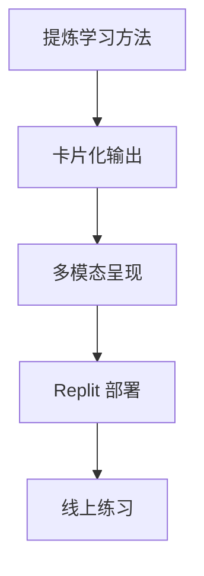
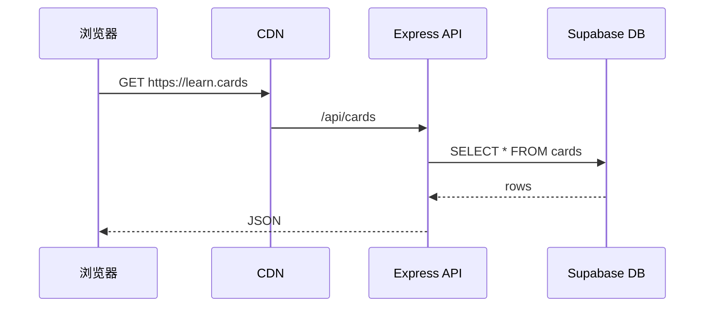
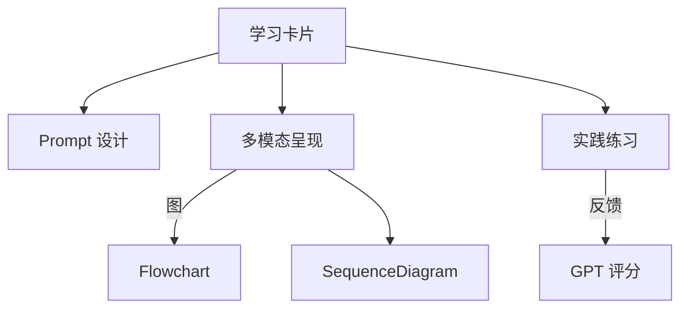

## AI 1对1辅导学习方法复盘报告
### 📅 2025年6月26日 | 👨‍🎓 徐添翼 (XTY) | 👨‍🏫 孙伟教练

> **🎯 1对1辅导场景简述**  
> - **日期时间**: 2025年6月26日 AI辅导实践课
> - **学生**: 徐添翼（主要操作者，负责代码实现与问题解决）
> - **教练**: 孙伟（实时提问与引导，方法论指导）  
> - **AI助手**: GPT（代码与内容生成，技术支持）
> - **课程目标**: 把"学习方法"整理成可复用的 **学习卡片**，并用 Replit + OpenRouter 部署成在线检索/练习网站
> 
> **🔄 核心教学任务链**：  
>   1. **提炼对话中的学习方法** → 卡片化（JSON / Markdown）  
>   2. **生成多模态呈现**（概念图、流程图、Sequence Diagram、词汇表等）  
>   3. **在 Replit 中迭代网站**：部署 → 发现 bug → Debug → Redeploy  
>   4. **加入即时练习**（自动生成材料、判分）  

---

### 一、已使用的关键学习方法 / 工具

| # | 方法/工具 | 场景中体现 | 价值 |
|---|-----------|-----------|------|
| 1 | **Prompt 迭代（Prompt-Refine）** | 多次让 GPT 重新理解"只做学习卡片，不做整站 App" | 通过反复澄清目的，逐步得到符合需求的输出 |
| 2 | **多模态转换**<br>Concept Map / Flowchart / Sequence Diagram | 让 GPT 输出网页流程与数据库流程可视化 | 把抽象流程外显，便于讨论与 Debug |
| 3 | **AI 朗读 + 翻译法** | 对英文定价页：GPT 朗读＋翻译＋术语澄清 | 提升生词吸收效率、加深理解 |
| 4 | **对照-问答（Self-Explain）** | 对生成的图表/名词逐项提问，"我不懂 X，请解释" | 及时暴露知识盲区，形成主动学习闭环 |
| 5 | **Bug-Driven Learning** | 每出现 bug 立即定位原因→向 GPT 提问→修改代码 | 以问题为驱动，快速串联新知识与旧经验 |
| 6 | **即时总结（Mini-Retrospective）** | 聊天尾声用口述或 GPT 总结当轮收获 | 强化元认知，固化学习痕迹 |
| 7 | **模板化卡片（Method Card Template）** | 统一字段：名称-步骤-适用场景-示例-练习 | 方便批量生成与检索，亦利于后端存储 |

---

### 二、主要痛点 & 反思

| 痛点 | 触发情景 | 复盘结论 |
|------|----------|----------|
| **1. 目标表述含糊 → GPT 误解** | GPT 把"卡片"理解成"App" | 写 Prompt 时应显式声明：<角色><任务><输出格式>，并附示例 |
| **2. 编译/部署循环慢** | Replit 每次 Redeploy 数分钟 | 利用本地 `npm run dev` 预览或启用 Replit 的 **Instant Preview**，只在通过后再 Redeploy |
| **3. 日志不透明 → 难定位卡顿** | OpenRouter 无调用记录 | 先用 Postman/curl 单独测试 API，再接入；必要时在前端加进度条 & 超时提示 |
| **4. 多 bug 并行导致认知负荷高** | 背景透明、滚动条丢失、双关闭按钮… | 采用 Kanban：**Todo-Doing-Done**，一次解决一个 bug 并记录复现步骤 |
| **5. 学习方法记录分散** | 方法散落在对话 & 代码片段 | 建立 `methods/` 目录 + 单文件索引 `index.json`；每新方法自动追加 |
| **6. 练习素材生成慢 / 欠互动** | GPT 生成练习卡顿 | 预生成练习缓存；或用轻量模型先生成素材，重模型判分 |
| **7. 模态切换成本** | 口述 ↔ GPT ↔ Replit 窗口频繁 | 用 OBS ⏺️录屏 + 飞书 AI 纪要后整理；或用 Cursor / VSCode 一体化终端减少跳窗 |

---

### 三、改进建议（下一迭代）

1. **Prompt 模板升级**  
   ```txt
   角色：学习卡片生成器  
   任务：从给定文本提取学习方法→输出统一 JSON  
   必含字段：name, purpose, steps, example, practice, tags  
   输出示例：{ "name": "...", "purpose": "...", ... }
   ```
   先放入 `prompt_library.md`，调用时复制即可。

2. **自动卡片管线**  
   - `scripts/extract_methods.py`：解析对话 txt → 追加 `methods.json`  
   - `scripts/build_site.sh`：生成静态卡片页，触发 Replit CLI 部署  
   - GitHub Actions：Push 时自动测试 & 部署，失败即邮件提示  
   - **好处**：减少手动 copy-paste，缩短反馈回路。

3. **本地 VS 线上双环境**  
   - 开启 `vite --host` → 局域网手机预览；通过后再 `replit deploy`。  
   - 部署前自动运行 `npm test` + ESLint，避免线上报错。

4. **Debug 工具链**  
   - 在前端加入 `window.onerror` & `fetch` 拦截，集中 log 到控制台。  
   - Replit → Settings → **Logs** 面板常驻；OpenRouter 用 **Dashboard** 实时看 token 消耗。

5. **练习组件雏形**  
   - 卡片末尾统一 `<PracticeBox>`：  
     - 显示原文段落 → 用户口述或填空 → 前端调用 GPT `function_call` 判分 → 即时反馈。  
   - 先用免费 GPT-3.5 模型，判分逻辑简单关键词匹配，再逐步升 4o。

6. **每日微复盘**  
   - 结束 5 分钟，回答三问：①今天学了什么? ②哪里卡住? ③下一步?  
   - 用飞书录音 + 自动转写，存 `daily_logs/2025-06-26.md`.

---

### 四、示例「学习方法卡片」(Markdown)

```markdown
## 流程图-拆解法
- **Purpose**：把复杂操作流程分解为可视化节点，快速发现瓶颈或 bug。
- **Steps**
  1. 收集原始步骤文字  
  2. 用 GPT 生成 Mermeid 流程图代码  
  3. 渲染预览 → 手动校正  
  4. 将图嵌入文档/PR，供团队讨论
- **Example**：浏览器访问网址 → CDN → Express API → DB → 返回 JSON  
- **Practice**：请把 "用户上传学习卡片" 的后台流程画成流程图。
- **Tags**：#可视化 #Debug #分解
```

---

### 五、2025-06-26 辅导课复盘小结

- **本次1对1AI辅导课特色**：这是一堂"边做边学"式实践课，通过真实的 App 调试过程，贯穿了 Prompt 设计、AI 代码生成、前端/后端部署、故障排查与多模态表达；学习与开发高度交织。  
- **徐添翼最大收获**：认识到 **"清晰目标 + 标准输出格式"** 对 AI 协作的决定性作用；同时体验了 CI/CD 思维在学习项目中的价值。  
- **教练孙伟观察要点**：学生在遇到技术障碍时，能够主动运用多模态工具（流程图、概念图）来外显思考过程，这是高效学习的关键表现。
- **下一步行动计划**：固化工具链与模板，让「学习-生成-部署-练习」形成 **可重复的闭环**，真正把"学习方法库"跑起来。

---

**📊 本报告生成信息**
- **报告日期**: 2025年6月27日
- **辅导课程日期**: 2025年6月26日  
- **报告类型**: AI 1对1辅导学习方法复盘
- **学习分析工具**: Claude Code + 多模态可视化


---

## 多模态速览 (Multi‑mode Snapshot)

> **为什么加入多模态？** 1o1 辅导里，我们经常用 *图形‑文字‑表格‑JSON* 多重表现来巩固理解、方便迁移。以下示例把本次任务链和关键概念立体化展示。

### 1. 核心任务链 — 流程图


### 2. 网站请求过程 — Sequence Diagram


### 3. 概念图 — Method Card 生态


### 4. 关键术语速查表

| Term | 中文 | Hint |
|------|------|------|
| **Redeploy** | 重新部署 | 在 Replit 触发新构建并上线 |
| **Sequence Diagram** | 时序图 | 展示请求‑响应交互顺序 |
| **Prompt** | 提示词 | 向 GPT 说明角色、任务、输出格式 |
| **Mermaid** | Mermaid 图 | Markdown 内嵌可视化语法 |

### 5. 示例 Method Card JSON

```json
{
  "name": "流程图-拆解法",
  "purpose": "把复杂操作流程分解为可视化节点",
  "steps": ["收集步骤", "生成Mermaid", "校正", "嵌入文档"],
  "example": "浏览器访问流程",
  "practice": "绘制用户上传学习卡片流程",
  "tags": ["可视化", "Debug", "分解"]
}
```