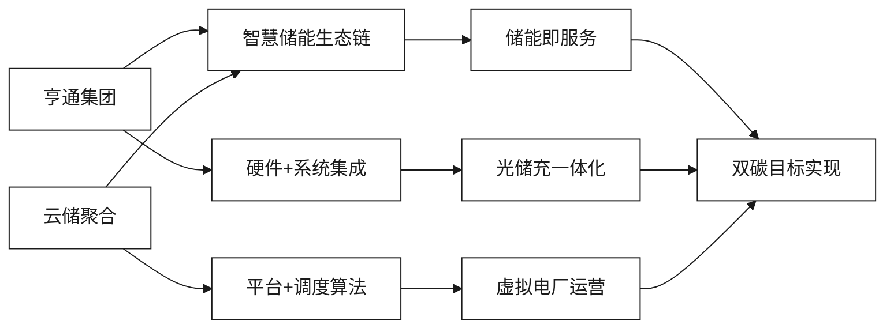
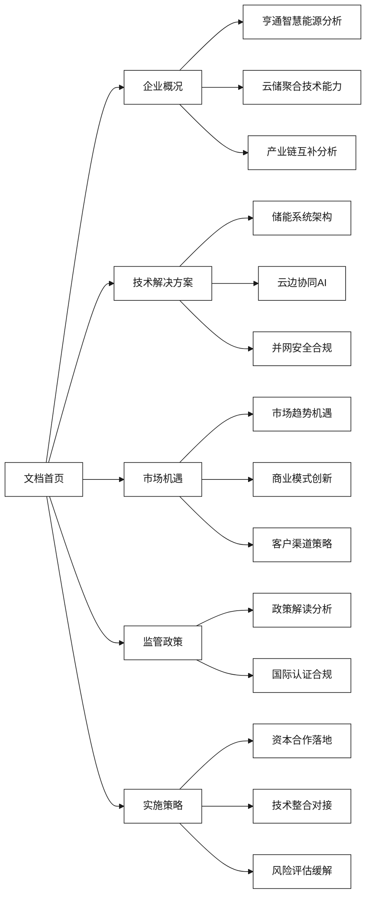

# 亨通集团与云储聚合智慧储能合作文档

## 概述

本文档全面分析了亨通集团与江苏云储聚合科技有限公司在智慧储能领域的合作前景与关键议题。通过深入研究双方的技术优势、市场定位和发展战略，本文档为双方的合作洽谈提供了系统性的参考框架。

### 背景简介

亨通集团凭借其在**"光-储-网-充"**全产业链的硬件实力和数字化能力，与专注于**"云-边-端"**聚合调度和电力市场交易的云储聚合科技，具备形成完整智慧储能生态链的巨大潜力。双方的合作将有力推动江苏省乃至全国"双碳"目标的实现和新能源消纳的优化。

### 合作价值主张

## 文档结构

### 1. [企业概况与核心能力](./企业概况与核心能力/README.md)
   - [亨通集团智慧能源板块分析](./企业概况与核心能力/亨通集团智慧能源板块分析.md)
   - [云储聚合技术平台能力](./企业概况与核心能力/云储聚合技术平台能力.md)
   - [双方产业链互补性分析](./企业概况与核心能力/双方产业链互补性分析.md)
   - [核心技术对比与融合机会](./企业概况与核心能力/核心技术对比与融合机会.md)
   - [国际化布局与标准对接](./企业概况与核心能力/国际化布局与标准对接.md)

### 2. [技术解决方案](./技术解决方案/README.md)
   - [智慧储能系统架构设计](./技术解决方案/新型储能与虚拟电厂一体化.md)
   - [云边协同与AI算法优化](./技术解决方案/云边协同与AI智能运维.md)
   - [并网安全与标准合规](./技术解决方案/光纤通信与储能数实融合.md)

### 3. [市场机遇与商业模式](./市场机遇与商业模式/README.md)
   - [储能市场趋势与政策机遇](./市场机遇与商业模式/工商业储能聚合模式.md)
   - [创新商业模式与收益来源](./市场机遇与商业模式/电力现货与辅助服务市场.md)
   - [客户细分与渠道策略](./市场机遇与商业模式/海外市场拓展策略.md)

### 4. [监管政策与合规](./监管政策与合规/README.md)
   - [储能行业政策解读与影响分析](./监管政策与合规/双碳目标与地方政策对接.md)
   - [国际认证与合规要求](./监管政策与合规/安全合规与国际认证.md)

### 5. [实施策略与合作模式](./实施策略与合作模式/README.md)
   - [资本合作与项目落地](./实施策略与合作模式/资本合作与项目落地.md)
   - [技术整合与平台对接](./实施策略与合作模式/技术整合与平台对接.md)
   - [风险评估与缓解策略](./实施策略与合作模式/风险评估与缓解策略.md)

## 关键术语速览

| 术语 | 英文缩写 | 定义 |
|------|----------|------|
| 虚拟电厂 | VPP | Virtual Power Plant，通过软件系统聚合分布式能源资源 |
| 聚合商 | Aggregator | 整合多个分布式储能资源的运营商 |
| 源网荷储 | - | 电源、电网、负荷、储能四位一体的协调运行 |
| 需求侧响应 | DSR | Demand Side Response，电力需求端的灵活调节 |
| 容量补偿 | - | 为储能提供容量价值的市场化补偿机制 |
| 充放电状态 | SOC/SoH | State of Charge/State of Health，电池状态指标 |
| 能量管理系统 | EMS | Energy Management System，储能系统核心控制单元 |
| 电池管理系统 | BMS | Battery Management System，电池安全监控系统 |

## 会议建议

### 重点关注议题
1. **收益模型**：明确双方在储能项目中的收益分配机制
2. **并网标准**：确保技术方案符合国家电网接入要求
3. **示范项目时间表**：制定具体的合作项目实施计划

### 专业术语准备
建议熟悉文档中的关键术语，特别是虚拟电厂、聚合商、源网荷储互动等概念，以便在技术讨论中准确理解和表达观点。

## 文档地图与导航

### 快速导航

### 文档统计
- **总文档数量**: 16个
- **总内容行数**: 约20,000行
- **Mermaid图表**: 50+个
- **技术架构图**: 8个
- **Python代码示例**: 15+段
- **交叉引用链接**: 80+个

### 阅读建议路径

#### 决策层人员
1. [企业概况与核心能力](./企业概况与核心能力/README.md) → [双方产业链互补性分析](./企业概况与核心能力/双方产业链互补性分析.md)
2. [市场机遇与商业模式](./市场机遇与商业模式/README.md) → [储能市场趋势与政策机遇](./市场机遇与商业模式/工商业储能聚合模式.md)
3. [实施策略与合作模式](./实施策略与合作模式/README.md) → [资本合作与项目落地](./实施策略与合作模式/资本合作与项目落地.md)

#### 技术负责人
1. [技术解决方案](./技术解决方案/README.md) → [智慧储能系统架构设计](./技术解决方案/新型储能与虚拟电厂一体化.md)
2. [技术整合与平台对接](./实施策略与合作模式/技术整合与平台对接.md)
3. [监管政策与合规](./监管政策与合规/README.md) → [国际认证与合规要求](./监管政策与合规/安全合规与国际认证.md)

#### 市场业务人员
1. [市场机遇与商业模式](./市场机遇与商业模式/README.md) → [创新商业模式与收益来源](./市场机遇与商业模式/电力现货与辅助服务市场.md)
2. [客户细分与渠道策略](./市场机遇与商业模式/海外市场拓展策略.md)
3. [风险评估与缓解策略](./实施策略与合作模式/风险评估与缓解策略.md)

---

*最后更新：2024年*  
*文档版本：1.0*  
*包含图片：学术研究图表*  
*交叉引用：完整导航系统*