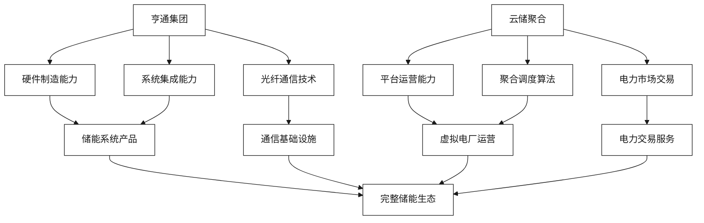

# 企业概况与核心能力

[首页](../README.md) > 企业概况与核心能力

## 概述

本章节深入分析亨通集团与云储聚合科技在智慧储能领域的核心能力、技术优势和市场定位，为双方合作提供全面的企业背景分析。

## 核心能力对比框架

## 章节内容

### [亨通集团智慧能源板块分析](./亨通集团智慧能源板块分析.md)
深入分析亨通集团在智慧能源领域的产业布局、技术积累和市场表现，重点关注其"光-储-网-充"全产业链能力。

### [云储聚合技术平台能力](./云储聚合技术平台能力.md)
全面评估云储聚合在"云-边-端"聚合调度、电力市场交易和虚拟电厂运营方面的核心技术能力。

### [双方产业链互补性分析](./双方产业链互补性分析.md)
系统分析双方在储能产业链上的定位和互补性，识别协同效应和价值创造机会。

### [核心技术对比与融合机会](./核心技术对比与融合机会.md)
深度对比双方的核心技术能力，探索技术融合的机会点和实现路径。

### [国际化布局与标准对接](./国际化布局与标准对接.md)
分析双方在国际市场的布局情况，以及在技术标准对接方面的协作机会。

## 关键发现

| 维度 | 亨通集团 | 云储聚合 | 协同价值 |
|------|----------|----------|----------|
| **核心定位** | 硬件制造商 | 平台运营商 | 硬件+软件完整解决方案 |
| **技术优势** | 储能设备、光纤通信 | 聚合调度、市场交易 | 端到端技术栈 |
| **市场覆盖** | 全球制造网络 | 江苏电力市场 | 国内外市场双覆盖 |
| **资质能力** | 制造认证 | 电力交易许可 | 完整业务资质 |

## 相关章节

- [技术解决方案](../技术解决方案/README.md) - 了解具体的技术整合方案
- [市场机遇与商业模式](../市场机遇与商业模式/README.md) - 探索市场机会和商业模式
- [实施策略与合作模式](../实施策略与合作模式/README.md) - 制定具体的合作实施策略

---

**导航**
- [下一章节：技术解决方案](../技术解决方案/README.md)
- [返回首页](../README.md)