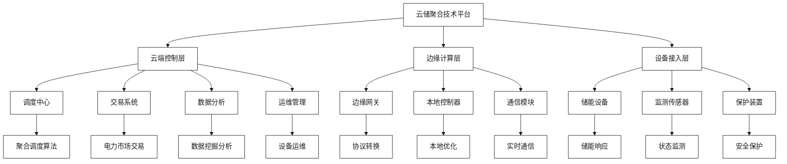
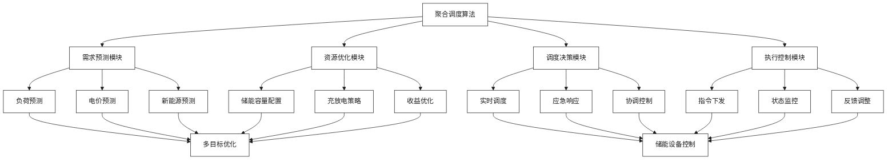
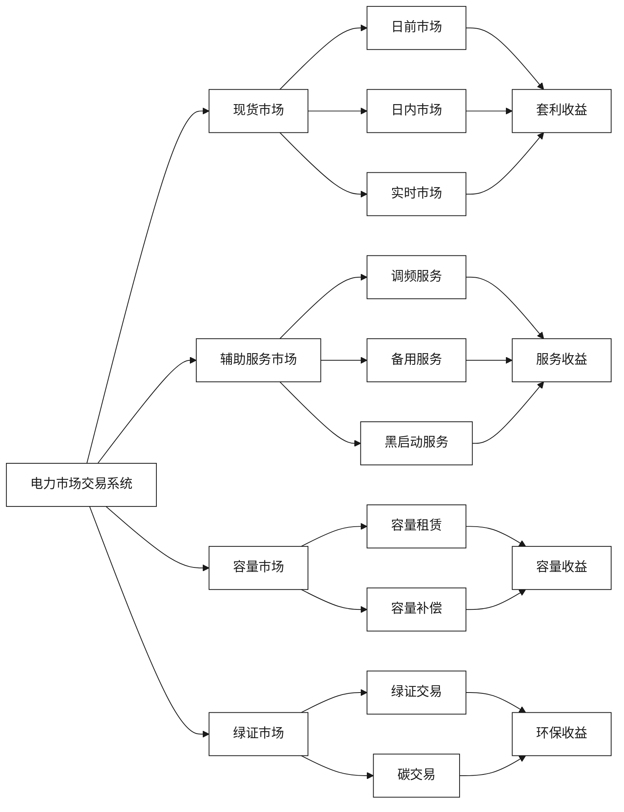

# 云储聚合技术平台能力

[首页](../README.md) > [企业概况与核心能力](./README.md) > 云储聚合技术平台能力

## 问答导引

### Q1: 云储聚合的核心技术平台包括哪些组件？
**A1:** 云储聚合的技术平台主要包括：
- **云端调度中心**：集中式储能资源管理和调度
- **边缘计算节点**：分布式储能设备本地智能
- **聚合算法引擎**：多储能节点协同优化
- **电力市场交易系统**：现货市场和辅助服务交易
- **数据分析平台**：储能运行数据挖掘和预测

### Q2: 云储聚合如何实现分布式储能的"聚合"？
**A2:** 云储聚合通过以下方式实现储能聚合：
- **统一接入标准**：标准化储能设备接入协议
- **虚拟化管理**：将分散储能资源虚拟化为统一资源池
- **智能调度算法**：基于AI的多目标优化调度
- **实时通信网络**：低时延指令传输和状态反馈
- **协同控制策略**：多储能节点协同响应电网需求

### Q3: 云储聚合在电力市场交易中的核心能力是什么？
**A3:** 云储聚合在电力市场交易的核心能力包括：
- **价格预测**：基于机器学习的电价预测算法
- **套利策略**：自动化峰谷套利和现货交易
- **风险管理**：交易风险识别和控制
- **合规管理**：符合电网调度和市场规则
- **收益优化**：多收益源协同优化

## 技术架构图

### 技术层级说明

| 层级 | 功能 | 核心技术 | 价值 |
|------|------|----------|------|
| 云端控制层 | 集中调度管理 | 聚合算法、市场交易 | 全局优化 |
| 边缘计算层 | 本地智能控制 | 边缘AI、实时控制 | 快速响应 |
| 设备接入层 | 设备连接管理 | 物联网、数据采集 | 状态感知 |
## 核心算法能力

### 聚合调度算法架构

### 算法模块详解

| 模块 | 核心算法 | 输入数据 | 输出结果 |
|------|----------|----------|----------|
| 需求预测 | LSTM神经网络 | 历史负荷、天气数据 | 负荷预测曲线 |
| 电价预测 | 时间序列分析 | 历史电价、市场数据 | 电价预测曲线 |
| 资源优化 | 遗传算法 | 储能参数、约束条件 | 最优调度方案 |
| 实时调度 | 模型预测控制 | 实时状态、预测数据 | 控制指令 |
| 协调控制 | 多智能体算法 | 多储能状态 | 协调策略 |

## 电力市场交易能力

### 交易系统架构

### 交易策略与收益模式

| 市场类型 | 交易策略 | 收益模式 | 风险控制 |
|----------|----------|----------|----------|
| **现货市场** | 峰谷套利 | 价差收益 | 价格波动风险 |
| **调频服务** | 快速响应 | 服务费+里程费 | 性能考核风险 |
| **备用服务** | 容量预留 | 容量补偿 | 可用性风险 |
| **容量市场** | 长期合约 | 固定收益 | 履约风险 |

## 数据处理与分析能力

### 数据流架构

1. **数据采集**
   - 储能设备运行数据（SOC、功率、温度）
   - 电网调度数据（频率、电压、负荷）
   - 市场交易数据（价格、成交量）
   - 环境数据（温度、湿度、天气）

2. **数据处理**
   - 实时数据清洗和预处理
   - 时序数据存储和管理
   - 多维数据关联分析
   - 异常数据识别和处理

3. **数据分析**
   - 储能设备健康状态评估
   - 电力市场价格预测
   - 用户用电行为分析
   - 系统运行效率评估

4. **数据应用**
   - 智能调度决策支持
   - 预测性维护建议
   - 投资决策分析
   - 风险预警提示

## 平台运营能力

### 运营服务体系

| 服务类型 | 服务内容 | 服务对象 | 价值创造 |
|----------|----------|----------|----------|
| **技术服务** | 系统集成、运维支持 | 储能设备商 | 降低运营成本 |
| **交易服务** | 市场交易、风险管理 | 储能投资商 | 提高收益率 |
| **数据服务** | 数据分析、报告生成 | 政府监管 | 提供决策支持 |
| **咨询服务** | 方案设计、政策解读 | 用户企业 | 优化投资回报 |

### 核心竞争优势

1. **技术优势**
   - 自主研发的聚合调度算法
   - 丰富的电力市场交易经验
   - 完整的云边端技术架构

2. **资质优势**
   - 国家能源局承装承修承试资质
   - 电力交易市场准入资质
   - 虚拟电厂运营资质

3. **经验优势**
   - 南通分布式储能示范项目
   - 多个工商业储能聚合案例
   - 与电网公司密切合作关系

4. **生态优势**
   - 产业链上下游合作伙伴
   - 金融机构融资支持
   - 政府政策扶持

## 技术发展路线图

### 技术演进阶段

1. **1.0阶段（已完成）**
   - 基础聚合平台搭建
   - 单一储能设备接入
   - 简单峰谷套利

2. **2.0阶段（当前）**
   - 多储能设备聚合
   - 多市场协同交易
   - 智能调度优化

3. **3.0阶段（规划中）**
   - 源网荷储一体化
   - 跨区域资源聚合
   - 国际市场拓展

### 技术创新方向

- **人工智能算法**：深度学习、强化学习
- **边缘计算**：5G+边缘AI、实时决策
- **区块链技术**：分布式交易、信任机制
- **数字孪生**：虚拟电厂数字化建模

## 市场定位与发展策略

### 市场定位

云储聚合定位为**"储能聚合服务商"**，核心价值在于：
- 连接储能设备与电力市场
- 提供专业化聚合调度服务
- 创造多元化收益模式
- 促进储能产业生态发展

### 发展策略

1. **技术领先战略**
   - 持续投入研发
   - 强化核心算法
   - 提升平台能力

2. **市场拓展战略**
   - 深耕江苏市场
   - 复制成功模式
   - 拓展全国市场

3. **生态合作战略**
   - 与设备商深度合作
   - 与金融机构联合
   - 与政府政策对接

## 相关资源

### 内部链接
- [亨通集团智慧能源板块分析](./亨通集团智慧能源板块分析.md)
- [双方技术优势对比](./双方技术优势对比.md)
- [工商业储能聚合模式](../市场机遇与商业模式/工商业储能聚合模式.md)

### 外部参考
- [江苏云储聚合科技](https://www.yunstorage.com.cn)
- [国家能源局储能政策](http://www.nea.gov.cn)

---

**导航**
- [上一页：亨通集团智慧能源板块分析](./亨通集团智慧能源板块分析.md)
- [下一页：双方技术优势对比](./双方技术优势对比.md)
- [返回首页](../README.md)