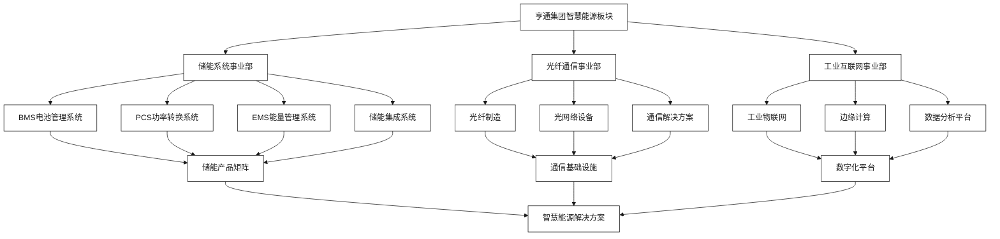
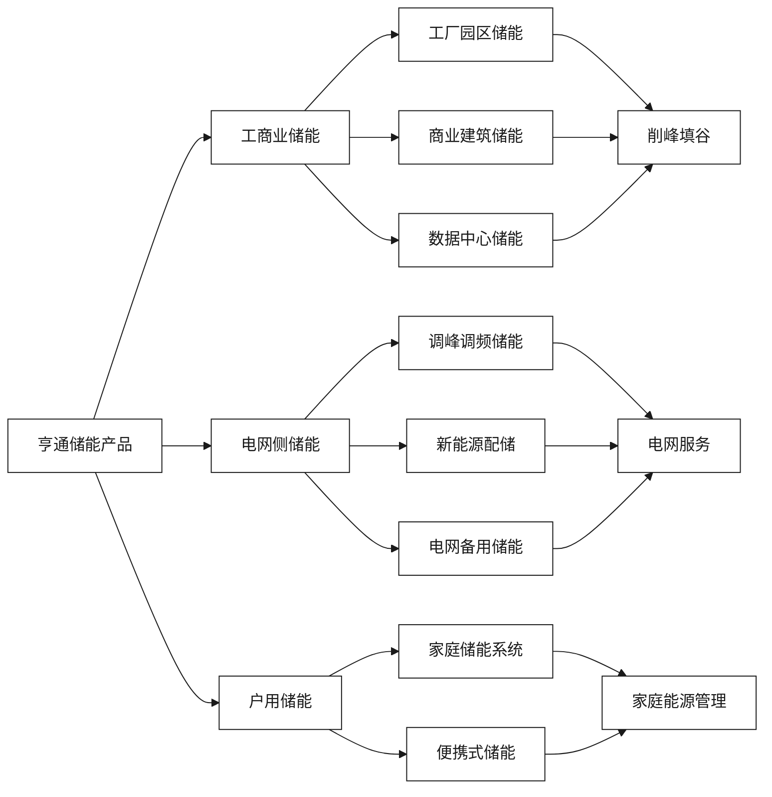

# 亨通集团智慧能源板块分析

[首页](../README.md) > [企业概况与核心能力](./README.md) > 亨通集团智慧能源板块分析

## 问答导引

### Q1: 亨通集团的智慧能源板块涵盖哪些核心业务？
**A1:** 亨通集团的智慧能源板块主要包括：
- **工商业储能系统**：直流/交流一体化储能解决方案
- **电力系统储能**：大规模储能电站建设和运营
- **微电网系统**：分布式能源管理和控制
- **光储充一体化**：太阳能+储能+充电桩集成方案
- **电网监测系统**：智能电网监控和数据分析

### Q2: 亨通在储能技术方面有哪些核心优势？
**A2:** 亨通的储能技术优势体现在：
- **系统集成能力**：BMS、PCS、EMS全套技术
- **制造实力**：量产化直流/交流一体化系统
- **智能化水平**：实现"云监控、云运维、云管理"
- **安全保障**：新能源高压线束等配套产品
- **数字化基因**：拥有"灯塔工厂"示范经验

### Q3: 亨通集团在光纤通信技术如何赋能储能业务？
**A3:** 光纤通信技术为储能业务提供：
- **低时延通信**：支持储能设备实时响应调度指令
- **高可靠性**：确保分布式储能节点稳定通信
- **数据传输**：承载海量储能运行数据
- **网络基础设施**：构建储能物联网底层架构
- **边缘计算支撑**：支持本地智能决策和控制

## 业务架构图

### 节点说明

| 节点 | 说明 | 核心能力 |
|------|------|----------|
| BMS | 电池管理系统 | 电池状态监控、安全保护 |
| PCS | 功率转换系统 | 交直流转换、功率控制 |
| EMS | 能量管理系统 | 能量优化、调度决策 |
| 光纤制造 | 光纤产品制造 | 低损耗光纤、特种光纤 |
| 工业物联网 | 工业设备联网 | 设备监控、数据采集 |
| 边缘计算 | 边缘智能处理 | 本地决策、实时响应 |

## 核心产品能力分析

### 储能系统产品矩阵

### 产品节点说明

| 产品类型 | 容量规模 | 应用场景 | 技术特点 |
|----------|----------|----------|----------|
| 工厂园区储能 | 1-10MWh | 工业园区 | 高功率密度、长寿命 |
| 商业建筑储能 | 100kWh-1MWh | 商业楼宇 | 模块化设计、易安装 |
| 调峰调频储能 | 10-100MWh | 电网调节 | 快速响应、高效率 |
| 新能源配储 | 20-200MWh | 风光电站 | 大容量、长周期 |
| 家庭储能系统 | 5-20kWh | 住宅用户 | 安全可靠、智能化 |

## 技术创新亮点

### 1. **直流/交流一体化技术**
- 集成度高，减少系统复杂度
- 效率提升5-8%
- 占地面积减少30%

### 2. **三云一体化管理**
- **云监控**：实时状态监测
- **云运维**：预测性维护
- **云管理**：智能调度优化

### 3. **灯塔工厂经验**
- 生产缺陷率降低60%
- 能耗下降25%
- 生产效率提升40%

## 市场表现与案例

### 重点项目案例

1. **南通分布式储能示范项目**
   - 规模：50MW/100MWh
   - 模式：聚合型分布式储能
   - 效果：峰谷套利+辅助服务双收益

2. **工业园区储能项目**
   - 规模：5MW/10MWh
   - 应用：削峰填谷+需求响应
   - 收益：年节约电费30%

3. **数据中心储能项目**
   - 规模：2MW/4MWh
   - 功能：UPS+储能一体化
   - 价值：提升供电可靠性

## 竞争优势分析

### 核心竞争力

| 维度 | 优势描述 | 市场影响 |
|------|----------|----------|
| **技术集成** | 全栈技术自主可控 | 成本优势、质量保证 |
| **制造能力** | 规模化生产制造 | 快速交付、价格竞争力 |
| **通信基因** | 光纤通信技术积累 | 差异化产品、技术壁垒 |
| **数字化** | 工业4.0实践经验 | 智能化程度高 |
| **全球网络** | 国际化销售服务 | 海外市场拓展能力 |

### 发展挑战

1. **市场竞争加剧**：储能市场参与者众多
2. **技术迭代快速**：需持续投入研发
3. **政策依赖性**：受储能政策变化影响
4. **成本压力**：原材料价格波动

## 战略发展方向

### 短期目标（1-2年）
- 完善储能产品矩阵
- 扩大工商业储能市场份额
- 强化与电网公司合作

### 中期目标（3-5年）
- 建设储能产业生态
- 进入海外储能市场
- 实现储能+通信融合发展

### 长期愿景（5年以上）
- 成为全球储能技术领导者
- 构建智慧能源生态系统
- 推动能源数字化转型

## 相关资源

### 内部链接
- [云储聚合技术平台能力](./云储聚合技术平台能力.md)
- [双方技术优势对比](./双方技术优势对比.md)
- [新型储能与虚拟电厂一体化](../技术解决方案/新型储能与虚拟电厂一体化.md)

### 外部参考
- [亨通集团官网 - 智慧能源](https://www.htgd.com.cn)
- [江苏亨通储能科技](https://www.htenergy.com.cn)

---

**导航**
- [上一页：企业概况与核心能力](./README.md)
- [下一页：云储聚合技术平台能力](./云储聚合技术平台能力.md)
- [返回首页](../README.md)