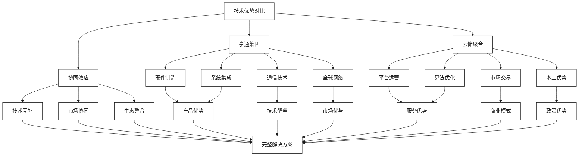
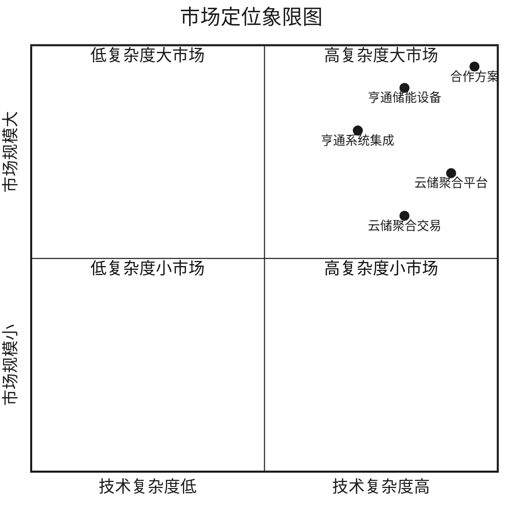
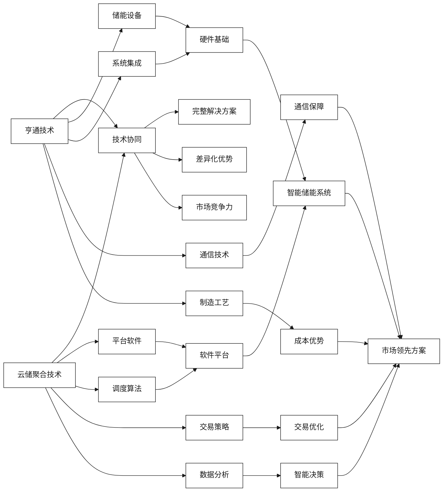

# 双方技术优势对比

[首页](../README.md) > [企业概况与核心能力](./README.md) > 双方技术优势对比

## 问答导引

### Q1: 亨通集团与云储聚合在技术路线上有何差异？
**A1:** 两家企业的技术路线各有特色：
- **亨通集团**：专注于**硬件制造**和**系统集成**，强调产品的稳定性和规模化生产
- **云储聚合**：专注于**软件平台**和**算法优化**，强调服务的智能化和精细化运营
- **差异化优势**：亨通具备制造基因，云储聚合具备互联网基因
- **协同效应**：硬件+软件的完美结合，形成端到端解决方案

### Q2: 双方在储能价值链上的定位有何不同？
**A2:** 在储能价值链上的定位差异：
- **亨通集团**：处于价值链**上游**，提供储能设备、系统集成和工程服务
- **云储聚合**：处于价值链**中游**，提供平台运营、市场交易和聚合服务
- **互补性**：亨通提供"硬实力"，云储聚合提供"软实力"
- **合作价值**：打通储能价值链，实现垂直整合

### Q3: 双方在市场策略上有何不同的优势？
**A3:** 市场策略优势对比：
- **亨通集团**：全球化布局，制造成本优势，品牌影响力
- **云储聚合**：本土化深耕，政策理解深度，客户关系紧密
- **市场互补**：亨通拓展海外市场，云储聚合深耕国内市场
- **协同效应**：内外市场双轮驱动，提升整体竞争力

## 技术优势对比框架

## 详细对比分析

### 技术能力对比

| 技术领域 | 亨通集团 | 云储聚合 | 协同价值 |
|----------|----------|----------|----------|
| **储能设备** | ⭐⭐⭐⭐⭐ | ⭐⭐ | 设备+平台一体化 |
| **系统集成** | ⭐⭐⭐⭐⭐ | ⭐⭐⭐ | 深度技术整合 |
| **通信技术** | ⭐⭐⭐⭐⭐ | ⭐⭐⭐ | 通信+储能融合 |
| **平台运营** | ⭐⭐ | ⭐⭐⭐⭐⭐ | 硬件+软件完整方案 |
| **算法优化** | ⭐⭐⭐ | ⭐⭐⭐⭐⭐ | 智能化水平提升 |
| **市场交易** | ⭐⭐ | ⭐⭐⭐⭐⭐ | 多收益源组合 |
| **工程服务** | ⭐⭐⭐⭐⭐ | ⭐⭐⭐ | 全生命周期服务 |
| **数据分析** | ⭐⭐⭐ | ⭐⭐⭐⭐⭐ | 数据驱动决策 |

### 市场定位对比

### 核心竞争力分析

#### 亨通集团核心竞争力

1. **制造优势**
   - 规模化生产能力
   - 质量控制体系
   - 成本控制能力
   - 供应链管理

2. **技术优势**
   - 储能系统集成技术
   - 光纤通信技术
   - 工业互联网技术
   - 智能制造技术

3. **市场优势**
   - 全球销售网络
   - 品牌影响力
   - 客户资源积累
   - 项目经验丰富

#### 云储聚合核心竞争力

1. **算法优势**
   - 聚合调度算法
   - 市场交易策略
   - 预测分析能力
   - 优化决策能力

2. **平台优势**
   - 云边端架构
   - 实时通信能力
   - 数据处理能力
   - 系统集成能力

3. **业务优势**
   - 电力市场深度理解
   - 政策法规熟悉
   - 客户需求把握
   - 商业模式创新

## 合作协同效应分析

### 技术协同效应

### 市场协同效应

| 协同维度 | 亨通贡献 | 云储聚合贡献 | 协同价值 |
|----------|----------|-------------|----------|
| **产品方案** | 硬件设备+系统集成 | 软件平台+算法优化 | 端到端完整解决方案 |
| **市场覆盖** | 全球市场网络 | 国内政策理解 | 内外市场双轮驱动 |
| **客户服务** | 工程实施能力 | 运营服务能力 | 全生命周期服务 |
| **技术创新** | 制造技术研发 | 算法平台研发 | 软硬件协同创新 |
| **成本控制** | 规模制造优势 | 运营效率优势 | 整体成本最优 |

### 商业模式协同

1. **收益模式互补**
   - 亨通：产品销售+工程服务
   - 云储聚合：平台服务+交易佣金
   - 协同：多元化收益来源

2. **风险分担**
   - 亨通：承担制造和技术风险
   - 云储聚合：承担市场和运营风险
   - 协同：风险分散化

3. **资源整合**
   - 亨通：制造资源+技术资源
   - 云储聚合：平台资源+数据资源
   - 协同：资源效率最大化

## 竞争对手分析

### 主要竞争对手

| 竞争对手 | 优势领域 | 威胁程度 | 应对策略 |
|----------|----------|----------|----------|
| **特斯拉** | 品牌+技术 | 高 | 差异化定位+成本优势 |
| **宁德时代** | 电池技术 | 高 | 系统集成+平台服务 |
| **阳光电源** | 逆变器技术 | 中 | 通信技术+聚合平台 |
| **科华数能** | 储能系统 | 中 | 规模优势+服务创新 |
| **远景能源** | 平台运营 | 中 | 硬件基础+本土优势 |

### 差异化竞争策略

1. **技术差异化**
   - 光纤通信+储能深度融合
   - 云边端协同架构
   - 聚合调度算法创新

2. **服务差异化**
   - 硬件+软件一体化服务
   - 全生命周期运维
   - 多元化收益模式

3. **成本差异化**
   - 规模制造成本优势
   - 平台运营效率优势
   - 供应链整合优势

## 发展战略建议

### 短期合作策略（1-2年）

1. **技术整合**
   - 建立联合研发中心
   - 统一技术标准
   - 开发联合产品

2. **市场试点**
   - 选择重点区域试点
   - 建立示范项目
   - 验证商业模式

3. **团队融合**
   - 建立联合工作组
   - 人员交流机制
   - 文化融合活动

### 中期发展策略（3-5年）

1. **规模扩张**
   - 复制成功模式
   - 扩大市场覆盖
   - 提升市场份额

2. **技术升级**
   - 下一代技术研发
   - 国际标准制定
   - 专利布局完善

3. **生态建设**
   - 产业链整合
   - 合作伙伴扩展
   - 平台生态完善

### 长期愿景策略（5年以上）

1. **行业领导者**
   - 技术标准制定者
   - 市场规则影响者
   - 生态系统主导者

2. **全球化布局**
   - 海外市场拓展
   - 国际合作深化
   - 全球品牌建设

3. **可持续发展**
   - 绿色技术创新
   - 社会责任履行
   - 长期价值创造

## 风险评估与对策

### 主要风险因素

1. **技术风险**
   - 技术整合难度
   - 标准不统一
   - 创新速度不足

2. **市场风险**
   - 政策变化
   - 竞争加剧
   - 需求波动

3. **合作风险**
   - 文化差异
   - 利益分配
   - 管理协调

### 风险缓解策略

1. **技术风险缓解**
   - 建立技术委员会
   - 制定统一标准
   - 加大研发投入

2. **市场风险缓解**
   - 多元化布局
   - 灵活调整策略
   - 强化政策研究

3. **合作风险缓解**
   - 明确合作协议
   - 建立沟通机制
   - 制定争议解决方案

## 相关资源

### 内部链接
- [亨通集团智慧能源板块分析](./亨通集团智慧能源板块分析.md)
- [云储聚合技术平台能力](./云储聚合技术平台能力.md)
- [新型储能与虚拟电厂一体化](../技术解决方案/新型储能与虚拟电厂一体化.md)

### 外部参考
- [储能产业竞争格局分析](https://www.cnesa.org)
- [智慧能源技术发展趋势](https://www.china-energy.gov.cn)

---

**导航**
- [上一页：云储聚合技术平台能力](./云储聚合技术平台能力.md)
- [下一页：技术解决方案](../技术解决方案/README.md)
- [返回首页](../README.md)