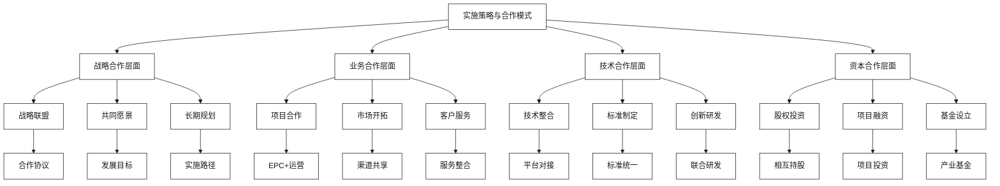
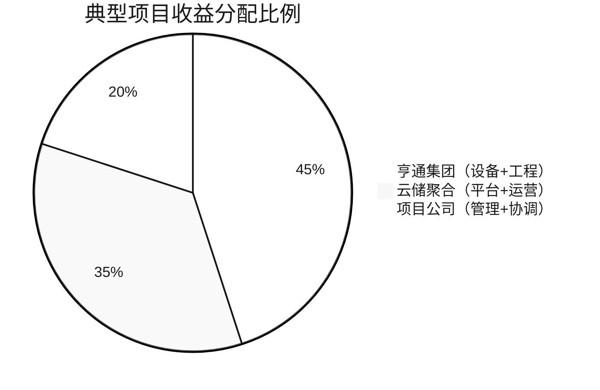

# 实施策略与合作模式

[首页](../README.md) > 实施策略与合作模式

## 概述

本章节制定亨通集团与云储聚合智慧储能合作的具体实施策略和合作模式，涵盖资本合作与项目落地、技术整合与平台对接、风险评估与缓解策略等关键环节，为双方合作提供可操作的实施路径。

## 合作模式框架



## 章节内容

### [资本合作与项目落地](./资本合作与项目落地.md)
深入分析双方资本合作模式，包括股权投资、项目融资、产业基金等形式，制定项目落地的具体实施方案。

### [技术整合与平台对接](./技术整合与平台对接.md)
探讨亨通储能设备与云储聚合平台的技术整合方案，实现硬件与软件的深度融合。

### [风险评估与缓解策略](./风险评估与缓解策略.md)
全面评估合作过程中可能面临的各种风险，制定相应的缓解策略和应对预案。

## 合作模式设计

### 战略合作模式

#### 合作层次结构
| 合作层次 | 合作内容 | 合作形式 | 预期成果 |
|----------|----------|----------|----------|
| **战略层** | 战略规划、品牌合作 | 战略联盟协议 | 共同发展愿景 |
| **业务层** | 市场开拓、项目合作 | 业务合作协议 | 市场份额提升 |
| **技术层** | 技术整合、标准制定 | 技术合作协议 | 技术优势互补 |
| **资本层** | 股权投资、项目融资 | 投资协议 | 资本纽带形成 |

#### 合作治理结构
```
合作治理委员会
├── 战略决策组
│   ├── 双方董事长/总裁
│   ├── 战略规划负责人
│   └── 投资决策负责人
├── 业务协调组
│   ├── 市场营销负责人
│   ├── 项目管理负责人
│   └── 客户服务负责人
├── 技术整合组
│   ├── 技术研发负责人
│   ├── 产品管理负责人
│   └── 标准化负责人
└── 财务监督组
    ├── 财务负责人
    ├── 风险控制负责人
    └── 审计负责人
```

### 业务合作模式

#### 1. 联合项目开发模式
**模式特点**：
- 共同承接大型储能项目
- 优势互补，风险共担
- 统一对外，协同服务

**适用场景**：
- 大型电网侧储能项目
- 综合能源服务项目
- 海外储能项目

#### 2. 产业链整合模式
**模式特点**：
- 上下游深度整合
- 全产业链协同
- 价值链优化

**整合领域**：
- 设备制造+系统集成
- 工程建设+运营服务
- 技术研发+标准制定

#### 3. 平台化服务模式
**模式特点**：
- 构建统一服务平台
- 标准化产品和服务
- 规模化运营

**平台功能**：
- 项目管理平台
- 客户服务平台
- 技术支持平台

## 实施策略

### 三阶段实施策略

#### 第一阶段：战略对接（6个月）
**主要任务**：
- 签署战略合作协议
- 建立合作治理机制
- 制定详细合作计划
- 启动试点项目

**关键里程碑**：
- 战略合作协议签署
- 合作治理委员会成立
- 第一个试点项目启动
- 技术整合方案确定

#### 第二阶段：深度合作（18个月）
**主要任务**：
- 推进项目规模化实施
- 深化技术整合
- 拓展市场合作
- 建立资本纽带

**关键里程碑**：
- 10个合作项目落地
- 技术平台对接完成
- 市场份额显著提升
- 资本合作协议签署

#### 第三阶段：战略融合（12个月）
**主要任务**：
- 实现战略深度融合
- 构建产业生态
- 国际市场拓展
- 持续创新发展

**关键里程碑**：
- 合作模式成熟稳定
- 产业生态初步形成
- 海外市场取得突破
- 技术创新显著成果

### 关键成功因素

#### 战略匹配度
1. **发展战略一致**：双方发展战略高度一致
2. **优势互补**：技术和资源优势互补
3. **文化融合**：企业文化相互融合
4. **目标统一**：合作目标明确统一

#### 执行保障
1. **组织保障**：建立有效的合作治理机制
2. **资源保障**：投入充足的人力物力资源
3. **制度保障**：建立完善的合作制度体系
4. **激励保障**：建立有效的激励约束机制

#### 风险管控
1. **风险识别**：全面识别合作风险
2. **风险评估**：科学评估风险影响
3. **风险防范**：制定风险防范措施
4. **风险应对**：建立风险应对机制

## 收益分配机制

### 分配原则

#### 基本原则
1. **价值贡献原则**：按照各方价值贡献分配收益
2. **风险承担原则**：收益与风险承担相匹配
3. **激励相容原则**：激励各方积极参与合作
4. **动态调整原则**：根据合作深化动态调整

#### 分配要素
- **资本投入**：各方投入的资本金额
- **技术贡献**：各方提供的技术价值
- **资源投入**：各方投入的人力和物力资源
- **市场贡献**：各方在市场开拓中的贡献
- **风险承担**：各方承担的经营风险

### 分配模式

#### 项目收益分配


#### 分配机制
1. **基础分配**：按投资比例分配基础收益
2. **贡献分配**：按价值贡献分配超额收益
3. **激励分配**：设立业绩激励和创新奖励
4. **风险分配**：风险损失按承担比例分担

## 合作保障机制

### 法律保障

#### 合作协议体系
```
战略合作框架协议
├── 业务合作协议
│   ├── 项目合作协议
│   ├── 市场合作协议
│   └── 服务合作协议
├── 技术合作协议
│   ├── 技术许可协议
│   ├── 联合研发协议
│   └── 标准制定协议
├── 投资合作协议
│   ├── 股权投资协议
│   ├── 项目投资协议
│   └── 基金设立协议
└── 保障协议
    ├── 保密协议
    ├── 竞业限制协议
    └── 争议解决协议
```

#### 知识产权保护
1. **专利保护**：共同申请核心技术专利
2. **商标保护**：保护各自品牌商标权益
3. **商业秘密**：建立商业秘密保护机制
4. **技术秘密**：保护核心技术秘密

### 组织保障

#### 组织架构设计
1. **决策层**：合作治理委员会
2. **执行层**：各专业工作组
3. **监督层**：合作监督委员会
4. **服务层**：合作服务办公室

#### 人员保障
1. **专职人员**：配备专职合作管理人员
2. **专家团队**：组建专家咨询团队
3. **培训交流**：定期开展人员培训交流
4. **激励机制**：建立人员激励机制

### 财务保障

#### 资金保障
1. **合作基金**：设立专项合作基金
2. **项目资金**：确保项目资金及时到位
3. **运营资金**：保障日常运营资金需求
4. **应急资金**：建立应急资金机制

#### 财务管理
1. **财务制度**：建立统一财务管理制度
2. **预算管理**：实施严格预算管理
3. **成本控制**：加强成本控制管理
4. **财务监督**：建立财务监督机制

## 绩效评估体系

### 评估指标体系

#### 战略目标指标
| 指标类别 | 具体指标 | 权重 | 目标值 |
|----------|----------|------|--------|
| **市场指标** | 市场份额提升 | 25% | 20%+ |
| **财务指标** | 收入增长率 | 25% | 30%+ |
| **技术指标** | 技术创新成果 | 20% | 10项+ |
| **合作指标** | 项目成功率 | 20% | 95%+ |
| **品牌指标** | 品牌影响力 | 10% | 显著提升 |

#### 过程管理指标
- **项目交付及时率**：95%以上
- **客户满意度**：90%以上
- **合作协调效率**：高效顺畅
- **风险控制能力**：有效可控

### 评估机制

#### 评估周期
1. **月度评估**：项目执行进度和问题
2. **季度评估**：业务指标和财务指标
3. **年度评估**：战略目标和整体绩效
4. **专项评估**：重大事项和关键节点

#### 评估方法
1. **定量评估**：基于数据的量化评估
2. **定性评估**：基于判断的质性评估
3. **第三方评估**：独立第三方专业评估
4. **自我评估**：合作双方自我评估

## 持续优化机制

### 持续改进

#### 改进流程
1. **问题识别**：及时识别合作中的问题
2. **原因分析**：深入分析问题产生原因
3. **改进方案**：制定针对性改进方案
4. **实施验证**：实施改进方案并验证效果

#### 创新发展
1. **模式创新**：持续创新合作模式
2. **技术创新**：推动技术创新发展
3. **管理创新**：优化合作管理机制
4. **服务创新**：提升客户服务水平

### 战略调整

#### 调整机制
1. **环境监测**：密切监测外部环境变化
2. **策略评估**：定期评估合作策略效果
3. **及时调整**：根据情况及时调整策略
4. **持续优化**：持续优化合作机制

#### 发展规划
1. **短期规划**：1-2年发展规划
2. **中期规划**：3-5年发展规划
3. **长期愿景**：10年发展愿景
4. **动态调整**：根据情况动态调整规划

## 相关章节

- [企业概况与核心能力](../企业概况与核心能力/README.md) - 了解合作基础
- [技术解决方案](../技术解决方案/README.md) - 理解技术整合
- [市场机遇与商业模式](../市场机遇与商业模式/README.md) - 把握市场机遇
- [监管政策与合规](../监管政策与合规/README.md) - 确保合规发展

---

**导航**
- [上一章节：监管政策与合规](../监管政策与合规/README.md)
- [返回首页](../README.md)