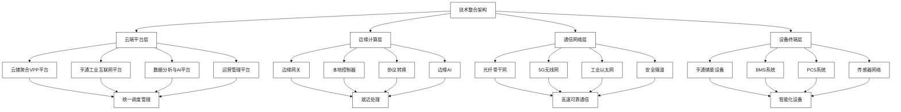
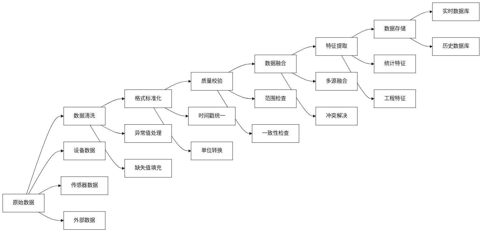
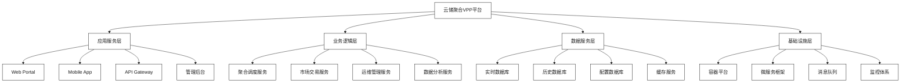
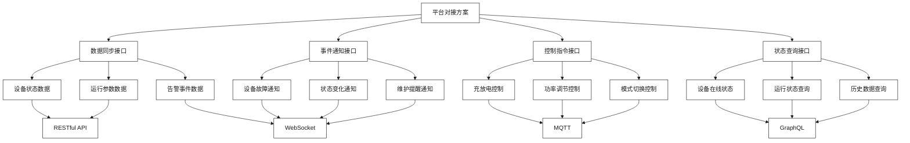
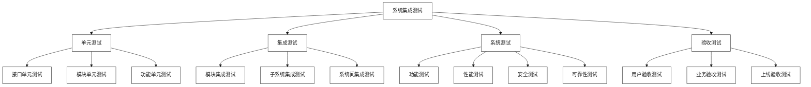
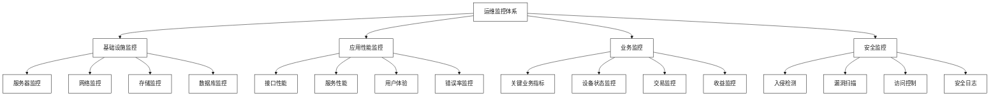

# 技术整合与平台对接

[首页](../README.md) > [实施策略与合作模式](./README.md) > 技术整合与平台对接

## 问答导引

### Q1: 亨通储能设备与云储聚合平台如何实现深度整合？
**A1:** 深度整合通过以下方式实现：
- **原生集成**：储能设备出厂即支持云储聚合平台协议
- **统一接口**：建立标准化的设备与平台通信接口
- **数据同步**：实现设备状态与平台数据的实时同步
- **协同控制**：平台指令与设备响应的无缝协同
- **联合优化**：硬件特性与软件算法的联合优化

### Q2: 技术整合过程中需要解决哪些关键技术挑战？
**A2:** 关键技术挑战包括：
- **协议统一**：不同设备和系统的通信协议统一
- **数据格式**：多源异构数据的标准化处理
- **实时性能**：毫秒级响应要求的技术实现
- **安全防护**：端到端的数据安全和系统安全
- **扩展性**：支持大规模设备接入的架构设计

### Q3: 平台对接后如何保证系统的稳定性和可靠性？
**A3:** 稳定性和可靠性保证措施：
- **冗余设计**：关键系统采用多重冗余架构
- **故障切换**：自动故障检测和快速切换机制
- **负载均衡**：智能负载分配和资源调度
- **监控预警**：7×24小时系统监控和预警
- **应急处理**：完善的应急响应和恢复机制

## 技术整合架构

### 整合架构设计

#### 总体架构图


### 核心技术模块

#### 1. 设备接入层
**功能定位**：实现储能设备与平台的标准化接入

**技术组件**：
- **设备驱动**：支持各种型号储能设备的标准化驱动
- **协议适配**：Modbus、IEC 61850、MQTT等协议适配
- **数据采集**：实时采集设备运行状态和参数
- **指令下发**：平台控制指令的可靠下发

**关键技术**：
```python
class DeviceConnector:
    def __init__(self, device_config):
        self.device_type = device_config['type']
        self.protocol = device_config['protocol']
        self.address = device_config['address']
        self.driver = self.load_driver()
    
    def connect(self):
        """建立设备连接"""
        try:
            self.connection = self.driver.connect(
                self.address, 
                self.protocol
            )
            return self.connection.is_connected()
        except Exception as e:
            self.logger.error(f"设备连接失败: {e}")
            return False
    
    def read_data(self):
        """读取设备数据"""
        data = {
            'timestamp': time.time(),
            'soc': self.driver.read_soc(),
            'voltage': self.driver.read_voltage(),
            'current': self.driver.read_current(),
            'temperature': self.driver.read_temperature(),
            'status': self.driver.read_status()
        }
        return self.format_data(data)
    
    def send_command(self, command):
        """发送控制指令"""
        return self.driver.send_command(command)
```

#### 2. 数据处理层
**功能定位**：实现多源数据的标准化处理和分析

**处理流程**：


**数据标准化**：
- **时间戳标准**：统一UTC时间戳格式
- **数据格式**：JSON格式数据交换
- **单位规范**：国际标准单位制
- **编码标准**：UTF-8字符编码

#### 3. 通信协议层
**功能定位**：实现设备与平台间的可靠通信

**协议栈设计**：
```
应用层协议
├── 云储聚合VPP协议
├── 亨通设备管理协议
└── 标准化接口协议

传输层协议
├── MQTT（物联网）
├── HTTP/HTTPS（Web）
└── WebSocket（实时）

网络层协议
├── TCP/IP
└── UDP

数据链路层
├── 以太网
├── 光纤通信
└── 无线通信
```

#### 4. 安全防护层
**功能定位**：保障整个系统的安全性

**安全架构**：
- **身份认证**：设备身份验证和用户身份认证
- **访问控制**：基于角色的访问控制（RBAC）
- **数据加密**：端到端数据加密传输
- **安全审计**：全程安全日志记录和审计
- **威胁检测**：实时安全威胁检测和响应

## 平台对接方案

### 云储聚合VPP平台架构

#### 平台技术架构


#### 核心服务模块
1. **聚合调度服务**
   - 储能资源聚合管理
   - 智能调度算法引擎
   - 实时调度指令生成
   - 多目标优化求解

2. **市场交易服务**
   - 电力市场接入
   - 交易策略生成
   - 风险管理控制
   - 结算清算处理

3. **运维管理服务**
   - 设备运行监控
   - 故障诊断分析
   - 预防性维护
   - 性能优化建议

4. **数据分析服务**
   - 大数据分析
   - 机器学习建模
   - 预测算法服务
   - 报表生成服务

### 亨通工业互联网平台

#### 平台能力
1. **设备管理能力**
   - 设备生命周期管理
   - 设备状态监控
   - 设备参数配置
   - 设备升级维护

2. **数据采集能力**
   - 多协议设备接入
   - 高频数据采集
   - 边缘数据处理
   - 数据质量保证

3. **通信服务能力**
   - 光纤通信服务
   - 无线通信服务
   - 网络管理服务
   - 安全通信保障

4. **应用开发能力**
   - 低代码开发平台
   - API服务接口
   - 组件化开发
   - 快速部署能力

### 平台对接技术方案

#### 接口对接方案


#### API接口规范
**数据同步接口**：
```json
{
  "api": "/api/v1/device/data/sync",
  "method": "POST",
  "headers": {
    "Content-Type": "application/json",
    "Authorization": "Bearer {token}"
  },
  "body": {
    "deviceId": "HT_ESS_001",
    "timestamp": 1703123456789,
    "data": {
      "soc": 75.5,
      "voltage": 382.4,
      "current": 125.6,
      "power": 48.1,
      "temperature": 25.3,
      "status": "charging"
    }
  }
}
```

**控制指令接口**：
```json
{
  "api": "/api/v1/device/control",
  "method": "POST",
  "headers": {
    "Content-Type": "application/json",
    "Authorization": "Bearer {token}"
  },
  "body": {
    "deviceId": "HT_ESS_001",
    "commandId": "CMD_20231201_001",
    "command": "setPower",
    "parameters": {
      "power": 50.0,
      "duration": 3600,
      "priority": "high"
    },
    "timestamp": 1703123456789
  }
}
```

## 数据整合与同步

### 数据模型设计

#### 统一数据模型
```python
class UnifiedDataModel:
    """统一数据模型"""
    
    def __init__(self):
        self.device_info = DeviceInfo()
        self.real_time_data = RealTimeData()
        self.historical_data = HistoricalData()
        self.control_data = ControlData()
        self.event_data = EventData()
    
    class DeviceInfo:
        """设备信息"""
        device_id: str          # 设备唯一标识
        device_type: str        # 设备类型
        manufacturer: str       # 制造商
        model: str             # 型号
        capacity: float        # 容量
        location: dict         # 位置信息
        install_date: datetime # 安装日期
        
    class RealTimeData:
        """实时数据"""
        timestamp: datetime    # 时间戳
        soc: float            # 电池SOC
        soh: float            # 电池SOH
        voltage: float        # 电压
        current: float        # 电流
        power: float          # 功率
        temperature: float    # 温度
        status: str           # 运行状态
        
    class HistoricalData:
        """历史数据"""
        time_series: list     # 时序数据
        aggregated_data: dict # 聚合数据
        statistics: dict      # 统计数据
        
    class ControlData:
        """控制数据"""
        command_id: str       # 指令ID
        command_type: str     # 指令类型
        parameters: dict      # 指令参数
        status: str          # 执行状态
        result: dict         # 执行结果
        
    class EventData:
        """事件数据"""
        event_id: str        # 事件ID
        event_type: str      # 事件类型
        severity: str        # 严重程度
        description: str     # 事件描述
        timestamp: datetime  # 事件时间
```

### 数据同步机制

#### 实时数据同步
```python
class RealTimeDataSync:
    """实时数据同步"""
    
    def __init__(self, config):
        self.mqtt_client = mqtt.Client()
        self.websocket_client = websocket.WebSocketApp()
        self.sync_interval = config.get('sync_interval', 1)  # 秒
        
    def start_sync(self):
        """启动实时同步"""
        # MQTT订阅设备数据
        self.mqtt_client.on_message = self.on_device_data
        self.mqtt_client.subscribe("device/+/data")
        
        # 定时同步任务
        scheduler = APScheduler()
        scheduler.add_job(
            self.sync_data,
            'interval',
            seconds=self.sync_interval
        )
        scheduler.start()
        
    def on_device_data(self, client, userdata, message):
        """处理设备数据消息"""
        try:
            data = json.loads(message.payload.decode())
            device_id = data['deviceId']
            
            # 数据验证和转换
            validated_data = self.validate_data(data)
            
            # 发送到VPP平台
            self.send_to_vpp_platform(device_id, validated_data)
            
        except Exception as e:
            self.logger.error(f"数据处理失败: {e}")
            
    def sync_data(self):
        """定时数据同步"""
        # 获取待同步数据
        pending_data = self.get_pending_data()
        
        # 批量同步
        self.batch_sync(pending_data)
```

#### 历史数据同步
- **增量同步**：只同步变化的数据
- **全量同步**：定期进行全量数据校验
- **断点续传**：网络中断后从断点继续同步
- **数据压缩**：大批量数据压缩传输

### 数据质量保证

#### 数据校验规则
1. **格式校验**：数据格式和类型校验
2. **范围校验**：数据取值范围校验
3. **逻辑校验**：数据逻辑一致性校验
4. **时序校验**：时序数据连续性校验

#### 数据清洗规则
1. **异常值处理**：识别和处理异常数据点
2. **缺失值处理**：缺失数据的插值和补充
3. **重复值处理**：重复数据的去重处理
4. **噪声过滤**：信号噪声的滤波处理

## 系统集成测试

### 测试策略

#### 测试层次


#### 测试用例设计
**接口测试用例**：
```python
class InterfaceTestCase:
    """接口测试用例"""
    
    def test_device_data_sync(self):
        """测试设备数据同步接口"""
        # 准备测试数据
        test_data = {
            "deviceId": "TEST_DEVICE_001",
            "timestamp": int(time.time() * 1000),
            "data": {
                "soc": 50.0,
                "voltage": 380.0,
                "current": 100.0,
                "power": 38.0,
                "temperature": 25.0,
                "status": "charging"
            }
        }
        
        # 发送请求
        response = self.client.post(
            "/api/v1/device/data/sync",
            json=test_data,
            headers=self.auth_headers
        )
        
        # 验证响应
        assert response.status_code == 200
        assert response.json()["code"] == "SUCCESS"
        
        # 验证数据同步结果
        synced_data = self.query_synced_data(test_data["deviceId"])
        assert synced_data["soc"] == test_data["data"]["soc"]
        
    def test_control_command(self):
        """测试控制指令接口"""
        # 准备控制指令
        command = {
            "deviceId": "TEST_DEVICE_001",
            "commandId": "TEST_CMD_001",
            "command": "setPower",
            "parameters": {
                "power": 50.0,
                "duration": 3600
            }
        }
        
        # 发送控制指令
        response = self.client.post(
            "/api/v1/device/control",
            json=command,
            headers=self.auth_headers
        )
        
        # 验证指令执行
        assert response.status_code == 200
        
        # 等待指令执行
        time.sleep(2)
        
        # 验证设备状态
        device_status = self.get_device_status(command["deviceId"])
        assert device_status["power"] == command["parameters"]["power"]
```

### 性能测试

#### 测试指标
| 性能指标 | 目标值 | 测试方法 |
|----------|--------|----------|
| **响应时间** | <100ms | 压力测试 |
| **吞吐量** | >10000 TPS | 负载测试 |
| **并发用户** | >1000 | 并发测试 |
| **可用性** | >99.9% | 可靠性测试 |
| **数据同步延迟** | <1s | 端到端测试 |

#### 性能优化
1. **数据库优化**：
   - 索引优化
   - 查询优化
   - 分库分表
   - 读写分离

2. **缓存优化**：
   - Redis缓存
   - 本地缓存
   - CDN加速
   - 静态资源缓存

3. **网络优化**：
   - 负载均衡
   - 连接池
   - 数据压缩
   - 协议优化

## 运维监控体系

### 监控架构

#### 全栈监控体系


#### 监控工具栈
1. **基础监控**：
   - Prometheus + Grafana
   - ELK Stack（日志分析）
   - Zabbix（基础设施）
   - Jaeger（链路追踪）

2. **应用监控**：
   - APM工具（Application Performance Monitoring）
   - 自定义监控指标
   - 实时告警系统
   - 性能分析工具

3. **业务监控**：
   - 业务指标大盘
   - 实时数据监控
   - 异常检测算法
   - 趋势分析预测

### 告警机制

#### 告警规则
```yaml
# 告警规则配置
alert_rules:
  - name: "设备离线告警"
    condition: "device_online_status == 0"
    severity: "critical"
    duration: "5m"
    action: "immediate_notification"
    
  - name: "接口响应时间告警"
    condition: "api_response_time > 1000ms"
    severity: "warning"
    duration: "2m"
    action: "email_notification"
    
  - name: "数据同步延迟告警"
    condition: "data_sync_delay > 30s"
    severity: "warning"
    duration: "1m"
    action: "sms_notification"
    
  - name: "系统资源告警"
    condition: "cpu_usage > 80% OR memory_usage > 85%"
    severity: "warning"
    duration: "3m"
    action: "email_notification"
```

#### 告警处理流程
1. **告警触发**：监控系统检测到异常
2. **告警发送**：根据规则发送告警通知
3. **人工确认**：运维人员确认告警信息
4. **问题处理**：根据预案处理问题
5. **告警关闭**：问题解决后关闭告警

### 自动化运维

#### 自动化场景
1. **自动化部署**：
   - CI/CD流水线
   - 滚动更新
   - 蓝绿部署
   - 灰度发布

2. **自动化运维**：
   - 自动扩缩容
   - 故障自愈
   - 定时任务
   - 备份恢复

3. **自动化测试**：
   - 单元测试
   - 集成测试
   - 性能测试
   - 安全测试

#### 运维工具
```python
class AutoOpsManager:
    """自动化运维管理器"""
    
    def __init__(self, config):
        self.k8s_client = kubernetes.client.ApiClient()
        self.ansible_runner = ansible.runner.Runner()
        self.monitoring = PrometheusClient()
        
    def auto_scale(self, service_name, metrics):
        """自动扩缩容"""
        current_load = metrics['cpu_usage']
        current_replicas = self.get_current_replicas(service_name)
        
        if current_load > 80:
            target_replicas = min(current_replicas * 2, 10)
            self.scale_service(service_name, target_replicas)
        elif current_load < 30:
            target_replicas = max(current_replicas // 2, 1)
            self.scale_service(service_name, target_replicas)
            
    def auto_healing(self, alert):
        """自动故障自愈"""
        if alert['type'] == 'service_down':
            self.restart_service(alert['service'])
        elif alert['type'] == 'high_error_rate':
            self.rollback_deployment(alert['service'])
        elif alert['type'] == 'resource_exhaustion':
            self.scale_up_service(alert['service'])
            
    def scheduled_maintenance(self):
        """定时维护任务"""
        # 数据库备份
        self.backup_database()
        
        # 日志清理
        self.cleanup_logs()
        
        # 缓存清理
        self.cleanup_cache()
        
        # 健康检查
        self.health_check()
```

## 技术演进规划

### 短期目标（6-12个月）

#### 基础整合
1. **接口对接**：完成核心接口的对接开发
2. **数据同步**：实现实时数据同步机制
3. **基础监控**：建立基础监控体系
4. **安全加固**：完善安全防护措施

#### 功能验证
1. **原型系统**：构建可演示的原型系统
2. **功能测试**：完成核心功能的测试验证
3. **性能调优**：初步性能优化和调优
4. **试点应用**：在小范围内试点应用

### 中期目标（1-2年）

#### 平台成熟
1. **功能完善**：完善所有计划功能模块
2. **性能优化**：达到生产环境性能要求
3. **稳定性提升**：确保系统稳定可靠运行
4. **标准化**：建立技术标准和规范

#### 规模应用
1. **商用部署**：在多个项目中商业化部署
2. **运营优化**：根据运营反馈持续优化
3. **生态建设**：构建技术生态和合作伙伴
4. **人才培养**：培养专业技术团队

### 长期目标（3-5年）

#### 技术引领
1. **技术创新**：在关键技术领域保持领先
2. **标准制定**：参与行业标准的制定
3. **开源贡献**：向开源社区贡献技术成果
4. **国际化**：技术方案国际化推广

#### 生态完善
1. **平台生态**：建立完善的技术生态
2. **产业链整合**：实现产业链深度整合
3. **品牌建设**：建立技术品牌影响力
4. **可持续发展**：实现技术可持续发展

## 相关资源

### 内部链接
- [资本合作与项目落地](./资本合作与项目落地.md)
- [风险评估与缓解策略](./风险评估与缓解策略.md)
- [新型储能与虚拟电厂一体化](../技术解决方案/新型储能与虚拟电厂一体化.md)

### 外部参考
- [工业互联网标准](http://www.aii-alliance.org)
- [电力系统通信标准](http://www.sac.gov.cn)
- [物联网技术标准](http://www.miit.gov.cn)

---

**导航**
- [上一页：资本合作与项目落地](./资本合作与项目落地.md)
- [下一页：风险评估与缓解策略](./风险评估与缓解策略.md)
- [返回首页](../README.md)