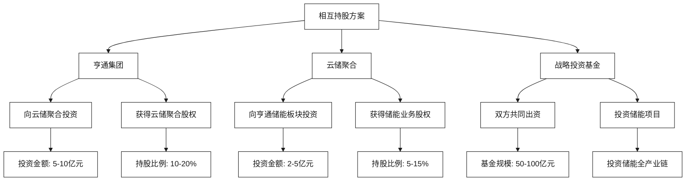
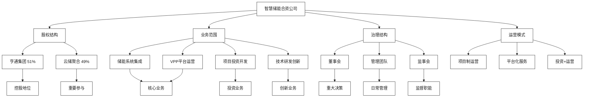
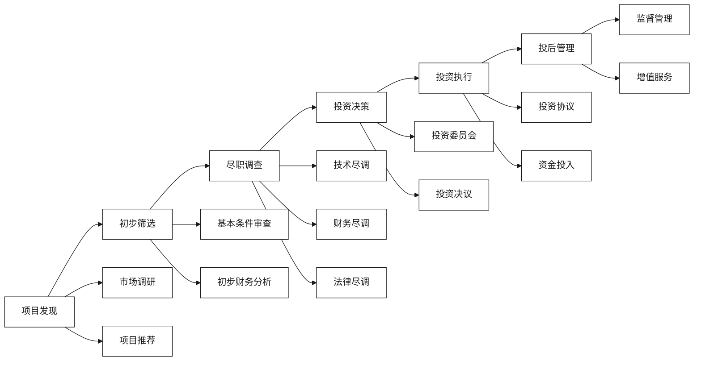
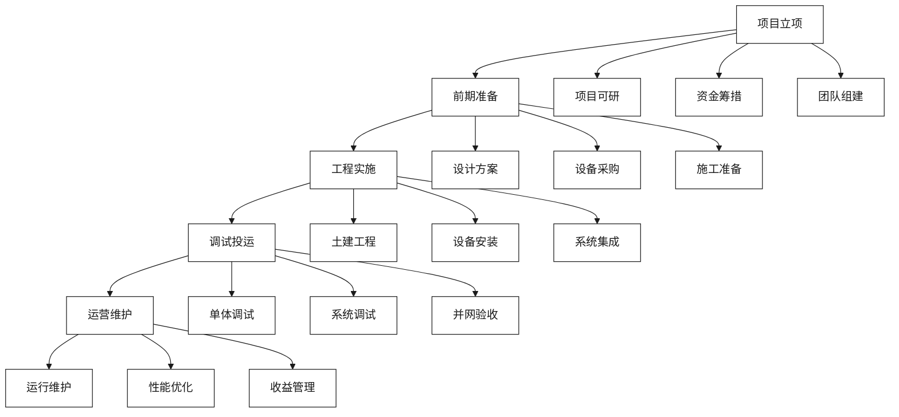
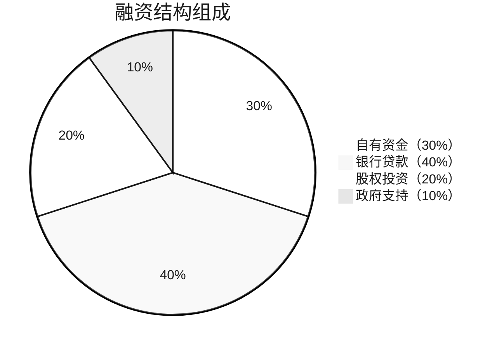

# 资本合作与项目落地

[首页](../README.md) > [实施策略与合作模式](./README.md) > 资本合作与项目落地

## 问答导引

### Q1: 亨通与云储聚合的资本合作有哪些可行模式？
**A1:** 资本合作模式包括：
- **股权投资**：相互持股，建立资本纽带关系
- **合资公司**：成立专门的储能合资公司
- **项目投资**：共同投资具体储能项目
- **产业基金**：设立储能产业投资基金
- **债权融资**：联合为项目提供债权融资支持

### Q2: 项目落地的关键成功因素有哪些？
**A2:** 关键成功因素包括：
- **政策对接**：紧密对接国家和地方储能政策
- **技术整合**：实现硬件与软件的深度融合
- **资金保障**：确保项目建设和运营资金充足
- **团队协同**：建立高效的项目管理团队
- **风险管控**：建立完善的风险管控体系

### Q3: 如何确保投资回报和风险控制的平衡？
**A3:** 平衡策略包括：
- **多元化投资**：分散投资降低单项目风险
- **阶段性投资**：按项目进展分阶段投入资金
- **保障机制**：建立完善的投资保障机制
- **退出机制**：设计灵活的投资退出机制
- **收益共享**：建立合理的收益分配机制

## 资本合作模式

### 股权投资模式

#### 相互持股方案


#### 股权投资策略
1. **战略导向**：以战略协同为主要目的
2. **财务回报**：追求合理的财务投资回报
3. **管控参与**：适度参与被投资方重大决策
4. **协同效应**：充分发挥业务协同效应

#### 投资估值方法
**云储聚合估值模型**：
- **市场法**：参考同类VPP平台公司估值
- **收益法**：基于未来现金流折现
- **资产法**：基于净资产价值评估
- **综合估值**：综合多种方法确定合理估值

**亨通储能板块估值**：
- **分部估值**：储能设备+系统集成+服务运营
- **市场倍数**：参考储能行业P/E、P/B倍数
- **增长预期**：考虑储能市场快速增长预期
- **协同价值**：评估与云储聚合的协同价值

### 合资公司模式

#### 合资架构设计


#### 合资公司方案
**公司名称**：亨通云储智慧能源科技有限公司
**注册资本**：10亿元人民币
**股权比例**：
- 亨通集团：51%（5.1亿元）
- 云储聚合：49%（4.9亿元）

**业务定位**：
- 储能系统集成商
- VPP平台运营商
- 综合能源服务商
- 储能技术创新中心

**治理结构**：
- 董事会：7名董事（亨通4名，云储聚合3名）
- 总经理：由董事会聘任
- 监事会：3名监事（各方派驻）

### 产业基金模式

#### 基金架构设计
**基金名称**：中国智慧储能产业投资基金
**基金规模**：100亿元人民币
**存续期限**：7年（5+1+1）

**出资结构**：
- 亨通集团：30%（30亿元）
- 云储聚合：10%（10亿元）
- 政府引导基金：20%（20亿元）
- 金融机构：25%（25亿元）
- 其他投资者：15%（15亿元）

#### 投资策略
1. **投资领域**：
   - 储能技术研发
   - 储能制造业
   - 储能系统集成
   - VPP平台运营
   - 储能应用项目

2. **投资阶段**：
   - 成长期项目：60%
   - 成熟期项目：30%
   - 早期项目：10%

3. **投资方式**：
   - 股权投资为主
   - 债权投资为辅
   - 可转债投资

4. **退出渠道**：
   - IPO上市
   - 并购退出
   - 股权转让
   - 管理层收购

## 项目投资策略

### 项目筛选标准

#### 基本条件
1. **政策支持**：符合国家和地方储能政策
2. **技术可行**：技术方案成熟可靠
3. **经济可行**：具备良好的经济效益
4. **风险可控**：风险水平在可接受范围

#### 评估指标
| 指标类别 | 具体指标 | 权重 | 标准要求 |
|----------|----------|------|----------|
| **政策指标** | 政策支持度 | 20% | 有明确政策支持 |
| **技术指标** | 技术成熟度 | 25% | 技术方案成熟 |
| **财务指标** | 投资回报率 | 30% | IRR≥12% |
| **市场指标** | 市场前景 | 15% | 市场需求明确 |
| **风险指标** | 风险可控性 | 10% | 风险可控 |

### 投资决策流程

#### 决策程序


#### 决策权限
- **500万元以下**：业务部门决策
- **500万-5000万元**：总经理决策
- **5000万-2亿元**：董事会决策
- **2亿元以上**：股东会决策

### 重点投资方向

#### 1. 工商业储能项目
**投资特点**：
- 单项投资规模：1000万-5000万元
- 投资回收期：5-8年
- 年化收益率：12-18%

**投资重点**：
- 制造业园区储能
- 商业楼宇储能
- 数据中心储能
- 冷链物流储能

#### 2. 电网侧储能项目
**投资特点**：
- 单项投资规模：5000万-5亿元
- 投资回收期：8-12年
- 年化收益率：10-15%

**投资重点**：
- 调峰调频储能电站
- 新能源配储项目
- 电网安全支撑项目
- 微电网储能项目

#### 3. 储能技术研发
**投资特点**：
- 单项投资规模：100万-5000万元
- 投资周期：3-7年
- 预期回报：高风险高收益

**投资重点**：
- 下一代电池技术
- 储能系统集成技术
- VPP平台技术
- AI运维技术

## 项目落地实施

### 项目落地流程

#### 标准化流程


#### 关键节点管控
1. **立项决策**：投资决策委员会审批
2. **设计评审**：技术委员会评审
3. **采购审批**：采购委员会审批
4. **施工监督**：工程监理全程监督
5. **验收把关**：第三方机构验收
6. **运营监控**：运营管理系统监控

### 项目管理体系

#### 组织架构
```
项目管理委员会
├── 项目总经理
├── 技术总监
├── 工程总监
├── 财务总监
└── 运营总监

项目执行团队
├── 设计团队
├── 采购团队
├── 施工团队
├── 调试团队
└── 运维团队
```

#### 管理制度
1. **项目章程**：明确项目目标和组织架构
2. **工作流程**：规范各阶段工作流程
3. **质量管理**：建立质量管理体系
4. **风险管理**：建立风险识别和应对机制
5. **沟通管理**：建立有效沟通机制

### 典型项目案例

#### 案例一：某工业园区储能项目
**项目概况**：
- 项目地点：江苏南通某制造业园区
- 装机规模：20MW/40MWh
- 总投资额：1.2亿元
- 建设周期：12个月

**投资结构**：
- 亨通集团：60%（7200万元）
- 云储聚合：40%（4800万元）

**技术方案**：
- 储能技术：磷酸铁锂电池
- 系统集成：亨通一体化储能系统
- 平台运营：云储聚合VPP平台
- 通信方案：光纤+5G混合通信

**商业模式**：
- 收益来源：峰谷套利+辅助服务+需求响应
- 运营模式：合资公司自主运营
- 服务对象：园区内制造企业

**项目收益**：
- 年营业收入：2400万元
- 年净利润：720万元
- 投资回收期：6.5年
- 内部收益率：15.2%

#### 案例二：海外储能项目
**项目概况**：
- 项目地点：印尼雅加达工业区
- 装机规模：50MW/100MWh
- 总投资额：3亿元
- 建设周期：18个月

**合作模式**：
- 投资主体：合资公司
- 当地合作：与印尼企业合资
- 技术输出：亨通设备+云储聚合平台
- 运营模式：BOT模式，25年运营期

**技术特色**：
- 热带环境适应性设计
- 远程智能运维
- 本土化服务团队
- 多语言操作界面

**项目价值**：
- 经济价值：预计25年总收益15亿元
- 战略价值：建立海外市场标杆
- 技术价值：验证技术国际化能力
- 品牌价值：提升国际品牌影响力

## 融资策略

### 融资渠道

#### 内部融资
1. **自有资金**：双方自有资金投入
2. **经营现金流**：项目经营产生的现金流
3. **资产变现**：非核心资产变现
4. **内部借款**：集团内部资金调配

#### 外部融资
1. **银行贷款**：
   - 项目贷款：针对具体项目的专项贷款
   - 信用贷款：基于企业信用的综合授信
   - 绿色信贷：绿色金融专项贷款
   - 银团贷款：多银行联合贷款

2. **债券融资**：
   - 企业债：公开发行企业债券
   - 公司债：非公开发行公司债券
   - 绿色债券：专门用于绿色项目的债券
   - 资产证券化：以项目资产为基础的证券化

3. **权益融资**：
   - 股权投资：引入战略投资者或财务投资者
   - 产业基金：政府产业引导基金投资
   - 众筹融资：股权众筹平台融资
   - 上市融资：通过IPO获得资金

4. **政策性融资**：
   - 政府补贴：各级政府储能项目补贴
   - 贴息贷款：政府贴息的银行贷款
   - 专项资金：国家和地方专项资金支持
   - 税收优惠：享受税收优惠政策

### 融资方案设计

#### 分层融资结构


#### 分阶段融资计划
**第一阶段（启动期）**：
- 融资需求：10亿元
- 融资方式：自有资金70% + 股权投资30%
- 用途：合资公司设立、首批项目启动

**第二阶段（发展期）**：
- 融资需求：50亿元
- 融资方式：银行贷款50% + 债券融资30% + 产业基金20%
- 用途：规模化项目建设、技术研发投入

**第三阶段（扩张期）**：
- 融资需求：100亿元
- 融资方式：上市融资40% + 银行贷款40% + 其他20%
- 用途：全国市场拓展、海外市场进入

### 融资成本控制

#### 成本优化策略
1. **多元化融资**：降低对单一融资渠道的依赖
2. **期限匹配**：融资期限与项目回收期匹配
3. **成本对比**：比较不同融资方式的成本
4. **政策利用**：充分利用政策性融资优惠

#### 融资成本测算
| 融资方式 | 年化成本 | 期限 | 占比 | 加权成本 |
|----------|----------|------|------|----------|
| 自有资金 | 8% | 长期 | 30% | 2.4% |
| 银行贷款 | 5% | 5-10年 | 40% | 2.0% |
| 股权投资 | 12% | 长期 | 20% | 2.4% |
| 政府支持 | 3% | 5-8年 | 10% | 0.3% |
| **综合成本** | | | **100%** | **7.1%** |

## 投资回报分析

### 回报模式

#### 多元化收益来源
1. **项目直接收益**：
   - 储能项目运营收益
   - 设备销售收益
   - 工程服务收益
   - 运维服务收益

2. **平台服务收益**：
   - VPP平台服务费
   - 电力交易佣金
   - 数据服务收入
   - 增值服务收入

3. **投资收益**：
   - 股权投资收益
   - 债权投资收益
   - 基金投资收益
   - 资产增值收益

4. **协同效益**：
   - 成本协同效益
   - 收入协同效益
   - 品牌协同效益
   - 技术协同效益

### 财务预测

#### 5年财务预测
**收入预测**：
- 2024年：5亿元
- 2025年：12亿元
- 2026年：25亿元
- 2027年：45亿元
- 2028年：70亿元

**利润预测**：
- 2024年：0.5亿元（净利率10%）
- 2025年：1.8亿元（净利率15%）
- 2026年：4亿元（净利率16%）
- 2027年：7.2亿元（净利率16%）
- 2028年：11.2亿元（净利率16%）

#### 投资回报指标
- **净现值（NPV）**：25.8亿元（折现率8%）
- **内部收益率（IRR）**：22.5%
- **投资回收期**：4.2年
- **投资利润率**：年均16.5%

### 价值创造分析

#### 股东价值创造
1. **亨通集团价值创造**：
   - 储能业务收入增长：年均50%以上
   - 市场地位提升：储能市场前三
   - 技术能力增强：掌握核心技术
   - 国际化发展：进入海外市场

2. **云储聚合价值创造**：
   - 平台规模扩大：聚合容量GW级
   - 技术能力提升：AI算法优化
   - 市场地位确立：VPP领域领先
   - 商业模式验证：盈利模式清晰

#### 社会价值创造
1. **环境价值**：
   - 碳减排：年减排CO2 100万吨以上
   - 新能源消纳：提升利用率3-5个百分点
   - 能效提升：提高能源利用效率

2. **经济价值**：
   - 就业创造：直接就业5000人以上
   - 产业带动：带动上下游产业发展
   - 税收贡献：年税收贡献10亿元以上

3. **技术价值**：
   - 技术创新：推动储能技术进步
   - 标准制定：参与行业标准制定
   - 人才培养：培养专业技术人才

## 风险管理

### 投资风险识别

#### 系统性风险
1. **政策风险**：储能政策变化风险
2. **市场风险**：储能市场需求变化
3. **技术风险**：技术路线变化风险
4. **竞争风险**：行业竞争加剧风险

#### 项目特有风险
1. **建设风险**：工程建设延期或超支
2. **技术风险**：技术方案不成熟
3. **运营风险**：运营管理不善
4. **合作风险**：合作伙伴关系恶化

### 风险防范措施

#### 系统性风险防范
1. **政策风险**：
   - 密切跟踪政策动态
   - 多元化政策依赖
   - 建立政府关系
   - 参与政策制定

2. **市场风险**：
   - 多元化市场布局
   - 灵活的商业模式
   - 强化市场研究
   - 建立预警机制

#### 项目风险防范
1. **建设风险**：
   - 选择优质承包商
   - 严格工程监理
   - 购买工程保险
   - 建立应急预案

2. **技术风险**：
   - 选择成熟技术
   - 技术方案备份
   - 技术风险评估
   - 技术保险保障

## 退出策略

### 退出方式

#### 正常退出
1. **IPO上市**：合资公司独立上市
2. **并购退出**：被行业龙头企业收购
3. **股权转让**：向第三方转让股权
4. **分红退出**：通过分红收回投资

#### 特殊情况退出
1. **协议退出**：按照协议约定退出
2. **强制退出**：触发强制退出条款
3. **清算退出**：公司清算分配资产
4. **破产退出**：公司破产清算

### 退出时机

#### 最佳退出时机
1. **公司发展成熟**：业务模式成熟稳定
2. **财务表现良好**：财务指标表现优异
3. **市场环境良好**：储能市场景气度高
4. **估值水平合理**：公司估值达到预期

#### 退出条件设置
1. **业绩条件**：达到预设业绩指标
2. **时间条件**：投资期限到期
3. **市场条件**：市场环境适宜
4. **协议条件**：满足协议约定条件

### 退出价值最大化

#### 价值提升策略
1. **业务优化**：优化业务结构和盈利模式
2. **管理提升**：提升公司治理和管理水平
3. **品牌建设**：提升公司品牌价值
4. **技术创新**：增强技术竞争优势

#### 退出价格谈判
1. **估值方法**：采用多种估值方法
2. **市场比较**：参考同类公司估值
3. **协商谈判**：充分协商争取最佳价格
4. **专业服务**：聘请专业机构协助

## 相关资源

### 内部链接
- [技术整合与平台对接](./技术整合与平台对接.md)
- [风险评估与缓解策略](./风险评估与缓解策略.md)
- [工商业储能聚合模式](../市场机遇与商业模式/工商业储能聚合模式.md)

### 外部参考
- [中国证监会](http://www.csrc.gov.cn)
- [中国银保监会](http://www.cbirc.gov.cn)
- [国家发展改革委](https://www.ndrc.gov.cn)

---

**导航**
- [上一页：实施策略与合作模式](./README.md)
- [下一页：技术整合与平台对接](./技术整合与平台对接.md)
- [返回首页](../README.md)