# 风险评估与缓解策略

## 目录
- [合作风险识别与分类](#合作风险识别与分类)
- [技术风险评估](#技术风险评估)
- [市场风险分析](#市场风险分析)
- [政策监管风险](#政策监管风险)
- [运营风险管控](#运营风险管控)
- [财务风险缓解](#财务风险缓解)
- [综合风险管理体系](#综合风险管理体系)

---

## 合作风险识别与分类

### Q1: 亨通集团与云储聚合合作面临的主要风险类别有哪些？

**A:** 根据双方业务特点和合作深度，主要风险可分为以下六大类别：

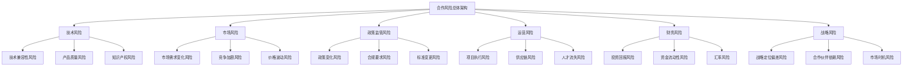

### Q2: 如何建立风险识别的动态监测机制？

**A:** 建立多层次、全覆盖的风险监测体系：

**1. 风险识别矩阵**
- 内部风险源监测：技术开发、生产制造、市场推广
- 外部风险源监测：政策环境、市场竞争、技术变革
- 合作风险源监测：沟通协调、资源配置、利益分配

**2. 预警指标体系**
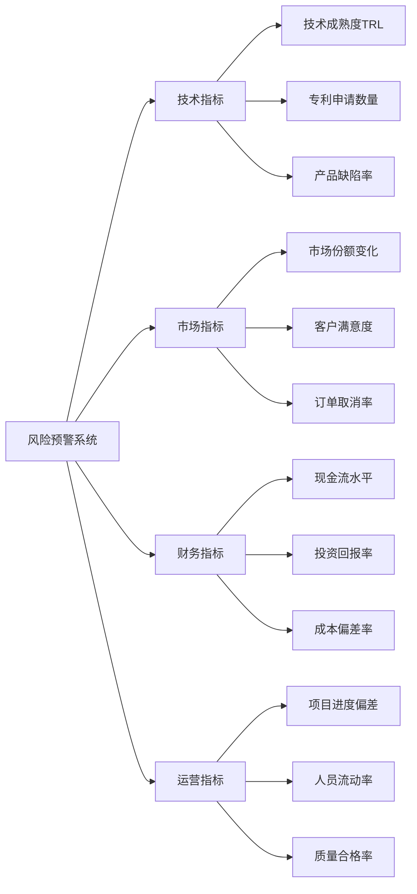

**3. 监测频率设置**
- 高风险领域：每周监测，实时预警
- 中风险领域：每月监测，定期评估
- 低风险领域：每季度监测，年度复查

---

## 技术风险评估

### Q3: 技术整合过程中的主要风险点及其评估方法是什么？

**A:** 技术风险主要集中在系统兼容性、技术标准统一和创新不确定性三个方面：

**1. 系统兼容性风险评估**

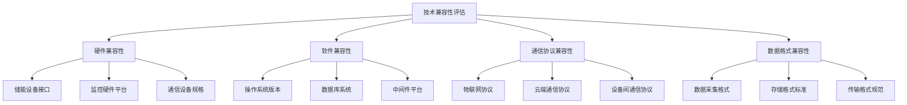

**兼容性测试框架：**
```python
class CompatibilityRiskAssessment:
    def __init__(self):
        self.risk_levels = {
            'hardware': {'high': 0.3, 'medium': 0.5, 'low': 0.2},
            'software': {'high': 0.2, 'medium': 0.4, 'low': 0.4},
            'protocol': {'high': 0.4, 'medium': 0.4, 'low': 0.2},
            'data_format': {'high': 0.1, 'medium': 0.3, 'low': 0.6}
        }
    
    def assess_compatibility_risk(self, category, parameters):
        """评估特定类别的兼容性风险"""
        risk_score = 0
        for param, value in parameters.items():
            if value < 0.7:  # 兼容性低于70%
                risk_score += 0.3
            elif value < 0.9:  # 兼容性70-90%
                risk_score += 0.1
        
        return min(risk_score, 1.0)
    
    def generate_risk_report(self):
        """生成综合风险报告"""
        return {
            'overall_risk': self.calculate_overall_risk(),
            'critical_areas': self.identify_critical_areas(),
            'mitigation_strategies': self.recommend_strategies()
        }
```

**2. 技术标准风险评估**

| 风险类型 | 概率评估 | 影响程度 | 风险等级 | 缓解措施 |
|---------|---------|---------|---------|---------|
| 国际标准变更 | 中等(0.4) | 高(0.8) | 高风险 | 持续跟踪标准动态，预留技术升级空间 |
| 行业标准不统一 | 高(0.7) | 中等(0.6) | 高风险 | 参与标准制定，建立适配层 |
| 专利标准冲突 | 低(0.2) | 高(0.9) | 中风险 | 专利预警，替代技术研发 |
| 安全标准升级 | 中等(0.5) | 高(0.8) | 高风险 | 安全设计冗余，定期安全审计 |

### Q4: 如何建立技术风险的量化评估模型？

**A:** 采用多维度量化评估模型，结合模糊评价和蒙特卡洛仿真：

**技术风险量化模型：**
```python
import numpy as np
from scipy.stats import norm
import matplotlib.pyplot as plt

class TechnicalRiskModel:
    def __init__(self):
        self.risk_factors = {
            'technical_maturity': {'weight': 0.25, 'distribution': 'normal'},
            'integration_complexity': {'weight': 0.20, 'distribution': 'uniform'},
            'standard_compliance': {'weight': 0.15, 'distribution': 'beta'},
            'ip_conflict': {'weight': 0.15, 'distribution': 'binomial'},
            'development_time': {'weight': 0.15, 'distribution': 'gamma'},
            'team_capability': {'weight': 0.10, 'distribution': 'normal'}
        }
    
    def monte_carlo_simulation(self, iterations=10000):
        """蒙特卡洛风险仿真"""
        results = []
        
        for _ in range(iterations):
            risk_score = 0
            for factor, params in self.risk_factors.items():
                weight = params['weight']
                
                if params['distribution'] == 'normal':
                    value = np.random.normal(0.5, 0.15)
                elif params['distribution'] == 'uniform':
                    value = np.random.uniform(0, 1)
                elif params['distribution'] == 'beta':
                    value = np.random.beta(2, 3)
                elif params['distribution'] == 'binomial':
                    value = np.random.binomial(1, 0.2)
                elif params['distribution'] == 'gamma':
                    value = np.random.gamma(2, 0.25)
                
                risk_score += weight * np.clip(value, 0, 1)
            
            results.append(risk_score)
        
        return np.array(results)
    
    def calculate_var(self, results, confidence_level=0.95):
        """计算风险价值VaR"""
        return np.percentile(results, (1 - confidence_level) * 100)
    
    def risk_sensitivity_analysis(self):
        """风险敏感性分析"""
        base_results = self.monte_carlo_simulation()
        sensitivities = {}
        
        for factor in self.risk_factors.keys():
            # 增加该因子权重10%
            original_weight = self.risk_factors[factor]['weight']
            self.risk_factors[factor]['weight'] *= 1.1
            
            modified_results = self.monte_carlo_simulation()
            sensitivity = np.mean(modified_results) - np.mean(base_results)
            sensitivities[factor] = sensitivity
            
            # 恢复原权重
            self.risk_factors[factor]['weight'] = original_weight
        
        return sensitivities
```

---

## 市场风险分析

### Q5: 储能市场的主要不确定性因素及其对合作项目的影响如何？

**A:** 储能市场风险主要来源于需求波动、技术替代和政策变化：

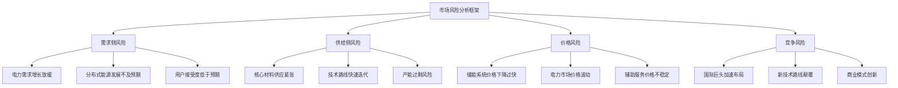

**市场风险量化分析：**

| 风险因子 | 历史波动率 | 预期影响 | 时间周期 | 缓解策略 |
|---------|-----------|---------|---------|---------|
| 储能装机需求 | ±25% | 直接影响订单 | 1-2年 | 多元化客户群体 |
| 锂电池价格 | ±30% | 影响成本结构 | 6个月-1年 | 供应链多元化 |
| 电力交易价格 | ±20% | 影响收益模式 | 实时-月度 | 灵活定价机制 |
| 政策补贴 | ±50% | 影响项目经济性 | 年度-政策周期 | 技术降本路径 |

### Q6: 如何建立市场风险的动态监测和预警机制？

**A:** 构建基于大数据和AI的市场风险监测平台：

**1. 数据采集体系**
```python
class MarketRiskMonitoring:
    def __init__(self):
        self.data_sources = {
            'market_data': ['电力交易中心', '能源局统计', '行业协会'],
            'policy_data': ['政府官网', '政策数据库', '法规更新'],
            'technology_data': ['专利数据库', '学术论文', '技术报告'],
            'competitor_data': ['公开财报', '新闻资讯', '招标信息']
        }
        
    def collect_market_indicators(self):
        """收集市场关键指标"""
        indicators = {
            'installed_capacity': self.get_installed_capacity_data(),
            'policy_signals': self.get_policy_sentiment_analysis(),
            'technology_trends': self.get_technology_development_trends(),
            'competitive_landscape': self.get_competitor_analysis(),
            'price_trends': self.get_price_trend_analysis()
        }
        return indicators
    
    def calculate_market_risk_score(self, indicators):
        """计算综合市场风险评分"""
        weights = {
            'installed_capacity': 0.25,
            'policy_signals': 0.20,
            'technology_trends': 0.20,
            'competitive_landscape': 0.20,
            'price_trends': 0.15
        }
        
        risk_score = sum(
            weights[key] * self.normalize_indicator(value) 
            for key, value in indicators.items()
        )
        
        return risk_score
    
    def generate_early_warning(self, risk_score, threshold=0.7):
        """生成预警信号"""
        if risk_score > threshold:
            return {
                'level': 'high',
                'message': '市场风险超过预警阈值，建议采取应对措施',
                'recommendations': self.get_risk_mitigation_strategies()
            }
        else:
            return {'level': 'normal', 'message': '市场风险在可控范围内'}
```

**2. 风险预测模型**
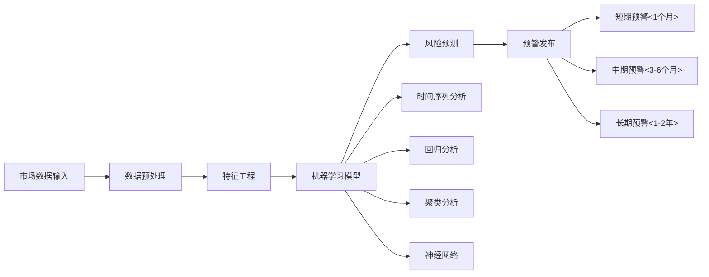

---

## 政策监管风险

### Q7: 储能行业政策环境的主要变化风险及应对策略？

**A:** 政策风险主要来源于补贴政策调整、技术标准变更和监管框架完善：

**政策风险分类分析：**
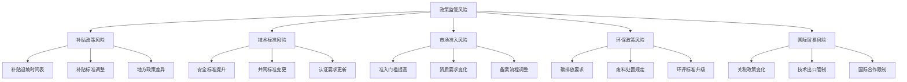

### Q8: 如何建立政策合规的动态跟踪和风险预警体系？

**A:** 建立多层次政策监测和合规管理体系：

**1. 政策监测网络**
```python
class PolicyRiskTracking:
    def __init__(self):
        self.policy_sources = {
            'national_level': [
                '国家发改委', '国家能源局', '工信部', 
                '生态环境部', '财政部'
            ],
            'local_level': [
                '省级发改委', '市级政府', '经信委',
                '电力公司', '园区管委会'
            ],
            'international': [
                'IEA', 'IRENA', '欧盟能源政策',
                '美国DOE', '日本METI'
            ]
        }
        
    def policy_sentiment_analysis(self, policy_text):
        """政策文本情感分析"""
        positive_keywords = [
            '支持', '鼓励', '促进', '加快', '推动',
            '优先', '重点', '加大', '提升'
        ]
        negative_keywords = [
            '限制', '禁止', '严格', '控制', '减少',
            '取消', '退坡', '调整', '规范'
        ]
        
        positive_score = sum(1 for word in positive_keywords if word in policy_text)
        negative_score = sum(1 for word in negative_keywords if word in policy_text)
        
        sentiment_score = (positive_score - negative_score) / len(policy_text.split())
        return sentiment_score
    
    def policy_impact_assessment(self, policy_changes):
        """政策影响评估"""
        impact_matrix = {
            'subsidy_policy': {'weight': 0.3, 'time_lag': 6},
            'technical_standard': {'weight': 0.25, 'time_lag': 12},
            'market_access': {'weight': 0.2, 'time_lag': 3},
            'environmental_regulation': {'weight': 0.15, 'time_lag': 18},
            'trade_policy': {'weight': 0.1, 'time_lag': 24}
        }
        
        overall_impact = 0
        for policy_type, change in policy_changes.items():
            if policy_type in impact_matrix:
                weight = impact_matrix[policy_type]['weight']
                impact = weight * change['magnitude'] * change['probability']
                overall_impact += impact
                
        return overall_impact
```

**2. 合规风险评估矩阵**

| 合规领域 | 当前状态 | 政策趋势 | 风险等级 | 应对时间窗口 |
|---------|---------|---------|---------|------------|
| 储能安全标准 | 基本合规 | 标准趋严 | 中风险 | 12-18个月 |
| 并网技术要求 | 完全合规 | 标准稳定 | 低风险 | >24个月 |
| 环保认证 | 部分合规 | 要求提升 | 高风险 | 6-12个月 |
| 产品认证 | 完全合规 | 国际化趋势 | 中风险 | 12-24个月 |
| 数据安全 | 基本合规 | 快速收紧 | 高风险 | 3-6个月 |

---

## 运营风险管控

### Q9: 合作项目实施过程中的主要运营风险及其管控措施？

**A:** 运营风险主要集中在项目执行、供应链管理和团队协作三个维度：

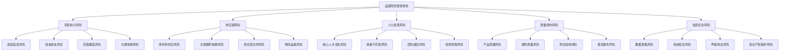

### Q10: 如何建立项目全生命周期的风险监控机制？

**A:** 构建基于里程碑的动态风险监控体系：

**1. 项目风险监控框架**
```python
class ProjectRiskMonitoring:
    def __init__(self):
        self.risk_categories = {
            'schedule': {'threshold': 0.1, 'weight': 0.25},
            'budget': {'threshold': 0.05, 'weight': 0.20},
            'quality': {'threshold': 0.15, 'weight': 0.20},
            'resource': {'threshold': 0.2, 'weight': 0.15},
            'stakeholder': {'threshold': 0.25, 'weight': 0.10},
            'technical': {'threshold': 0.3, 'weight': 0.10}
        }
        
    def calculate_project_health_score(self, current_metrics):
        """计算项目健康度评分"""
        health_score = 0
        alert_flags = []
        
        for category, config in self.risk_categories.items():
            if category in current_metrics:
                deviation = abs(current_metrics[category] - 1.0)
                weight = config['weight']
                threshold = config['threshold']
                
                if deviation > threshold:
                    alert_flags.append(category)
                    risk_factor = min(deviation / threshold, 2.0)
                else:
                    risk_factor = deviation / threshold
                
                health_score += weight * (1 - risk_factor)
        
        return {
            'health_score': max(health_score, 0),
            'alert_flags': alert_flags,
            'risk_level': self.get_risk_level(health_score)
        }
    
    def get_risk_level(self, health_score):
        """确定风险等级"""
        if health_score >= 0.8:
            return 'LOW'
        elif health_score >= 0.6:
            return 'MEDIUM'
        elif health_score >= 0.4:
            return 'HIGH'
        else:
            return 'CRITICAL'
    
    def generate_mitigation_plan(self, alert_flags):
        """生成风险缓解计划"""
        mitigation_strategies = {
            'schedule': [
                '增加资源投入', '优化关键路径', '并行任务处理',
                '外包非核心任务', '调整项目范围'
            ],
            'budget': [
                '成本控制审查', '供应商重新谈判', '价值工程分析',
                '预算重新分配', '增加资金来源'
            ],
            'quality': [
                '质量保证强化', '测试流程优化', '质量培训',
                '供应商质量审核', '客户需求澄清'
            ],
            'resource': [
                '资源重新分配', '技能培训计划', '外部顾问支持',
                '跨部门协调', '人员激励措施'
            ]
        }
        
        plans = []
        for flag in alert_flags:
            if flag in mitigation_strategies:
                plans.extend(mitigation_strategies[flag])
        
        return list(set(plans))  # 去重
```

**2. 供应链风险管控**
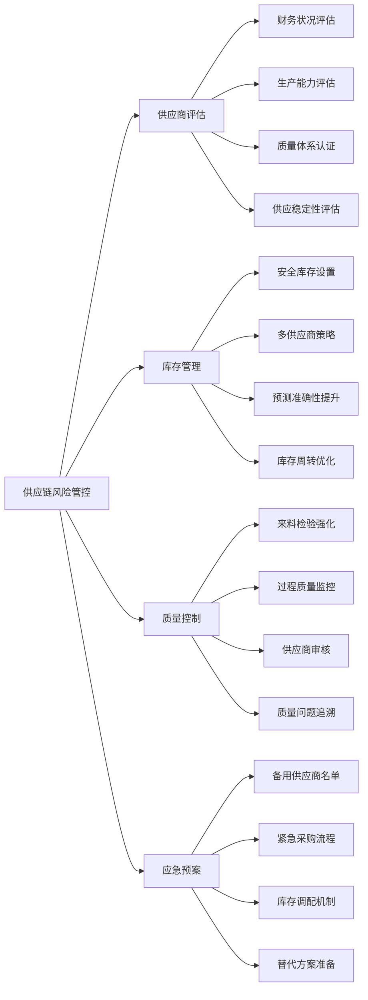

**供应链风险量化模型：**
```python
class SupplyChainRiskModel:
    def __init__(self):
        self.supplier_risk_factors = {
            'financial_stability': 0.25,
            'delivery_reliability': 0.20,
            'quality_performance': 0.20,
            'capacity_utilization': 0.15,
            'geographical_risk': 0.10,
            'technology_capability': 0.10
        }
    
    def assess_supplier_risk(self, supplier_data):
        """评估单个供应商风险"""
        risk_score = 0
        for factor, weight in self.supplier_risk_factors.items():
            if factor in supplier_data:
                # 假设数据已标准化到0-1范围，越低风险越小
                risk_score += weight * supplier_data[factor]
        
        return {
            'risk_score': risk_score,
            'risk_level': self.categorize_risk(risk_score),
            'critical_factors': self.identify_critical_factors(supplier_data)
        }
    
    def categorize_risk(self, risk_score):
        """风险等级分类"""
        if risk_score < 0.3:
            return 'LOW'
        elif risk_score < 0.6:
            return 'MEDIUM'
        else:
            return 'HIGH'
    
    def supply_chain_optimization(self, suppliers_risk_data):
        """供应链优化建议"""
        recommendations = []
        
        high_risk_suppliers = [
            supplier for supplier, data in suppliers_risk_data.items()
            if self.assess_supplier_risk(data)['risk_level'] == 'HIGH'
        ]
        
        if len(high_risk_suppliers) > len(suppliers_risk_data) * 0.3:
            recommendations.append('供应商多元化：减少对高风险供应商的依赖')
        
        if any(data.get('delivery_reliability', 1) < 0.8 for data in suppliers_risk_data.values()):
            recommendations.append('库存策略调整：增加安全库存量')
        
        return recommendations
```

---

## 财务风险缓解

### Q11: 合作项目的主要财务风险及其量化评估方法？

**A:** 财务风险主要包括投资回报、现金流、汇率和信用风险四个方面：

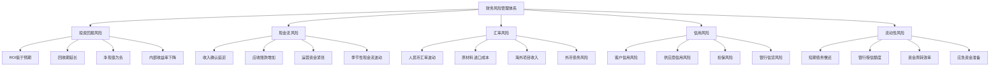

### Q12: 如何构建财务风险的量化模型和预警机制？

**A:** 建立基于VaR和压力测试的财务风险管理模型：

**1. 财务风险VaR模型**
```python
import numpy as np
from scipy import stats
import pandas as pd

class FinancialRiskVaR:
    def __init__(self):
        self.confidence_levels = [0.95, 0.99, 0.999]
        self.time_horizons = [1, 5, 10, 30]  # 天数
        
    def calculate_portfolio_var(self, returns_data, weights, confidence_level=0.95):
        """计算投资组合VaR"""
        portfolio_returns = np.dot(returns_data, weights)
        
        # 历史模拟法
        var_historical = np.percentile(portfolio_returns, (1 - confidence_level) * 100)
        
        # 参数法（假设正态分布）
        mean_return = np.mean(portfolio_returns)
        std_return = np.std(portfolio_returns)
        var_parametric = stats.norm.ppf(1 - confidence_level, mean_return, std_return)
        
        # 蒙特卡洛模拟
        simulated_returns = np.random.normal(mean_return, std_return, 10000)
        var_monte_carlo = np.percentile(simulated_returns, (1 - confidence_level) * 100)
        
        return {
            'historical_var': var_historical,
            'parametric_var': var_parametric,
            'monte_carlo_var': var_monte_carlo,
            'expected_shortfall': np.mean(portfolio_returns[portfolio_returns <= var_historical])
        }
    
    def stress_testing(self, base_scenario, stress_scenarios):
        """压力测试"""
        results = {'base_case': self.calculate_scenario_impact(base_scenario)}
        
        for scenario_name, scenario_params in stress_scenarios.items():
            results[scenario_name] = self.calculate_scenario_impact(scenario_params)
        
        return results
    
    def calculate_scenario_impact(self, scenario_params):
        """计算情景影响"""
        revenue_impact = scenario_params.get('revenue_change', 0)
        cost_impact = scenario_params.get('cost_change', 0)
        exchange_rate_impact = scenario_params.get('fx_change', 0)
        
        total_impact = revenue_impact + cost_impact + exchange_rate_impact
        
        return {
            'revenue_impact': revenue_impact,
            'cost_impact': cost_impact,
            'fx_impact': exchange_rate_impact,
            'total_impact': total_impact
        }
```

**2. 现金流风险预测模型**
```python
class CashFlowRiskModel:
    def __init__(self):
        self.cash_flow_components = {
            'operating_cash_flow': {
                'revenue': {'volatility': 0.15, 'seasonality': 0.1},
                'costs': {'volatility': 0.08, 'correlation_with_revenue': 0.7},
                'working_capital': {'days_sales_outstanding': 45, 'days_payable': 30}
            },
            'investing_cash_flow': {
                'capex': {'planned': 50000000, 'volatility': 0.2},
                'acquisitions': {'probability': 0.3, 'size_range': [10000000, 30000000]}
            },
            'financing_cash_flow': {
                'debt_service': {'fixed': 8000000, 'variable_rate_exposure': 20000000},
                'dividend_policy': {'payout_ratio': 0.3, 'minimum_cash_reserve': 15000000}
            }
        }
    
    def simulate_cash_flows(self, periods=12, simulations=1000):
        """模拟现金流"""
        results = []
        
        for sim in range(simulations):
            cash_flows = []
            cumulative_cash = 20000000  # 初始现金
            
            for period in range(periods):
                # 经营性现金流
                operating_cf = self.simulate_operating_cash_flow(period)
                
                # 投资性现金流
                investing_cf = self.simulate_investing_cash_flow(period)
                
                # 筹资性现金流
                financing_cf = self.simulate_financing_cash_flow(period, cumulative_cash)
                
                period_cf = operating_cf + investing_cf + financing_cf
                cumulative_cash += period_cf
                
                cash_flows.append({
                    'period': period,
                    'operating_cf': operating_cf,
                    'investing_cf': investing_cf,
                    'financing_cf': financing_cf,
                    'total_cf': period_cf,
                    'cumulative_cash': cumulative_cash
                })
            
            results.append(cash_flows)
        
        return results
    
    def analyze_liquidity_risk(self, simulation_results):
        """分析流动性风险"""
        cash_shortfall_probability = 0
        min_cash_levels = []
        
        for simulation in simulation_results:
            min_cash = min(period['cumulative_cash'] for period in simulation)
            min_cash_levels.append(min_cash)
            
            if min_cash < 5000000:  # 最低现金要求
                cash_shortfall_probability += 1
        
        cash_shortfall_probability /= len(simulation_results)
        
        return {
            'shortfall_probability': cash_shortfall_probability,
            'min_cash_5th_percentile': np.percentile(min_cash_levels, 5),
            'min_cash_1st_percentile': np.percentile(min_cash_levels, 1),
            'average_min_cash': np.mean(min_cash_levels)
        }
```

**3. 财务预警指标体系**

| 指标类别 | 关键指标 | 预警阈值 | 监测频率 | 预警级别 |
|---------|---------|---------|---------|---------|
| 盈利能力 | 毛利率 | <15% | 月度 | 高风险 |
| | 净利率 | <5% | 月度 | 中风险 |
| | ROE | <8% | 季度 | 中风险 |
| 偿债能力 | 流动比率 | <1.2 | 月度 | 高风险 |
| | 速动比率 | <1.0 | 月度 | 高风险 |
| | 资产负债率 | >70% | 月度 | 中风险 |
| 现金流量 | 经营现金流 | 连续2个月为负 | 月度 | 高风险 |
| | 现金覆盖率 | <3个月 | 周度 | 高风险 |
| 营运能力 | 应收账款周转率 | <6次/年 | 月度 | 中风险 |
| | 库存周转率 | <4次/年 | 月度 | 中风险 |

---

## 综合风险管理体系

### Q13: 如何建立覆盖全面的综合风险管理体系？

**A:** 构建"识别-评估-应对-监控"的全流程风险管理体系：

```mermaid
graph TD
    A[综合风险管理体系] --> B[风险治理结构]
    A --> C[风险识别机制]
    A --> D[风险评估体系]
    A --> E[风险应对策略]
    A --> F[风险监控预警]
    A --> G[风险文化建设]
    
    B --> B1[风险管理委员会]
    B --> B2[风险管理部门]
    B --> B3[业务部门风险专员]
    B --> B4[外部风险顾问]
    
    C --> C1[风险登记册]
    C --> C2[风险识别工具]
    C --> C3[内外部信息收集]
    C --> C4[风险识别流程]
    
    D --> D1[定性评估]
    D --> D2[定量评估]
    D --> D3[情景分析]
    D --> D4[压力测试]
    
    E --> E1[风险规避]
    E --> E2[风险缓解]
    E --> E3[风险转移]
    E --> E4[风险接受]
    
    F --> F1[关键风险指标KRI]
    F --> F2[预警阈值设定]
    F --> F3[监控频率安排]
    F --> F4[报告机制]
    
    G --> G1[风险意识培训]
    G --> G2[风险管理制度]
    G --> G3[激励约束机制]
    G --> G4[风险文化评估]
```

### Q14: 风险管理的组织架构和制度设计如何优化？

**A:** 建立三道防线的风险管理组织架构：

**1. 风险治理架构**
```python
class RiskGovernanceFramework:
    def __init__(self):
        self.governance_structure = {
            'board_level': {
                'risk_committee': {
                    'composition': ['独立董事', '专业人士', '高管代表'],
                    'responsibilities': ['风险战略制定', '重大风险决策', '风险偏好设定'],
                    'meeting_frequency': '季度'
                }
            },
            'management_level': {
                'risk_management_committee': {
                    'composition': ['CRO', '业务负责人', '风险专员'],
                    'responsibilities': ['风险政策执行', '风险评估审核', '应急预案制定'],
                    'meeting_frequency': '月度'
                }
            },
            'operational_level': {
                'risk_management_department': {
                    'responsibilities': ['日常风险监控', '风险报告编制', '风险培训组织'],
                    'reporting_line': 'CRO直线管理'
                },
                'business_risk_officers': {
                    'responsibilities': ['业务风险识别', '第一道防线把控', '风险文化建设'],
                    'reporting_line': '双线汇报制'
                }
            }
        }
    
    def define_risk_appetite(self):
        """定义风险偏好"""
        return {
            'strategic_risks': {
                'technology_risk': 'MODERATE',
                'market_risk': 'MODERATE',
                'competitive_risk': 'HIGH'
            },
            'financial_risks': {
                'credit_risk': 'LOW',
                'liquidity_risk': 'LOW',
                'market_risk': 'MODERATE'
            },
            'operational_risks': {
                'supply_chain_risk': 'MODERATE',
                'cybersecurity_risk': 'LOW',
                'regulatory_risk': 'LOW'
            },
            'quantitative_limits': {
                'max_single_customer_exposure': 0.15,
                'max_geographic_concentration': 0.4,
                'min_liquidity_ratio': 1.5,
                'max_leverage_ratio': 3.0
            }
        }
```

**2. 风险管理制度框架**

| 制度类别 | 具体制度 | 实施层级 | 更新频率 | 责任部门 |
|---------|---------|---------|---------|---------|
| 基础制度 | 风险管理基本制度 | 集团层面 | 年度 | 风险管理委员会 |
| | 风险偏好声明 | 集团层面 | 年度 | 董事会 |
| 专项制度 | 信用风险管理制度 | 业务层面 | 半年度 | 风险管理部 |
| | 市场风险管理制度 | 业务层面 | 半年度 | 风险管理部 |
| | 操作风险管理制度 | 业务层面 | 半年度 | 风险管理部 |
| 操作程序 | 风险识别评估程序 | 操作层面 | 季度 | 各业务部门 |
| | 风险报告程序 | 操作层面 | 季度 | 风险管理部 |
| | 应急响应程序 | 操作层面 | 半年度 | 各业务部门 |

### Q15: 如何设计有效的风险监控和预警机制？

**A:** 建立多维度、动态化的风险监控预警体系：

**1. 关键风险指标（KRI）体系**
```python
class RiskMonitoringSystem:
    def __init__(self):
        self.kri_framework = {
            'strategic_risks': {
                'market_share_decline': {
                    'indicator': '市场份额变化率',
                    'threshold': {'yellow': -5, 'red': -10},
                    'frequency': 'monthly',
                    'data_source': '市场研究报告'
                },
                'technology_obsolescence': {
                    'indicator': '技术更新周期',
                    'threshold': {'yellow': 18, 'red': 24},
                    'frequency': 'quarterly',
                    'data_source': '技术发展跟踪'
                }
            },
            'operational_risks': {
                'supply_disruption': {
                    'indicator': '关键供应商集中度',
                    'threshold': {'yellow': 0.6, 'red': 0.8},
                    'frequency': 'monthly',
                    'data_source': '采购系统'
                },
                'quality_issues': {
                    'indicator': '产品缺陷率',
                    'threshold': {'yellow': 0.02, 'red': 0.05},
                    'frequency': 'weekly',
                    'data_source': '质量管理系统'
                }
            },
            'financial_risks': {
                'liquidity_shortage': {
                    'indicator': '现金流覆盖倍数',
                    'threshold': {'yellow': 3, 'red': 1.5},
                    'frequency': 'daily',
                    'data_source': '财务管理系统'
                }
            }
        }
    
    def calculate_composite_risk_score(self, risk_data):
        """计算综合风险评分"""
        weights = {
            'strategic_risks': 0.4,
            'operational_risks': 0.35,
            'financial_risks': 0.25
        }
        
        composite_score = 0
        for category, category_data in risk_data.items():
            if category in weights:
                category_score = self.calculate_category_score(category_data)
                composite_score += weights[category] * category_score
        
        return composite_score
    
    def generate_risk_dashboard(self, current_data):
        """生成风险仪表板"""
        dashboard = {
            'overall_risk_level': self.get_overall_risk_level(current_data),
            'trending_risks': self.identify_trending_risks(current_data),
            'critical_alerts': self.get_critical_alerts(current_data),
            'risk_heat_map': self.generate_risk_heat_map(current_data)
        }
        return dashboard
```

**2. 预警响应机制**
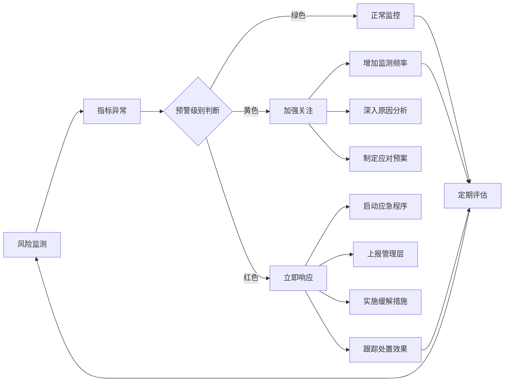

**应急响应流程：**
```python
class EmergencyResponseSystem:
    def __init__(self):
        self.response_levels = {
            'LEVEL_1': {  # 低风险
                'response_time': '24小时',
                'escalation_authority': '业务部门主管',
                'required_actions': ['风险评估', '监控加强']
            },
            'LEVEL_2': {  # 中风险
                'response_time': '4小时',
                'escalation_authority': '风险管理部门',
                'required_actions': ['详细调查', '制定应对计划', '上报进展']
            },
            'LEVEL_3': {  # 高风险
                'response_time': '1小时',
                'escalation_authority': '高级管理层',
                'required_actions': ['立即响应', '启动应急预案', '外部支持']
            },
            'LEVEL_4': {  # 极高风险
                'response_time': '立即',
                'escalation_authority': '最高管理层',
                'required_actions': ['全面应急响应', '媒体沟通', '监管报告']
            }
        }
    
    def trigger_emergency_response(self, risk_event):
        """触发应急响应"""
        response_level = self.assess_risk_level(risk_event)
        response_plan = self.response_levels[response_level]
        
        # 自动化响应步骤
        self.notify_stakeholders(risk_event, response_plan)
        self.activate_response_team(response_level)
        self.initiate_containment_measures(risk_event)
        self.start_monitoring_and_reporting(risk_event)
        
        return {
            'response_level': response_level,
            'estimated_resolution_time': response_plan['response_time'],
            'assigned_team': response_plan['escalation_authority'],
            'next_steps': response_plan['required_actions']
        }
```

**风险管理成效评估：**

| 评估维度 | 评估指标 | 目标值 | 当前表现 | 改进方向 |
|---------|---------|-------|---------|---------|
| 风险识别能力 | 风险识别覆盖率 | >95% | 92% | 扩大风险扫描范围 |
| | 新风险发现及时性 | <30天 | 25天 | 提升监测灵敏度 |
| 风险评估准确性 | 风险评估准确率 | >85% | 88% | 保持并提升 |
| | 重大风险预测成功率 | >80% | 75% | 完善预测模型 |
| 风险应对效果 | 风险缓解成功率 | >90% | 87% | 优化应对策略 |
| | 应急响应及时性 | 100% | 94% | 强化响应机制 |
| 风险文化建设 | 员工风险意识评分 | >4.0/5.0 | 3.8 | 加强培训教育 |
| | 风险报告主动性 | >80% | 82% | 保持良好态势 |

---

## 总结

本文档全面分析了亨通集团与云储聚合智慧储能合作中的各类风险及其缓解策略。通过建立系统性的风险管理框架，双方能够：

1. **前瞻性识别风险**：通过多维度风险扫描和动态监测，及时发现潜在威胁
2. **科学化评估风险**：运用量化模型和情景分析，准确评估风险影响程度  
3. **系统化应对风险**：制定针对性缓解策略，建立完善的应急响应机制
4. **持续化改进管控**：通过绩效评估和经验总结，不断优化风险管理体系

风险管理不是一次性工作，而是需要在合作全过程中持续关注和动态调整的系统工程。只有建立完善的风险管控体系，才能确保合作项目的稳健发展和长期成功。

---

## 相关文档

### 内部链接
- [资本合作与项目落地](./资本合作与项目落地.md) - 了解项目投资与资本风险
- [技术整合与平台对接](./技术整合与平台对接.md) - 查看技术风险缓解措施
- [云边协同与AI算法优化](../技术解决方案/云边协同与AI智能运维.md) - 技术风险评估参考
- [储能行业政策解读与影响分析](../监管政策与合规/双碳目标与地方政策对接.md) - 政策风险分析
- [亨通集团智慧能源板块分析](../企业概况与核心能力/亨通集团智慧能源板块分析.md) - 企业能力风险评估

### 导航链接
- [返回实施策略与合作模式主页](./README.md)
- [返回项目根目录](../README.md)
- [技术整合与平台对接](./技术整合与平台对接.md)