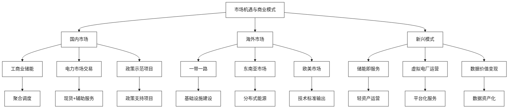

# 市场机遇与商业模式

[首页](../README.md) > 市场机遇与商业模式

## 概述

本章节深入分析亨通集团与云储聚合在智慧储能领域面临的市场机遇和可行的商业模式，涵盖工商业储能聚合、电力现货与辅助服务市场参与，以及海外市场拓展等关键领域。


## 市场机遇全景图



## 章节内容

### [工商业储能聚合模式](./工商业储能聚合模式.md)
分析工商业储能聚合的市场机遇、技术方案和商业模式，重点关注"小容量、多节点"的分布式储能聚合应用。

### [电力现货与辅助服务市场](./电力现货与辅助服务市场.md)
深入研究储能参与电力现货市场和辅助服务市场的策略和收益模式，把握电力市场化改革机遇。

### [海外市场拓展策略](./海外市场拓展策略.md)
探讨亨通+云储聚合"硬件+VPP"整体方案的海外市场拓展策略，重点关注"一带一路"和东南亚市场。

## 市场规模与前景

### 国内市场规模
| 市场细分 | 2024年规模 | 2030年预测 | 年复合增长率 |
|----------|------------|-------------|-------------|
| **工商业储能** | 200亿元 | 1000亿元 | 30% |
| **电力市场服务** | 50亿元 | 300亿元 | 35% |
| **储能运营服务** | 30亿元 | 200亿元 | 40% |
| **合计** | 280亿元 | 1500亿元 | 32% |

### 海外市场潜力
- **东南亚市场**：缺电地区基础设施建设需求
- **中东市场**：石油国家能源转型需求
- **非洲市场**：分布式能源解决方案需求
- **欧美市场**：储能技术标准和解决方案输出

## 核心商业模式

### 1. 储能即服务（EaaS）
- **模式特点**：轻资产运营，用户按需付费
- **价值主张**：降低投资门槛，专业化运营
- **收益来源**：设备租赁+运营服务+交易佣金

### 2. 虚拟电厂运营
- **模式特点**：聚合分布式资源，统一调度
- **价值主张**：提升资源利用效率，创造市场价值
- **收益来源**：聚合服务费+交易收益分成

### 3. 综合能源服务
- **模式特点**：一站式能源解决方案
- **价值主张**：降低用能成本，提升能源效率
- **收益来源**：工程总包+运营服务+增值服务

## 竞争优势分析

### 技术差异化优势
- **硬件+软件**：端到端完整解决方案
- **光纤+储能**：通信与储能深度融合
- **云边协同**：智能化运维管理

### 市场定位优势
- **国内深耕**：政策理解深度，客户关系紧密
- **海外拓展**：全球化网络，技术标准输出
- **生态整合**：产业链上下游协同发展

## 投资价值评估

### 财务预测（3年）
```
2024年：营收5亿元，净利润0.5亿元
2025年：营收12亿元，净利润1.8亿元
2026年：营收25亿元，净利润4亿元
```

### 估值分析
- **市净率**：3-5倍（参考储能行业平均水平）
- **市盈率**：20-30倍（参考新能源科技企业）
- **预估市值**：100-150亿元（2026年）

## 风险与机遇

### 主要风险
1. **政策风险**：储能政策变化影响
2. **技术风险**：技术迭代和标准变化
3. **市场风险**：竞争加剧，价格下降
4. **运营风险**：项目执行和运营管理

### 发展机遇
1. **政策机遇**：双碳目标推动储能发展
2. **技术机遇**：储能技术成熟，成本下降
3. **市场机遇**：电力市场化改革深化
4. **国际机遇**："一带一路"基础设施建设

## 相关章节

- [企业概况与核心能力](../企业概况与核心能力/README.md) - 了解双方能力基础
- [技术解决方案](../技术解决方案/README.md) - 理解技术实现方案
- [实施策略与合作模式](../实施策略与合作模式/README.md) - 制定具体实施计划

---

**导航**
- [上一章节：技术解决方案](../技术解决方案/README.md)
- [下一章节：监管政策与合规](../监管政策与合规/README.md)
- [返回首页](../README.md)