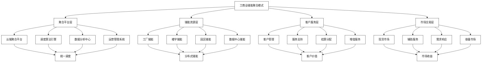
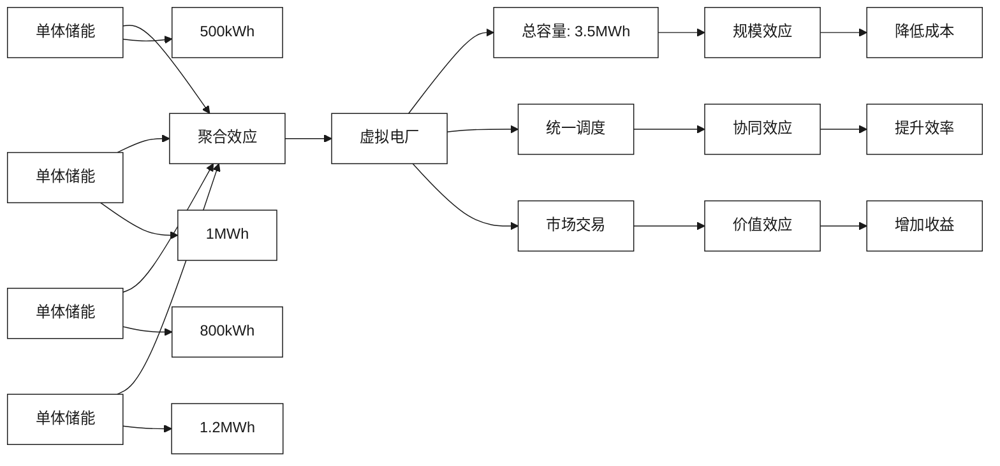
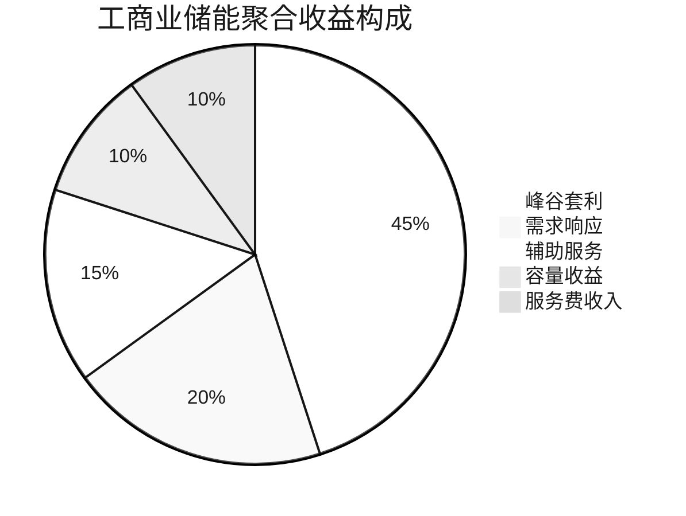

# 工商业储能聚合模式

[首页](../README.md) > [市场机遇与商业模式](./README.md) > 工商业储能聚合模式

## 问答导引

### Q1: 工商业储能聚合模式的核心价值是什么？
**A1:** 工商业储能聚合模式的核心价值在于：
- **规模效应**：将分散的小容量储能聚合成大规模虚拟电厂
- **成本分摊**：平台化运营降低单体储能运营成本
- **收益提升**：聚合参与电力市场获得更高收益
- **风险分散**：分布式布局降低单点风险
- **专业服务**：专业团队统一运营管理

### Q2: 亨通与云储聚合在聚合模式中的分工是什么？
**A2:** 双方分工如下：
- **亨通集团**：提供储能设备、系统集成、工程实施
- **云储聚合**：提供聚合平台、调度算法、市场交易
- **联合服务**：共同提供运营维护、客户服务
- **收益分配**：按照价值贡献进行合理分配
- **风险共担**：技术风险与市场风险分担

### Q3: 聚合模式的目标客户群体有哪些？
**A3:** 主要目标客户包括：
- **制造业企业**：高载能制造企业，用电成本敏感
- **商业楼宇**：写字楼、购物中心、酒店等
- **工业园区**：产业园区、开发区管委会
- **数据中心**：互联网企业、云服务提供商
- **连锁企业**：连锁超市、餐饮、零售等

## 聚合模式架构



## 市场机遇分析

### 工商业储能市场现状

#### 市场规模与增长
- **2024年市场规模**：200亿元
- **2030年预测规模**：1000亿元
- **年复合增长率**：30%+
- **装机规模**：从2GW增长到20GW

#### 市场驱动因素
1. **电价改革**：峰谷电价差扩大，套利空间增加
2. **政策支持**：储能参与电力市场政策落地
3. **技术成熟**：储能技术成本下降，性能提升
4. **需求增长**：工商业用户降本增效需求强烈

### 聚合模式优势

#### 对比分析
| 维度 | 单体储能 | 聚合储能 | 优势倍数 |
|------|----------|----------|----------|
| **投资门槛** | 高 | 低 | 50%降低 |
| **运营成本** | 高 | 低 | 30%降低 |
| **收益水平** | 有限 | 多元化 | 2-3倍 |
| **风险水平** | 高 | 分散 | 显著降低 |
| **专业水平** | 用户自运营 | 专业团队 | 显著提升 |

#### 聚合效应


## 商业模式设计

### 核心商业模式

#### 1. 储能即服务（EaaS）模式
**模式特点**：
- 用户无需投资，按需付费
- 专业团队运营维护
- 收益共享，风险转移

**收益结构**：
- **设备租赁费**：按容量收取月租费
- **运营服务费**：按电量收取服务费
- **收益分成**：电力市场收益分成

**典型合同结构**：
```
基础服务费：200元/kWh/月
运营服务费：0.1元/kWh
收益分成：用户70%，平台30%
合同期限：10年
```

#### 2. 合作投资模式
**模式特点**：
- 三方合作投资建设
- 专业分工明确
- 风险收益共担

**投资分工**：
- **亨通集团**：设备投资（50%）
- **云储聚合**：平台投资（20%）
- **用户企业**：场地投资（30%）

**收益分配**：
- 按投资比例分配基础收益
- 按服务贡献分配运营收益
- 按风险承担分配超额收益

#### 3. 代理运营模式
**模式特点**：
- 用户自主投资建设
- 委托专业团队运营
- 保证收益+超额分成

**服务内容**：
- 系统设计和采购建议
- 设备安装调试
- 运营维护服务
- 电力市场交易

### 收益分析模型

#### 收益来源结构


#### 典型项目收益分析
**项目概况**：某工业园区10MW/20MWh储能聚合项目

| 收益类型 | 年收益（万元） | 占比 | 收益特点 |
|----------|---------------|------|----------|
| **峰谷套利** | 900 | 45% | 稳定可预期 |
| **需求响应** | 400 | 20% | 政策相关 |
| **辅助服务** | 300 | 15% | 市场波动 |
| **容量收益** | 200 | 10% | 长期稳定 |
| **服务费收入** | 200 | 10% | 持续增长 |
| **总计** | 2000 | 100% | 综合收益 |

## 关键技术方案

### 聚合调度技术

#### 调度算法架构
```python
class AggregationScheduler:
    def __init__(self):
        self.storage_units = []
        self.market_data = MarketDataManager()
        self.optimization_engine = OptimizationEngine()
    
    def aggregate_scheduling(self, time_horizon):
        """
        聚合调度主算法
        """
        # 收集储能单元状态
        unit_states = self.collect_unit_states()
        
        # 获取市场数据
        market_prices = self.market_data.get_price_forecast(time_horizon)
        
        # 多目标优化
        schedule = self.optimization_engine.optimize(
            units=unit_states,
            prices=market_prices,
            objectives=['cost_min', 'revenue_max', 'grid_support']
        )
        
        # 下发调度指令
        self.dispatch_commands(schedule)
        
        return schedule
```

#### 关键技术要点
1. **实时数据采集**：毫秒级数据采集和处理
2. **预测算法**：负荷预测、价格预测、收益预测
3. **优化算法**：多目标优化、约束优化、动态规划
4. **协调控制**：分布式控制、协同优化

### 平台技术架构

#### 系统架构图
```
┌─────────────────────────────────────────┐
│                 应用层                   │
├─────────────────────────────────────────┤
│ 客户门户 │ 运营管理 │ 数据分析 │ 移动APP │
├─────────────────────────────────────────┤
│                 服务层                   │
├─────────────────────────────────────────┤
│ 聚合服务 │ 调度服务 │ 交易服务 │ 结算服务 │
├─────────────────────────────────────────┤
│                 数据层                   │
├─────────────────────────────────────────┤
│ 实时数据 │ 历史数据 │ 配置数据 │ 交易数据 │
├─────────────────────────────────────────┤
│                 接入层                   │
├─────────────────────────────────────────┤
│ 储能设备 │ 电网系统 │ 市场系统 │ 第三方系统 │
└─────────────────────────────────────────┘
```

#### 核心模块功能
1. **设备接入模块**：多协议设备接入、数据标准化
2. **调度优化模块**：实时调度、预测优化、应急响应
3. **交易管理模块**：市场交易、风险管理、结算清算
4. **运营管理模块**：客户管理、设备管理、服务管理

## 实施案例分析

### 案例一：某制造业园区聚合项目

#### 项目概况
- **地点**：江苏南通某制造业园区
- **规模**：20个储能节点，总容量15MW/30MWh
- **客户**：纺织、化工、机械制造企业
- **模式**：储能即服务模式

#### 实施方案
1. **设备配置**：
   - 单体容量：500kWh-2MWh
   - 储能技术：磷酸铁锂电池
   - 通信方式：光纤+4G混合通信

2. **聚合策略**：
   - 按行业特性分组调度
   - 根据用电曲线优化充放电
   - 参与江苏电力市场交易

3. **运营服务**：
   - 7×24小时监控
   - 预测性维护
   - 月度收益报告

#### 运营效果
- **投资回收期**：6.5年
- **年化收益率**：15%
- **客户满意度**：95%
- **设备可用率**：99.2%

### 案例二：商业楼宇聚合项目

#### 项目概况
- **地点**：上海浦东商业区
- **规模**：50个储能节点，总容量25MW/50MWh
- **客户**：写字楼、购物中心、酒店
- **模式**：合作投资模式

#### 技术特点
1. **小容量分布**：单体容量200kWh-1MWh
2. **智能调度**：基于楼宇负荷特性的智能调度
3. **用户友好**：APP监控、收益透明

#### 商业价值
- **年节约电费**：客户平均节约15%电费
- **投资回报**：三方投资年化收益12%
- **社会效益**：年减排CO2 1.2万吨

## 市场推广策略

### 目标市场细分

#### 优先级市场
1. **高载能制造业**：电费占比高，价格敏感
2. **商业楼宇**：用电规律性强，管理规范
3. **工业园区**：集中管理，易于推广
4. **数据中心**：UPS+储能需求，可靠性要求高

#### 市场进入策略
1. **示范项目**：选择标杆客户建设示范项目
2. **行业深耕**：深入了解行业需求，定制化服务
3. **渠道建设**：建立销售渠道和服务网络
4. **品牌推广**：参与行业展会、技术交流

### 营销策略

#### 价值主张
- **零投资**：用户无需初期投资
- **保收益**：保证最低收益水平
- **专业化**：专业团队运营管理
- **智能化**：AI算法优化运营

#### 推广措施
1. **政策解读**：帮助客户理解储能政策
2. **案例分享**：展示成功案例和收益
3. **免费咨询**：提供储能方案免费咨询
4. **体验服务**：提供试运行服务

## 风险管理

### 主要风险识别

#### 技术风险
1. **设备故障**：储能设备故障影响收益
2. **通信故障**：通信中断影响调度
3. **系统安全**：网络安全威胁
4. **技术迭代**：技术更新换代风险

#### 市场风险
1. **政策变化**：储能政策调整影响
2. **价格波动**：电力市场价格波动
3. **竞争加剧**：行业竞争加剧
4. **客户流失**：客户续约风险

#### 运营风险
1. **人员风险**：关键人员流失
2. **管理风险**：运营管理不善
3. **资金风险**：资金链紧张
4. **合规风险**：法律法规合规

### 风险缓解措施

#### 技术风险缓解
1. **设备选型**：选择成熟可靠设备
2. **冗余设计**：关键环节冗余备份
3. **预防维护**：定期维护保养
4. **技术升级**：持续技术升级

#### 市场风险缓解
1. **政策跟踪**：密切跟踪政策动态
2. **多元收益**：多种收益来源组合
3. **差异化**：技术和服务差异化
4. **客户绑定**：长期合同绑定客户

## 发展展望

### 市场前景
- **市场规模**：2030年工商业储能聚合市场规模达500亿元
- **技术趋势**：储能技术成本持续下降，性能持续提升
- **政策支持**：储能参与电力市场政策进一步完善
- **商业模式**：从产品销售向服务运营转变

### 发展建议
1. **技术创新**：持续投入研发，保持技术领先
2. **模式创新**：探索新的商业模式和服务模式
3. **生态建设**：构建完整的储能生态系统
4. **国际化**：积极拓展海外市场

## 相关资源

### 内部链接
- [新型储能与虚拟电厂一体化](../技术解决方案/新型储能与虚拟电厂一体化.md)
- [电力现货与辅助服务市场](./电力现货与辅助服务市场.md)
- [资本合作与项目落地](../实施策略与合作模式/资本合作与项目落地.md)

### 外部参考
- [工商业储能市场分析报告](https://www.cnesa.org)
- [储能聚合技术白皮书](https://www.sgcc.com.cn)

---

**导航**
- [上一页：市场机遇与商业模式](./README.md)
- [下一页：电力现货与辅助服务市场](./电力现货与辅助服务市场.md)
- [返回首页](../README.md)