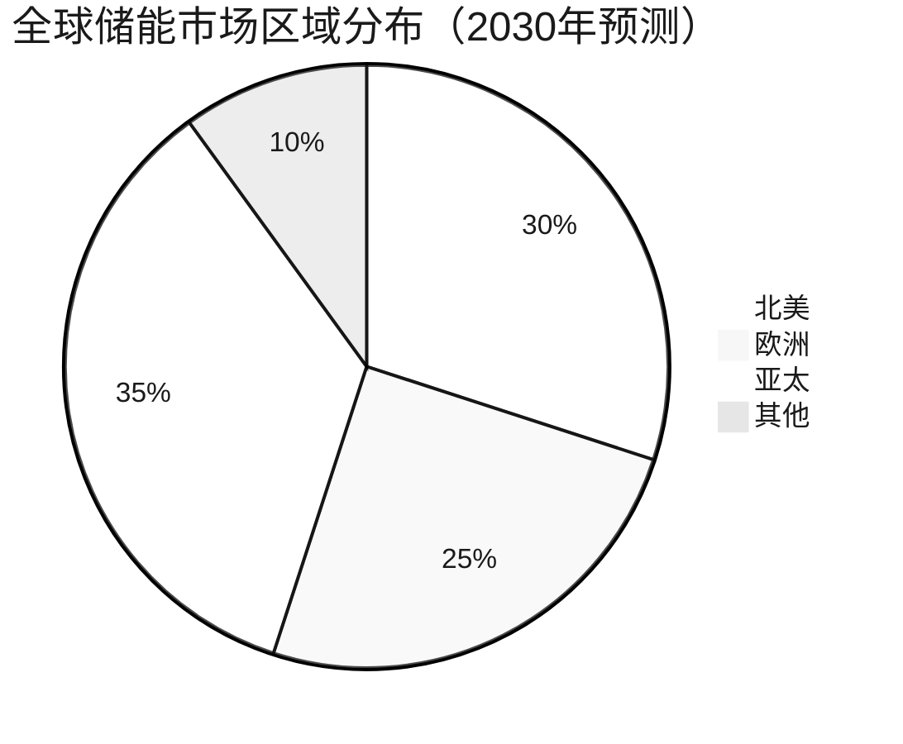
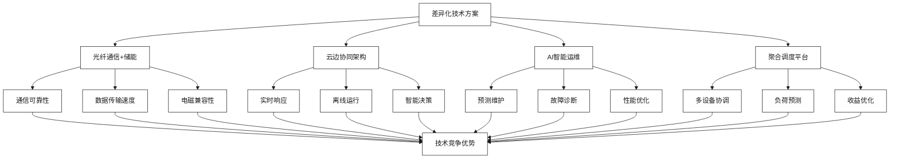
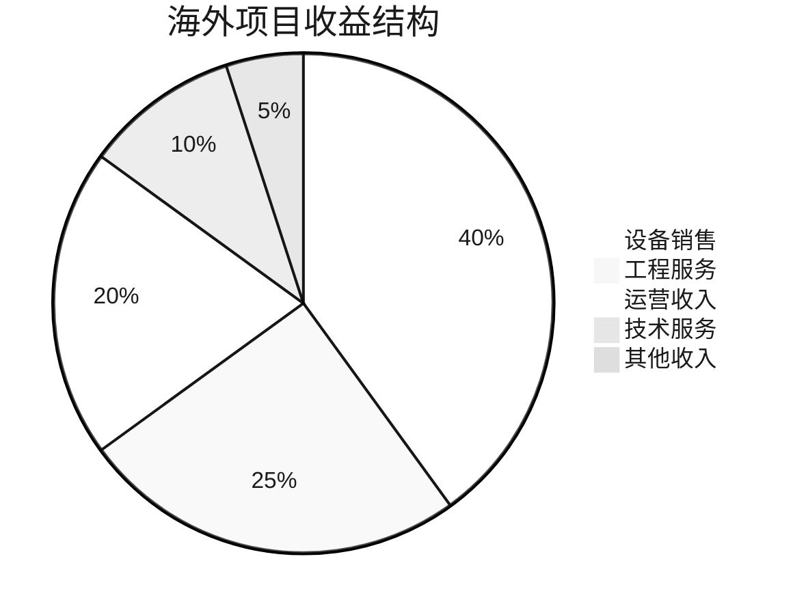

# 海外市场拓展策略

[首页](../README.md) > [市场机遇与商业模式](./README.md) > 海外市场拓展策略

## 问答导引

### Q1: 亨通+云储聚合海外拓展的核心优势是什么？
**A1:** 海外拓展的核心优势包括：
- **完整解决方案**：硬件+软件+服务的端到端方案
- **成本竞争力**：中国制造的成本优势
- **技术领先性**：光纤通信+储能的创新融合
- **全球网络**：亨通的全球销售和服务网络
- **本土化经验**：云储聚合的市场运营经验

### Q2: 海外市场的主要目标区域有哪些？
**A2:** 重点目标区域包括：
- **一带一路沿线**：基础设施建设需求大
- **东南亚市场**：缺电地区，分布式能源需求强
- **中东市场**：石油国家能源转型需求
- **非洲市场**：离网和微网应用场景丰富
- **欧美市场**：技术标准输出和高端市场

### Q3: 海外市场拓展面临的主要挑战是什么？
**A3:** 主要挑战包括：
- **标准差异**：各国技术标准和认证要求不同
- **政策风险**：贸易政策和投资政策变化
- **文化差异**：商业文化和运营模式差异
- **竞争激烈**：国际巨头竞争激烈
- **本土化需求**：需要本土化团队和服务

## 全球市场机遇分析

### 全球储能市场概况

#### 市场规模与增长
- **2023年全球储能市场**：300亿美元
- **2030年预测规模**：1500亿美元
- **年复合增长率**：25%+
- **装机规模**：从30GW增长到300GW

#### 区域分布特征

### 重点目标市场分析

#### 一带一路沿线市场

**市场特点**：
- **基础设施需求**：电力基础设施建设需求大
- **政策支持**：中国政府政策支持
- **资金优势**：中国资金和技术支持
- **合作基础**：已有良好的合作基础

**重点国家**：
| 国家 | 市场规模 | 主要需求 | 合作模式 |
|------|----------|----------|----------|
| **哈萨克斯坦** | 2GW | 工业储能 | EPC+运营 |
| **巴基斯坦** | 3GW | 电网储能 | BOT模式 |
| **印尼** | 5GW | 分布式储能 | 合资公司 |
| **泰国** | 2GW | 工商业储能 | 技术输出 |

#### 东南亚市场

**市场驱动因素**：
1. **电力缺口**：部分地区电力供应不足
2. **新能源发展**：太阳能、风能快速发展
3. **工业化进程**：制造业快速发展
4. **政策支持**：政府支持清洁能源

**商业模式**：
- **微网解决方案**：为偏远地区提供微网系统
- **工业储能**：为制造业提供储能解决方案
- **电网储能**：为电网公司提供储能服务
- **分布式储能**：为商业用户提供储能系统

#### 中东市场

**市场特点**：
- **能源转型**：从石油依赖向清洁能源转型
- **资金充足**：油气收入提供资金支持
- **政策推动**：政府推动能源多元化
- **技术需求**：需要先进的储能技术

**重点项目**：
- **沙特NEOM项目**：100GW可再生能源+储能
- **阿联酋迪拜储能项目**：250MW/1000MWh
- **卡塔尔工业储能**：为世界杯场馆提供储能

## 技术输出策略

### 核心技术优势

#### 差异化技术方案

#### 标准化输出
1. **技术标准**：推广中国储能技术标准
2. **产品标准**：统一产品规格和接口
3. **服务标准**：建立标准化服务体系
4. **质量标准**：确保产品质量一致性

### 本土化策略

#### 技术本土化
- **标准适配**：适应当地技术标准
- **产品定制**：根据当地需求定制产品
- **认证获取**：获得当地技术认证
- **专利保护**：在当地申请专利保护

#### 人才本土化
- **本土团队**：建立本土化技术团队
- **技术培训**：培训当地技术人员
- **合作伙伴**：与当地企业合作
- **人才交流**：中外人才交流合作

## 商业模式创新

### 多元化商业模式

#### 1. EPC+O&M模式
**模式特点**：
- 设计-采购-建设-运营一体化
- 长期运营维护服务
- 性能保证和收益保证

**适用市场**：
- 大型电网储能项目
- 工业园区储能项目
- 政府投资项目

#### 2. BOT/PPP模式
**模式特点**：
- 建设-运营-移交
- 政府支持和参与
- 长期投资回报

**适用市场**：
- 基础设施项目
- 公共事业项目
- 政府合作项目

#### 3. 合资公司模式
**模式特点**：
- 与当地企业合资
- 共同投资和运营
- 本土化优势

**适用市场**：
- 政策敏感市场
- 需要本土化的市场
- 长期发展市场

#### 4. 技术许可模式
**模式特点**：
- 技术授权和许可
- 技术服务和支持
- 轻资产运营

**适用市场**：
- 技术门槛高的市场
- 知识产权保护好的市场
- 快速扩张市场

### 收益模式分析

#### 收益构成

## 风险管理

### 主要风险识别

#### 政策风险
1. **贸易政策**：贸易保护主义政策
2. **投资政策**：外商投资限制政策
3. **技术政策**：技术标准变化
4. **环保政策**：环保要求提高

#### 市场风险
1. **汇率风险**：汇率波动影响收益
2. **价格风险**：原材料价格波动
3. **竞争风险**：国际竞争加剧
4. **需求风险**：市场需求变化

#### 运营风险
1. **文化风险**：文化差异影响运营
2. **人才风险**：本土人才缺乏
3. **技术风险**：技术适应性风险
4. **合规风险**：法律法规合规风险

### 风险缓解策略

#### 政策风险缓解
1. **政府关系**：加强与当地政府沟通
2. **合规管理**：严格遵守当地法规
3. **本土化**：提高本土化程度
4. **多元化**：分散市场风险

#### 市场风险缓解
1. **汇率对冲**：使用金融工具对冲汇率风险
2. **价格锁定**：与供应商签订长期价格协议
3. **差异化**：技术和服务差异化竞争
4. **市场调研**：深入了解市场需求

## 实施路径

### 三步走战略

#### 第一步：市场探索（2024-2025）
**目标**：
- 完成3-5个目标市场的深度调研
- 建立2-3个重点市场的合作伙伴关系
- 完成1-2个示范项目

**重点任务**：
- 市场调研和分析
- 合作伙伴筛选
- 技术标准适配
- 团队建设

#### 第二步：市场进入（2025-2027）
**目标**：
- 在5-8个国家建立业务
- 完成10-15个项目
- 建立3-5个区域服务中心

**重点任务**：
- 项目执行和交付
- 本土化团队建设
- 服务体系建设
- 品牌推广

#### 第三步：规模扩张（2027-2030）
**目标**：
- 在15-20个国家开展业务
- 年海外收入达到50亿元
- 成为全球储能解决方案供应商

**重点任务**：
- 规模化运营
- 技术标准输出
- 生态系统建设
- 品牌全球化

### 关键成功因素

#### 战略层面
1. **明确定位**：明确海外市场定位和策略
2. **资源配置**：合理配置人力和资金资源
3. **合作伙伴**：选择合适的合作伙伴
4. **风险管理**：建立完善的风险管理体系

#### 执行层面
1. **项目管理**：建立专业的项目管理体系
2. **质量控制**：确保产品和服务质量
3. **客户服务**：提供优质的客户服务
4. **持续改进**：持续改进产品和服务

## 重点项目案例

### 案例一：印尼分布式储能项目

#### 项目概况
- **地点**：印尼雅加达工业区
- **规模**：50MW/100MWh
- **投资**：8000万美元
- **模式**：EPC+10年运营

#### 项目特点
- **技术方案**：光储充一体化
- **通信方案**：光纤+5G混合通信
- **运营模式**：远程运营+本土服务
- **收益模式**：峰谷套利+备用服务

#### 项目成效
- **建设周期**：12个月
- **投资回收期**：8年
- **年化收益率**：12%
- **客户满意度**：95%

### 案例二：沙特大型储能项目

#### 项目概况
- **地点**：沙特NEOM新城
- **规模**：200MW/800MWh
- **投资**：3亿美元
- **模式**：BOT模式，25年运营

#### 技术创新
- **极端环境适应**：耐高温、防沙尘设计
- **智能运维**：AI预测维护系统
- **远程监控**：卫星通信+光纤通信
- **本土化服务**：建立当地服务团队

#### 商业价值
- **示范效应**：在中东市场建立标杆
- **技术输出**：输出中国储能技术标准
- **品牌价值**：提升国际品牌影响力
- **经济效益**：预计总收益15亿美元

## 发展前景

### 市场前景
- **市场规模**：2030年海外市场收入达到50亿元
- **市场份额**：在目标市场占据10%以上份额
- **项目数量**：完成100+个海外项目
- **服务网络**：建立20+个海外服务中心

### 战略价值
1. **收入增长**：为公司带来新的收入增长点
2. **技术输出**：输出中国储能技术和标准
3. **品牌提升**：提升国际品牌影响力
4. **产业升级**：推动储能产业国际化发展

### 发展建议
1. **加强合作**：与国际伙伴深化合作
2. **技术创新**：持续投入技术创新
3. **人才培养**：培养国际化人才
4. **风险管控**：建立完善的风险管控体系

## 相关资源

### 内部链接
- [工商业储能聚合模式](./工商业储能聚合模式.md)
- [电力现货与辅助服务市场](./电力现货与辅助服务市场.md)
- [光储充微网与新能源汽车生态](../技术解决方案/光储充微网与新能源汽车生态.md)

### 外部参考
- [一带一路储能项目](https://www.ndrc.gov.cn)
- [全球储能市场报告](https://www.iea.org)

---

**导航**
- [上一页：电力现货与辅助服务市场](./电力现货与辅助服务市场.md)
- [下一页：监管政策与合规](../监管政策与合规/README.md)
- [返回首页](../README.md)