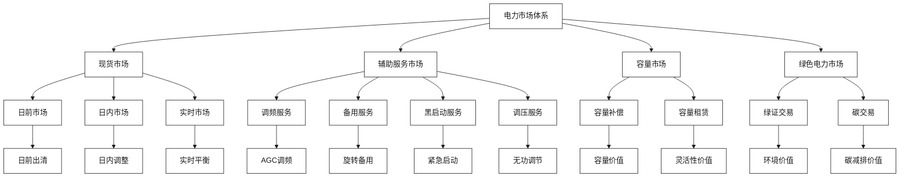
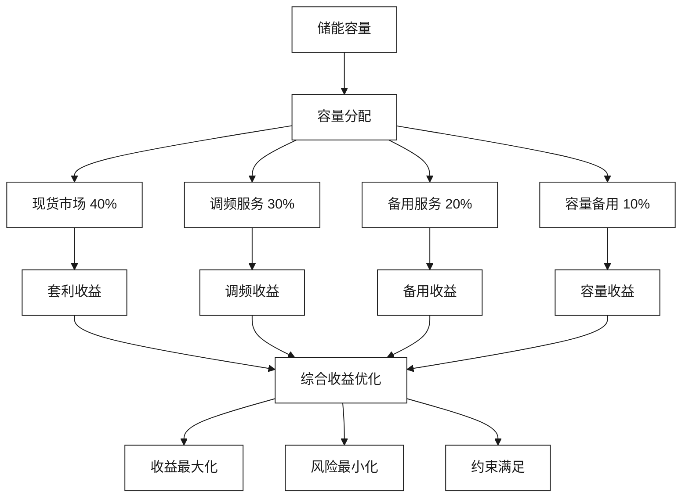

# 电力现货与辅助服务市场

[首页](../README.md) > [市场机遇与商业模式](./README.md) > 电力现货与辅助服务市场

## 问答导引

### Q1: 储能参与电力现货市场的核心价值是什么？
**A1:** 储能在电力现货市场的核心价值体现在：
- **套利功能**：低价时充电，高价时放电，获取价差收益
- **调节功能**：快速响应电网调度，提供功率支撑
- **平衡功能**：平抑新能源波动，维护电网稳定
- **容量功能**：提供备用容量，增强电网可靠性
- **服务功能**：提供调频、调压等辅助服务

### Q2: 江苏电力市场为储能提供了哪些机会？
**A2:** 江苏电力市场机会包括：
- **现货市场**：日前、日内、实时市场的套利机会
- **辅助服务市场**：调频、备用、黑启动等服务
- **容量市场**：容量补偿机制正在建设中
- **需求响应**：峰时需求响应、绿色电力交易
- **政策支持**：储能聚合商、独立储能主体新政

### Q3: 储能参与电力市场的主要风险有哪些？
**A3:** 主要风险包括：
- **价格风险**：电力价格波动影响收益稳定性
- **政策风险**：市场规则变化影响参与方式
- **技术风险**：设备故障影响市场响应
- **履约风险**：无法按时履行市场承诺
- **竞争风险**：市场参与者增多，竞争加剧

## 电力市场架构



## 现货市场参与策略

### 市场机制理解

#### 江苏电力现货市场特点
1. **时间序列**：日前→日内→实时的递进优化
2. **价格机制**：边际出清价格，反映供需平衡
3. **结算规则**：按节点边际价格结算
4. **约束条件**：输电约束、安全约束、环保约束

#### 储能参与方式
| 参与方式 | 准入条件 | 竞价策略 | 收益模式 |
|----------|----------|----------|----------|
| **独立储能** | 容量≥1MW | 报价参与 | 价差套利 |
| **聚合储能** | 聚合容量≥1MW | 代理参与 | 聚合收益 |
| **用户侧储能** | 配合大用户 | 减少用电 | 避峰收益 |

### 套利策略设计

#### 价差套利模型
```python
def arbitrage_strategy(price_forecast, soc_current, constraints):
    """
    储能套利策略优化模型
    """
    # 目标函数：最大化收益
    revenue = sum(price[t] * power[t] for t in time_horizon)
    
    # 约束条件
    constraints = [
        # 功率约束
        -P_max <= power[t] <= P_max,
        
        # 容量约束  
        SOC_min <= soc[t] <= SOC_max,
        
        # 能量平衡
        soc[t+1] = soc[t] + power[t] * efficiency,
        
        # 循环约束
        soc[0] = soc[24]  # 日循环
    ]
    
    # 求解优化问题
    optimal_schedule = optimize(revenue, constraints)
    
    return optimal_schedule
```

#### 关键策略要素
1. **价格预测**：基于历史数据和机器学习的价格预测
2. **风险管理**：设置止损点，控制最大损失
3. **容量配置**：根据价差分布优化容量配置
4. **时间管理**：优化充放电时间窗口

### 收益分析

#### 江苏现货市场价差特征
- **平均价差**：0.3-0.5元/kWh
- **最大价差**：1.2元/kWh
- **价差频次**：每日2-3次套利机会
- **季节性**：夏季价差大于冬季

#### 储能套利收益测算
**基本假设**：
- 储能容量：1MW/2MWh
- 充放电效率：90%
- 年运行天数：300天
- 平均价差：0.4元/kWh

**年收益计算**：
```
日均套利收益 = 2MWh × 0.4元/kWh × 0.9 = 720元
年套利收益 = 720元 × 300天 = 21.6万元
单位容量收益 = 21.6万元 / 1MW = 216元/kW
```

## 辅助服务市场

### 服务类型与要求

#### 调频服务
**技术要求**：
- 响应时间：≤15秒
- 调节精度：±2%
- 持续时间：≥15分钟
- 可用率：≥95%

**收益构成**：
- 里程费：按调节量计费
- 容量费：按可用容量计费
- 性能费：按调节精度计费

**收益水平**：
- 里程费：8-12元/MWh
- 容量费：60-100元/MW/h
- 综合收益：150-200元/MW/h

#### 备用服务
**服务分类**：
- 旋转备用：在线待命，快速响应
- 非旋转备用：离线待命，较慢响应
- 紧急备用：应急情况下的后备力量

**技术要求**：
- 响应时间：10秒-10分钟
- 持续时间：30分钟-4小时
- 可用率：≥98%

**收益模式**：
- 容量费：按可用容量支付
- 启动费：按调用次数支付
- 电量费：按实际发电量支付

### 储能参与辅助服务优势

#### 技术优势
1. **快速响应**：毫秒级响应时间
2. **精确控制**：功率控制精度高
3. **双向调节**：可充电可放电
4. **零排放**：环保无污染

#### 经济优势
1. **成本竞争力**：边际成本低
2. **多重收益**：同时参与多个市场
3. **利用率高**：全天候可用
4. **维护成本低**：自动化运行

### 辅助服务策略

#### 多市场参与策略


#### 优化策略
1. **动态分配**：根据市场价格动态调整容量分配
2. **协同优化**：统筹考虑多个市场的约束条件
3. **风险对冲**：通过多市场参与分散风险
4. **性能考核**：确保满足各市场性能要求

## 市场交易系统

### 交易系统架构

#### 系统组成
```
┌─────────────────────────────────────────┐
│              交易决策层                  │
├─────────────────────────────────────────┤
│ 策略引擎 │ 风险管理 │ 收益优化 │ 合规检查 │
├─────────────────────────────────────────┤
│              交易执行层                  │
├─────────────────────────────────────────┤
│ 报价模块 │ 中标管理 │ 结算管理 │ 履约管理 │
├─────────────────────────────────────────┤
│              数据处理层                  │
├─────────────────────────────────────────┤
│ 市场数据 │ 设备数据 │ 价格预测 │ 负荷预测 │
├─────────────────────────────────────────┤
│              接口适配层                  │
├─────────────────────────────────────────┤
│ 交易平台 │ 调度系统 │ 储能设备 │ 监控系统 │
└─────────────────────────────────────────┘
```

#### 核心功能模块
1. **报价决策**：自动生成最优报价策略
2. **中标管理**：处理中标通知和确认
3. **履约控制**：确保按时履行市场承诺
4. **结算管理**：处理电量和费用结算

### 风险管理系统

#### 风险识别
1. **价格风险**：电力价格波动风险
2. **技术风险**：设备故障和性能风险
3. **履约风险**：无法按时履行承诺
4. **信用风险**：交易对手违约风险

#### 风险控制措施
1. **价格限制**：设置最高最低报价限制
2. **容量预留**：预留应急容量
3. **实时监控**：7×24小时设备监控
4. **应急预案**：制定各种应急处理预案

### 算法优化

#### 价格预测算法
```python
class PriceForecast:
    def __init__(self):
        self.model = LSTMModel()
        self.features = ['load', 'renewable', 'price_history', 'weather']
    
    def predict_price(self, horizon=24):
        """
        电力价格预测
        """
        # 特征工程
        X = self.prepare_features()
        
        # 模型预测
        prices = self.model.predict(X, horizon)
        
        # 不确定性分析
        confidence = self.uncertainty_analysis(prices)
        
        return prices, confidence
```

#### 收益优化算法
```python
def revenue_optimization(price_forecast, storage_params):
    """
    多市场收益优化
    """
    # 定义决策变量
    power_spot = {}  # 现货市场功率
    power_freq = {}  # 调频功率
    power_reserve = {}  # 备用功率
    
    # 目标函数：最大化总收益
    revenue = (
        sum(price_spot[t] * power_spot[t] for t in time_horizon) +
        sum(price_freq[t] * power_freq[t] for t in time_horizon) +
        sum(price_reserve[t] * power_reserve[t] for t in time_horizon)
    )
    
    # 约束条件
    constraints = [
        # 功率约束
        power_spot[t] + power_freq[t] + power_reserve[t] <= P_max,
        
        # 容量约束
        soc_min <= soc[t] <= soc_max,
        
        # 响应时间约束
        response_time_freq <= 15,  # 调频15秒
        response_time_reserve <= 600,  # 备用10分钟
    ]
    
    # 求解优化问题
    solution = solve_optimization(revenue, constraints)
    
    return solution
```

## 项目案例分析

### 案例一：镇江储能电站

#### 项目概况
- **位置**：江苏镇江
- **规模**：101MW/202MWh
- **投资**：12.6亿元
- **运营方**：国网江苏电力

#### 市场参与表现
- **现货市场**：年套利收益8000万元
- **调频服务**：年服务收益5000万元
- **备用服务**：年服务收益3000万元
- **总收益**：年收益1.6亿元

#### 成功经验
1. **规模效应**：大规模储能降低单位成本
2. **技术先进**：采用先进的储能技术
3. **运营专业**：专业化运营管理
4. **政策支持**：政府政策大力支持

### 案例二：用户侧储能聚合

#### 项目概况
- **位置**：江苏南京
- **规模**：50MW/100MWh（聚合）
- **节点**：100个用户侧储能
- **运营方**：云储聚合

#### 商业模式
- **聚合运营**：统一调度管理
- **收益分成**：与用户分成收益
- **服务费用**：收取运营服务费
- **风险共担**：运营风险由平台承担

#### 运营效果
- **年收益率**：15%
- **用户满意度**：92%
- **设备利用率**：85%
- **市场份额**：占江苏聚合储能市场30%

## 政策环境分析

### 国家政策支持

#### 关键政策文件
1. **新型储能发展指导意见**：明确储能发展目标和支持政策
2. **储能参与电力市场政策**：允许储能参与各类电力市场
3. **储能安全管理办法**：规范储能设备安全管理
4. **储能标准体系**：建立完善的储能技术标准

#### 政策红利
- **税收优惠**：储能设备享受设备折旧优惠
- **并网优先**：储能项目享受并网绿色通道
- **市场准入**：放开储能参与电力市场限制
- **补贴支持**：部分地区给予储能补贴

### 江苏省政策环境

#### 省级政策
1. **江苏储能发展规划**：2025年储能装机5GW
2. **电力现货市场规则**：完善储能参与市场规则
3. **储能示范项目**：支持储能示范项目建设
4. **聚合商政策**：支持储能聚合商发展

#### 地方支持
- **南京市**：储能项目补贴0.3元/Wh
- **苏州市**：储能项目贷款贴息支持
- **南通市**：储能示范项目土地支持
- **镇江市**：储能项目电网接入支持

## 发展前景展望

### 市场发展趋势

#### 市场规模预测
- **2025年**：江苏储能市场规模100亿元
- **2030年**：江苏储能市场规模500亿元
- **年复合增长率**：38%

#### 技术发展趋势
1. **成本下降**：储能系统成本持续下降
2. **性能提升**：储能技术性能持续提升
3. **标准完善**：储能技术标准逐步完善
4. **应用拓展**：储能应用场景不断拓展

### 市场机遇

#### 政策机遇
1. **碳达峰碳中和**：储能是实现双碳目标的重要手段
2. **新型电力系统**：储能是新型电力系统的重要组成
3. **电力市场化**：电力市场化改革为储能创造机遇
4. **数字化转型**：数字化技术推动储能发展

#### 技术机遇
1. **AI技术**：人工智能技术推动储能智能化
2. **物联网技术**：物联网技术提升储能管理水平
3. **区块链技术**：区块链技术创新储能商业模式
4. **5G技术**：5G技术提升储能通信能力

## 合作建议

### 短期合作（1-2年）
1. **示范项目**：建设2-3个储能电力市场示范项目
2. **技术验证**：验证储能参与电力市场的技术方案
3. **模式探索**：探索储能电力市场商业模式
4. **团队建设**：建设专业的电力市场团队

### 中期合作（3-5年）
1. **规模扩张**：扩大储能电力市场参与规模
2. **技术升级**：升级储能电力市场技术平台
3. **模式复制**：复制成功的商业模式
4. **市场拓展**：拓展其他省份电力市场

### 长期合作（5年以上）
1. **行业领导**：成为储能电力市场的行业领导者
2. **标准制定**：参与储能电力市场标准制定
3. **国际合作**：参与国际储能电力市场合作
4. **生态构建**：构建储能电力市场生态系统

## 相关资源

### 内部链接
- [工商业储能聚合模式](./工商业储能聚合模式.md)
- [海外市场拓展策略](./海外市场拓展策略.md)
- [新型储能与虚拟电厂一体化](../技术解决方案/新型储能与虚拟电厂一体化.md)

### 外部参考
- [江苏电力交易中心](http://www.jsemc.com.cn)
- [国家电网储能政策](http://www.sgcc.com.cn)

---

**导航**
- [上一页：工商业储能聚合模式](./工商业储能聚合模式.md)
- [下一页：海外市场拓展策略](./海外市场拓展策略.md)
- [返回首页](../README.md)