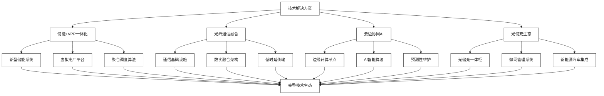

# 技术解决方案

[首页](../README.md) > 技术解决方案

## 概述

本章节深入分析亨通集团与云储聚合在技术融合层面的核心解决方案，涵盖新型储能与虚拟电厂一体化、光纤通信与储能数实融合、云边协同与AI智能运维，以及光储充微网与新能源汽车生态等关键技术领域。

## 技术解决方案架构

## 章节内容

### [智慧储能系统架构设计](./新型储能与虚拟电厂一体化.md)
深入分析新型储能技术与虚拟电厂平台的深度融合，探讨BMS/EMS/PCS三大核心系统集成和储能设备标准化接口设计。

**核心内容：** 虚拟电厂聚合调度算法 | 多时间尺度协调优化 | 储能即服务模式  
**相关章节：** [技术整合与平台对接](../实施策略与合作模式/技术整合与平台对接.md)

### [云边协同与AI算法优化](./云边协同与AI智能运维.md)
结合云计算和边缘计算优势，通过AI算法实现储能系统的智能预测性维护和优化调度。

**核心内容：** 边缘智能实时响应 | AI驱动预测性维护 | 机器学习优化调度  
**相关章节：** [风险评估与缓解策略](../实施策略与合作模式/风险评估与缓解策略.md)

### [并网安全与标准合规](./光纤通信与储能数实融合.md)
利用亨通光纤通信优势，构建高可靠性、低时延的储能数据传输网络，确保并网安全和标准合规。

**核心内容：** 光纤通信基础设施 | 并网安全技术要求 | 国际标准合规认证  
**相关章节：** [国际认证与合规要求](../监管政策与合规/安全合规与国际认证.md)

## 核心技术整合

| 技术领域 | 亨通贡献 | 云储聚合贡献 | 整合价值 |
|----------|----------|-------------|----------|
| **储能系统** | BMS/PCS/EMS硬件 | 聚合调度软件 | 硬软件一体化 |
| **通信网络** | 光纤基础设施 | 数据传输协议 | 低时延高可靠通信 |
| **边缘计算** | 边缘硬件平台 | AI算法部署 | 本地智能决策 |
| **系统集成** | 工程实施能力 | 平台运营能力 | 端到端服务 |

## 技术创新亮点

### 1. **硬件+软件深度融合**
- 储能设备与调度平台原生集成
- 统一的数据接口和通信协议
- 联合优化的控制策略

### 2. **通信+储能跨界融合**
- 光纤通信技术在储能领域的创新应用
- 5G+光纤的混合通信架构
- 数据传输与能量传输的协同

### 3. **云边端协同架构**
- 云端大脑+边缘智能+终端执行
- 分层分布式的决策机制
- 实时性与可靠性的平衡

### 4. **AI驱动的智能运维**
- 机器学习算法驱动的预测性维护
- 数字孪生技术的应用
- 自适应优化的运营策略

## 应用场景分析

### 工商业储能场景
- **目标客户**：工业园区、商业楼宇、数据中心
- **核心价值**：削峰填谷、需求响应、备用电源
- **技术方案**：模块化储能+智能调度+云边协同

### 电网侧储能场景
- **目标客户**：电网公司、发电企业
- **核心价值**：调频调峰、新能源消纳、电网稳定
- **技术方案**：大规模储能+VPP聚合+实时调度

### 微网储能场景
- **目标客户**：园区、社区、海岛等独立微网
- **核心价值**：能源自给、电力平衡、运行优化
- **技术方案**：光储充一体+微网控制+智能管理

## 技术发展路线图

### 第一阶段（2024-2025）
- 完成核心技术整合
- 建设示范项目
- 验证技术方案

### 第二阶段（2025-2027）
- 规模化产业应用
- 技术标准制定
- 生态体系建设

### 第三阶段（2027-2030）
- 技术全面成熟
- 市场广泛应用
- 国际标准输出

## 相关章节

- [企业概况与核心能力](../企业概况与核心能力/README.md) - 了解双方技术基础
- [市场机遇与商业模式](../市场机遇与商业模式/README.md) - 探索技术商业化路径
- [监管政策与合规](../监管政策与合规/README.md) - 理解技术合规要求

---

**导航**
- [上一章节：企业概况与核心能力](../企业概况与核心能力/README.md)
- [下一章节：市场机遇与商业模式](../市场机遇与商业模式/README.md)
- [返回首页](../README.md)