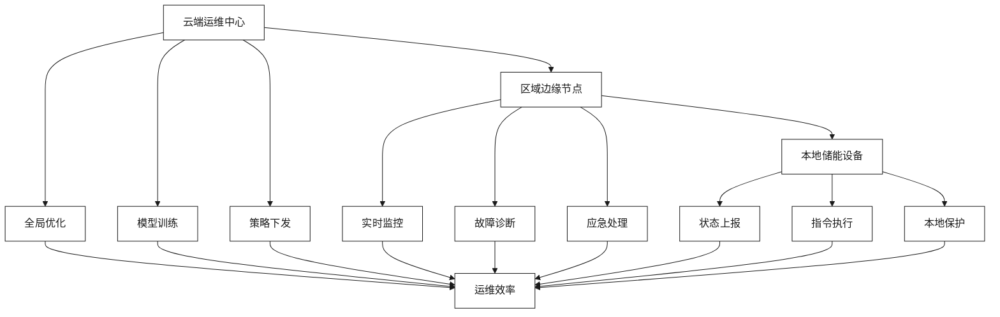

# 云边协同与AI智能运维

[首页](../README.md) > [技术解决方案](./README.md) > 云边协同与AI智能运维

## 问答导引

### Q1: 云边协同在储能系统中的核心价值是什么？
**A1:** 云边协同为储能系统提供：
- **实时响应**：边缘节点处理紧急情况，响应时间<100ms
- **智能决策**：云端大脑+边缘智能的分层决策机制
- **带宽优化**：边缘预处理减少云端数据传输量80%
- **离线运行**：边缘节点独立运行，确保断网时基本功能
- **成本控制**：边缘计算降低云端计算和存储成本

### Q2: AI智能运维如何提升储能系统效率？
**A2:** AI智能运维通过以下方式提升效率：
- **预测性维护**：提前7-15天预测设备故障，避免突发停机
- **性能优化**：AI算法优化充放电策略，提升效率5-10%
- **自动化运维**：90%运维任务自动化，减少人工干预
- **智能诊断**：故障定位时间从小时级缩短到分钟级
- **寿命管理**：精确预测电池寿命，优化更换策略

### Q3: 双方在云边协同方面如何分工合作？
**A3:** 分工合作体现在：
- **亨通集团**：提供边缘硬件平台、储能设备集成
- **云储聚合**：提供云端平台、AI算法、数据分析
- **协同创新**：共同开发云边协同调度算法
- **标准制定**：联合制定储能云边协同技术标准
- **运维服务**：提供一体化智能运维服务## 云边协同架构图

```mermaid
%%{init: {
  'theme':'base',
  'themeVariables': {
    'primaryColor':'#ffffff',
    'primaryTextColor':'#1a1a1a',
    'secondaryColor':'#f7f7f7',
    'secondaryTextColor':'#1a1a1a',
    'primaryBorderColor':'#1a1a1a',
    'lineColor':'#1a1a1a'
  }
}}%%
graph TB
    A[云边协同架构] --> B[云端层]
    A --> C[边缘层]
    A --> D[终端层]
    
    B --> E[云储聚合平台]
    B --> F[AI训练中心]
    B --> G[数据中心]
    B --> H[调度中心]
    
    C --> I[边缘网关]
    C --> J[边缘计算节点]
    C --> K[本地AI引擎]
    C --> L[缓存存储]
    
    D --> M[储能设备]
    D --> N[传感器]
    D --> O[执行器]
    D --> P[保护装置]## AI智能运维技术

### 预测性维护系统

```mermaid
%%{init: {
  'theme':'base',
  'themeVariables': {
    'primaryColor':'#ffffff',
    'primaryTextColor':'#1a1a1a',
    'secondaryColor':'#f7f7f7',
    'secondaryTextColor':'#1a1a1a',
    'primaryBorderColor':'#1a1a1a',
    'lineColor':'#1a1a1a'
  },
  'darkThemeVariables': {
    'primaryColor':'#1a1a1a',
    'primaryTextColor':'#ffffff',
    'secondaryColor':'#333333',
    'secondaryTextColor':'#ffffff',
    'primaryBorderColor':'#ffffff',
    'lineColor':'#ffffff'
  }
}}%%
flowchart LR
    A[数据采集] --> B[特征提取]
    B --> C[模型训练]
    C --> D[状态评估]
    D --> E[故障预测]
    E --> F[维护决策]
    F --> G[维护执行]
    
    A --> H[温度/电压/电流]
    A --> I[充放电曲线]
    A --> J[环境参数]
    
    B --> K[统计特征]
    B --> L[频域特征]
    B --> M[时域特征]
    
    C --> N[深度学习]
    C --> O[机器学习]
    C --> P[集成学习]
    
    D --> Q[健康度评估]
    E --> R[故障预警]
    F --> S[维护计划]
    G --> T[维护记录]
```### 关键算法与技术

#### 1. 电池健康度评估算法
```python
def battery_health_assessment(voltage, current, temperature, cycle_count):
    """
    电池健康度评估算法
    """
    # 容量衰减评估
    capacity_fade = calculate_capacity_fade(cycle_count, temperature)
    
    # 内阻增长评估
    resistance_growth = calculate_resistance_growth(voltage, current)
    
    # 综合健康度计算
    soh = 1 - (capacity_fade * 0.7 + resistance_growth * 0.3)
    
    return soh
```

#### 2. 故障预测模型
- **LSTM神经网络**：用于时序数据预测
- **随机森林**：用于多特征分类
- **支持向量机**：用于异常检测
- **集成学习**：多模型融合提升准确率

#### 3. 智能调度优化
- **强化学习**：Q-learning优化调度策略
- **遗传算法**：多目标优化求解
- **粒子群优化**：参数自适应调整
- **模糊控制**：处理不确定性因素

## 应用场景与价值

### 大规模储能电站运维

#### 场景特点
- **设备数量**：数百到数千台储能设备
- **数据量**：TB级实时数据处理
- **响应要求**：秒级故障响应
- **运维挑战**：人员有限，设备分散

#### 解决方案
- **云端**：全局数据分析、模型训练、策略优化
- **边缘**：本地数据处理、实时控制、故障诊断
- **终端**：设备监控、状态上报、指令执行

#### 价值创造
| 指标 | 传统运维 | 智能运维 | 提升效果 |
|------|----------|----------|----------|
| 故障预测准确率 | 60% | 90%+ | 50%提升 |
| 运维成本 | 基准 | 降低40% | 显著 |
| 设备利用率 | 85% | 95% | 12%提升 |
| 平均修复时间 | 4小时 | 1小时 | 75%缩短 |

### 分布式储能聚合运维

#### 技术挑战
- **设备分散**：地理位置分散，维护困难
- **通信复杂**：多种通信方式并存
- **标准不一**：不同厂家设备差异大
- **成本控制**：单体设备运维成本高

#### 云边协同方案


## 技术创新亮点

### 1. 边缘AI推理引擎
- **模型轻量化**：云端训练，边缘推理
- **实时响应**：<100ms响应时间
- **离线运行**：断网时仍可基本运行
- **自适应学习**：根据本地数据微调模型

### 2. 数字孪生技术
- **实时同步**：物理设备与数字模型同步
- **仿真预测**：预测设备未来状态
- **虚拟试验**：在数字空间测试策略
- **全生命周期**：从设计到退役全过程

### 3. 知识图谱应用
- **故障知识库**：结构化故障知识
- **专家经验**：专家知识系统化
- **推理诊断**：基于知识图谱的推理
- **持续学习**：知识库动态更新

## 平台架构与部署

### 云端平台架构
```
├── 数据接入层
│   ├── 消息队列
│   ├── 数据预处理
│   └── 数据存储
├── AI服务层
│   ├── 模型训练
│   ├── 模型管理
│   └── 推理服务
├── 业务逻辑层
│   ├── 故障诊断
│   ├── 预测维护
│   └── 运维调度
└── 应用展示层
    ├── 监控大屏
    ├── 移动APP
    └── API接口
```

### 边缘节点架构
```
├── 设备接入层
│   ├── 协议适配
│   ├── 数据采集
│   └── 指令下发
├── 边缘计算层
│   ├── 实时处理
│   ├── 本地存储
│   └── AI推理
├── 通信服务层
│   ├── 云边通信
│   ├── 设备通信
│   └── 网络管理
└── 安全防护层
    ├── 访问控制
    ├── 数据加密
    └── 安全审计
```

## 实施效果与案例

### 某工业园区储能项目

#### 项目概况
- **规模**：20MW/40MWh分布式储能
- **节点**：50个储能站点
- **技术方案**：云边协同+AI运维
- **运行时间**：2年

#### 实施效果
- **故障率降低**：从5%降至1%
- **运维成本节约**：年节约200万元
- **设备利用率提升**：从80%提升至95%
- **响应时间缩短**：从小时级到分钟级

#### 关键成功因素
1. **统一标准**：建立统一的设备接入标准
2. **边缘智能**：就近处理提升响应速度
3. **数据质量**：高质量数据支撑AI算法
4. **运维团队**：专业运维团队配合

### 技术优势总结

| 技术维度 | 传统方案 | 云边协同AI方案 | 创新价值 |
|----------|----------|---------------|----------|
| **响应速度** | 分钟级 | 秒级 | 实时响应 |
| **故障预测** | 被动维护 | 主动预测 | 预防为主 |
| **运维效率** | 人工为主 | 自动化为主 | 效率提升 |
| **成本控制** | 高人工成本 | 低运维成本 | 成本优化 |
| **扩展性** | 线性增长 | 智能扩展 | 规模效应 |

## 发展展望

### 技术发展方向
1. **更智能的AI算法**：自监督学习、联邦学习
2. **更强的边缘计算**：边缘AI芯片、5G网络
3. **更深的数字孪生**：全要素数字化建模
4. **更广的应用场景**：从储能扩展到综合能源

### 市场前景
- **市场规模**：智能运维市场年复合增长率30%+
- **政策支持**：数字化转型、智能制造政策支持
- **技术成熟**：AI、云计算、边缘计算技术成熟
- **成本下降**：硬件成本持续下降，应用门槛降低

## 相关资源

### 内部链接
- [新型储能与虚拟电厂一体化](./新型储能与虚拟电厂一体化.md)
- [光纤通信与储能数实融合](./光纤通信与储能数实融合.md)
- [光储充微网与新能源汽车生态](./光储充微网与新能源汽车生态.md)

### 外部参考
- [边缘计算技术白皮书](https://www.cesi.ac.cn)
- [AI在能源领域应用报告](https://www.iea.org)

---

**导航**
- [上一页：光纤通信与储能数实融合](./光纤通信与储能数实融合.md)
- [下一页：光储充微网与新能源汽车生态](./光储充微网与新能源汽车生态.md)
- [返回首页](../README.md)