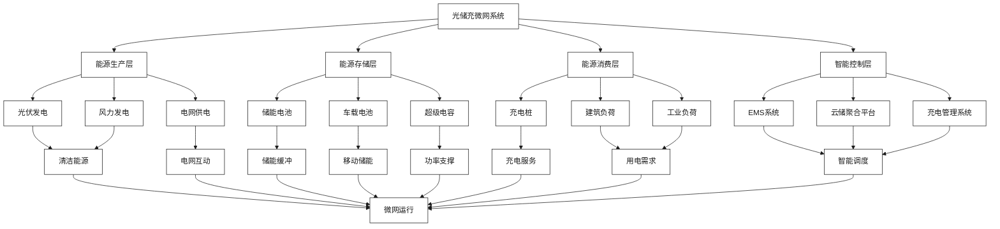
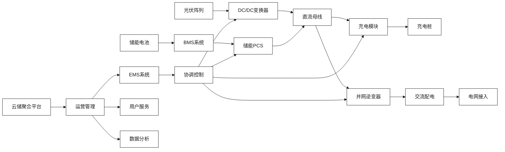
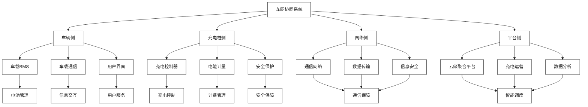
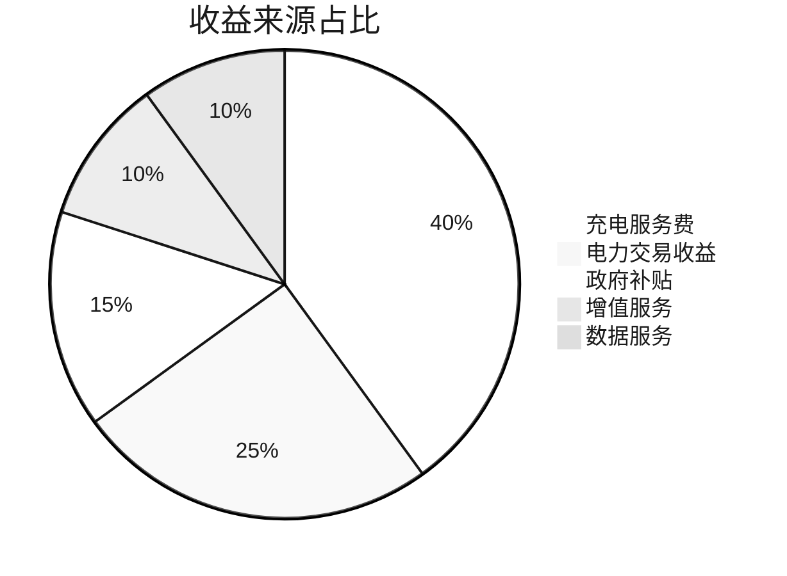

# 光储充微网与新能源汽车生态

[首页](../README.md) > [技术解决方案](./README.md) > 光储充微网与新能源汽车生态

## 问答导引

### Q1: 光储充一体化方案的核心理念是什么？
**A1:** 光储充一体化的核心理念包括：
- **能源协同**：光伏发电+储能+充电桩的协同运行
- **削峰填谷**：利用储能平滑充电负荷对电网的冲击
- **自给自足**：最大化利用本地可再生能源
- **智能管理**：通过EMS实现能源流的智能调度
- **经济优化**：降低用电成本，提高投资收益

### Q2: 亨通与云储聚合在光储充方案中如何分工？
**A2:** 双方分工如下：
- **亨通集团**：提供储充一体柜、高压线束、光伏组件、系统集成
- **云储聚合**：提供充电桩运营平台、能源管理系统、市场交易服务
- **联合创新**：共同开发光储充协调控制算法
- **运营服务**：提供全生命周期运营维护服务
- **市场推广**：面向园区、社区、高速服务区等场景推广

### Q3: 光储充方案如何与新能源汽车生态结合？
**A3:** 与新能源汽车生态结合体现在：
- **V2G技术**：电动汽车反向供电，成为移动储能单元
- **智能充电**：根据电价和车主需求智能调度充电
- **数据互通**：车辆数据与充电数据融合分析
- **服务整合**：充电、停车、商业服务一体化
- **生态协同**：与整车厂、电池厂、运营商协同发展

## 技术架构图



## 核心技术方案

### 光储充一体化设计

#### 系统集成架构


#### 关键技术特点

1. **直流母线架构**
   - 减少AC/DC转换损耗
   - 提高系统效率5-8%
   - 降低设备成本和占地面积

2. **储充一体化**
   - 储能与充电深度融合
   - 功率电子器件复用
   - 智能功率分配

3. **模块化设计**
   - 标准化模块便于扩展
   - 即插即用快速部署
   - 分布式运行提高可靠性

### 智能能源管理系统

#### 多目标优化调度
```python
# 光储充优化调度算法示例
def optimize_energy_dispatch(pv_forecast, load_forecast, price_forecast):
    """
    光储充系统多目标优化调度
    """
    # 目标函数
    objectives = {
        'cost_minimization': minimize_electricity_cost(),
        'revenue_maximization': maximize_charging_revenue(),
        'carbon_reduction': minimize_carbon_emission(),
        'grid_support': maximize_grid_services()
    }
    
    # 约束条件
    constraints = {
        'power_balance': pv_power + grid_power + storage_discharge 
                       == charging_load + building_load + storage_charge,
        'storage_soc': soc_min <= soc <= soc_max,
        'charging_capacity': charging_power <= charging_capacity,
        'grid_limitation': grid_power <= grid_capacity
    }
    
    # 多目标优化求解
    solution = multi_objective_optimization(objectives, constraints)
    
    return solution
```

#### 预测算法集成
- **光伏出力预测**：基于天气数据的发电量预测
- **负荷需求预测**：基于历史数据的用电需求预测
- **充电需求预测**：基于用户行为的充电需求预测
- **电价预测**：基于市场数据的电价走势预测

### V2G双向充放电技术

#### 技术原理
1. **双向变流器**：支持能量双向流动
2. **通信协议**：车网协同通信标准
3. **安全保护**：过充过放保护机制
4. **智能调度**：车辆充放电优化调度

#### 应用场景
| 场景 | 功能 | 价值 | 技术要求 |
|------|------|------|----------|
| **削峰填谷** | 高峰放电，低谷充电 | 电网调峰 | 快速响应 |
| **应急供电** | 停电时车辆供电 | 供电保障 | 孤岛运行 |
| **频率调节** | 快速功率调节 | 电网稳定 | 毫秒级响应 |
| **新能源消纳** | 消纳多余新能源 | 环保效益 | 预测控制 |

## 应用场景分析

### 工业园区光储充微网

#### 场景特点
- **用电负荷**：工业生产+办公+充电
- **用电特性**：白天高峰，夜间低谷
- **充电需求**：员工通勤+物流车队
- **经济目标**：降低用电成本，提高能源利用效率

#### 系统配置
- **光伏装机**：2MW屋顶分布式光伏
- **储能容量**：2MW/4MWh磷酸铁锂储能
- **充电设施**：100个充电桩，含快充和慢充
- **控制系统**：EMS+云储聚合平台

#### 经济效益分析
```
年电费节约：200万元
充电服务收入：150万元
政府补贴：50万元
总年收益：400万元
投资回收期：6-8年
```

### 商业楼宇光储充一体化

#### 场景描述
商业楼宇结合停车场建设光储充一体化系统，为访客和员工提供充电服务。

#### 技术方案
- **光伏系统**：停车场遮阳棚光伏
- **储能系统**：地下室储能设备
- **充电系统**：地上地下充电桩
- **智能管理**：APP预约+无人值守

#### 商业模式
1. **充电服务费**：按kWh收费
2. **停车费**：充电免费停车
3. **增值服务**：洗车、维修、商城
4. **广告收入**：充电桩广告投放

### 高速服务区光储充站

#### 场景特点
- **用电环境**：偏远地区，电网容量有限
- **充电需求**：大功率快充，周转率高
- **运营挑战**：维护成本高，故障影响大
- **经济要求**：投资回收期短，盈利能力强

#### 解决方案
- **大容量储能**：平滑充电负荷峰值
- **快速充电**：350kW超快充技术
- **智能运维**：远程监控+预测维护
- **增值服务**：餐饮、零售、休闲娱乐

## 新能源汽车生态整合

### 车网协同技术

#### 技术架构


#### 关键技术要点

1. **通信协议标准化**
   - ISO 15118：车桩通信标准
   - GB/T 27930：中国充电通信协议
   - OCPP：开放充电点协议

2. **智能充电算法**
   - 基于电价的智能充电
   - 基于电网需求的柔性充电
   - 基于用户习惯的个性化充电

3. **安全防护机制**
   - 车辆身份认证
   - 充电过程监控
   - 异常情况保护

### 数据价值挖掘

#### 数据类型与来源
- **车辆数据**：电池状态、行驶里程、充电习惯
- **充电数据**：充电时间、充电量、充电频次
- **电网数据**：电价、负荷、电能质量
- **用户数据**：消费行为、偏好设置、支付信息

#### 价值应用方向
1. **精准营销**：基于用户画像的个性化服务
2. **需求预测**：充电需求时空分布预测
3. **优化调度**：基于大数据的智能调度
4. **商业创新**：数据驱动的新业务模式

## 技术创新与差异化

### 核心技术创新

1. **光储充深度融合**
   - 一体化设计减少转换损耗
   - 智能功率分配提高效率
   - 统一监控管理降低成本

2. **车网双向互动**
   - V2G技术实现车网协同
   - 移动储能概念拓展应用
   - 用户参与电力市场交易

3. **AI智能调度**
   - 多维度数据融合分析
   - 自适应优化算法
   - 实时动态调度决策

### 差异化竞争优势

| 差异化维度 | 传统方案 | 亨通+云储聚合方案 | 竞争优势 |
|------------|----------|-------------------|----------|
| **技术集成** | 单一设备 | 光储充一体化 | 系统效率高 |
| **通信技术** | 传统通信 | 光纤+5G融合 | 通信可靠性强 |
| **运营模式** | 分散运营 | 平台化运营 | 运营效率高 |
| **服务能力** | 单一服务 | 综合能源服务 | 服务价值高 |

## 商业模式与收益分析

### 多元化收益模式

#### 收益来源结构


#### 详细收益分析
| 收益类型 | 年收益估算 | 占比 | 增长潜力 |
|----------|------------|------|----------|
| **充电服务费** | 160万元 | 40% | 稳定增长 |
| **电力交易收益** | 100万元 | 25% | 快速增长 |
| **政府补贴** | 60万元 | 15% | 逐步减少 |
| **增值服务** | 40万元 | 10% | 高速增长 |
| **数据服务** | 40万元 | 10% | 爆发式增长 |
| **总计** | 400万元 | 100% | 持续增长 |

### 投资回报分析

#### 典型项目投资构成
```
设备投资：60%
- 光伏系统：800万元
- 储能系统：1000万元
- 充电设施：600万元
- 其他设备：200万元

工程投资：25%
- 土建工程：400万元
- 安装调试：250万元

软件投资：15%
- 控制系统：200万元
- 运营平台：150万元
```

#### 财务指标
- **总投资**：3600万元
- **年运营收入**：800万元
- **年运营成本**：400万元
- **年净利润**：400万元
- **投资回收期**：9年
- **内部收益率**：12%

## 政策支持与发展前景

### 政策支持体系

#### 国家层面政策
1. **新能源汽车政策**
   - 购置税减免延续
   - 充电基础设施建设支持
   - 新能源汽车下乡政策

2. **储能产业政策**
   - 新型储能发展指导意见
   - 储能参与电力市场政策
   - 储能安全管理规范

3. **分布式能源政策**
   - 分布式光伏发电政策
   - 微电网建设指导意见
   - 综合能源服务政策

#### 地方支持措施
- **江苏省**：新能源汽车充电设施建设奖补
- **南京市**：光储充一体化示范项目支持
- **苏州市**：工业园区综合能源服务试点
- **南通市**：分布式储能聚合应用示范

### 市场发展前景

#### 市场规模预测
- **2025年**：光储充市场规模500亿元
- **2030年**：市场规模达到2000亿元
- **年复合增长率**：30%以上

#### 发展驱动因素
1. **政策驱动**：碳达峰碳中和目标
2. **技术驱动**：技术成熟度提升
3. **市场驱动**：新能源汽车普及
4. **成本驱动**：设备成本持续下降

## 实施路径与建议

### 三步走实施策略

#### 第一步：示范验证（2024-2025）
- **目标**：建设2-3个示范项目
- **重点**：技术验证、模式探索
- **投资**：3000万元
- **预期**：形成成熟技术方案

#### 第二步：规模推广（2025-2027）
- **目标**：建设20-30个项目
- **重点**：商业模式复制、标准化
- **投资**：2亿元
- **预期**：占据市场领先地位

#### 第三步：生态完善（2027-2030）
- **目标**：建设100+项目
- **重点**：生态整合、平台化运营
- **投资**：10亿元
- **预期**：成为行业标杆

### 关键成功要素

1. **技术创新**：持续投入研发，保持技术领先
2. **模式创新**：探索可复制的商业模式
3. **生态合作**：构建完整的产业生态
4. **政策对接**：紧跟政策导向，争取支持
5. **人才培养**：培养专业化运营团队

## 相关资源

### 内部链接
- [新型储能与虚拟电厂一体化](./新型储能与虚拟电厂一体化.md)
- [云边协同与AI智能运维](./云边协同与AI智能运维.md)
- [工商业储能聚合模式](../市场机遇与商业模式/工商业储能聚合模式.md)

### 外部参考
- [新能源汽车充电基础设施标准](http://www.catarc.org.cn)
- [光储充一体化技术白皮书](https://www.cesa.org.cn)

---

**导航**
- [上一页：云边协同与AI智能运维](./云边协同与AI智能运维.md)
- [下一页：市场机遇与商业模式](../市场机遇与商业模式/README.md)
- [返回首页](../README.md)