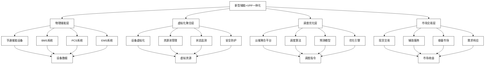
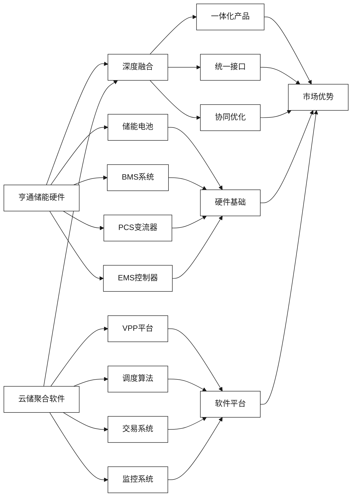

# 新型储能与虚拟电厂一体化

[首页](../README.md) > [技术解决方案](./README.md) > 新型储能与虚拟电厂一体化

## 问答导引


### Q1: 新型储能与虚拟电厂一体化的核心理念是什么？
**A1:** 新型储能与虚拟电厂一体化的核心理念是：
- **硬件+软件深度融合**：亨通储能设备与云储聚合VPP平台原生集成
- **物理+虚拟协同**：物理储能设备通过虚拟化技术形成聚合资源池
- **本地+云端协同**：本地储能控制与云端调度优化相结合
- **即插即用**：储能设备可快速接入VPP平台，实现自动化管理
- **服务化运营**：从产品销售向"储能即服务"模式转变

### Q2: 一体化方案如何实现储能设备的聚合调度？
**A2:** 聚合调度通过以下机制实现：
- **标准化接口**：统一的设备通信协议和数据格式
- **实时监控**：7×24小时设备状态监测和数据采集
- **智能调度**：基于AI算法的多目标优化调度
- **协同控制**：多个储能设备的协调一致动作
- **自适应优化**：根据运行反馈持续优化调度策略

### Q3: 一体化方案在电力市场中如何创造价值？
**A3:** 价值创造体现在多个层面：
- **容量价值**：向电网提供备用容量服务
- **能量价值**：通过峰谷套利获取电价差收益
- **调节价值**：提供调频、调压等辅助服务
- **可靠性价值**：提升电网稳定性和供电可靠性
- **环境价值**：促进新能源消纳和碳减排

## 技术架构图



### 架构层级说明

| 层级 | 主要功能 | 关键技术 | 责任方 |
|------|----------|----------|--------|
| 物理储能层 | 能量存储和转换 | 电池技术、功率变换 | 亨通集团 |
| 虚拟化聚合层 | 设备抽象和管理 | 虚拟化技术、物联网 | 双方合作 |
| 调度优化层 | 智能调度决策 | AI算法、优化算法 | 云储聚合 |
| 市场交易层 | 电力市场参与 | 交易策略、风险管理 | 云储聚合 |

## 核心技术融合

### 硬件与软件深度融合



### 技术融合要点

1. **原生集成设计**
   - 储能设备出厂即支持VPP协议
   - 统一的数据格式和通信标准
   - 硬件预留软件功能接口

2. **实时双向通信**
   - 毫秒级指令传输时延
   - 高可靠性通信保障
   - 多重冗余通信链路

3. **协同优化算法**
   - 硬件约束与软件算法联合优化
   - 设备特性与调度策略匹配
   - 实时性能与长期寿命平衡

## 应用场景分析

### 工商业储能聚合场景

#### 场景描述
在工业园区、商业楼宇部署分布式储能，通过VPP平台实现聚合调度，参与电力市场交易。

#### 技术方案
- **储能配置**：500kWh-2MWh模块化储能系统
- **通信方案**：光纤+4G/5G混合通信
- **调度策略**：基于电价预测的充放电优化
- **收益模式**：峰谷套利+需求响应+辅助服务

#### 价值分析
| 价值类型 | 年收益估算 | 投资回收期 | 关键成功因素 |
|----------|------------|------------|------------|
| 峰谷套利 | 150-200万元/MW | 5-7年 | 电价差幅度 |
| 需求响应 | 50-100万元/MW | 3-5年 | 响应频次 |
| 辅助服务 | 100-150万元/MW | 4-6年 | 服务质量 |

### 台区储能聚合场景

#### 场景描述
在配电台区部署小容量储能，通过聚合形成虚拟电厂，为配电网提供支撑服务。

#### 技术方案
- **储能配置**：50-200kWh小型储能系统
- **聚合规模**：单个VPP聚合10-50个台区
- **控制策略**：分层分布式协调控制
- **服务内容**：电压调节+负荷平衡+故障支撑

#### 关键技术挑战
1. **小容量设备管理**：海量小设备的高效管理
2. **通信成本控制**：低成本可靠通信方案
3. **收益分配机制**：公平合理的收益分享
4. **运维服务**：低成本远程运维模式

### 电网侧储能场景

#### 场景描述
在变电站或独立站址建设大规模储能，通过VPP平台参与电力市场。

#### 技术方案
- **储能配置**：10-100MWh大规模储能系统
- **控制方式**：集中式控制+分布式执行
- **市场参与**：现货市场+辅助服务+容量市场
- **技术特点**：高功率密度+快速响应+长周期调节

## 关键技术创新

### 1. 统一调度协议

#### 协议设计原则
- **标准化**：遵循IEC61850等国际标准
- **扩展性**：支持不同厂家设备接入
- **安全性**：端到端加密通信
- **实时性**：支持毫秒级响应

#### 协议架构
```
应用层：VPP调度指令
表示层：数据格式转换
会话层：连接管理
传输层：TCP/UDP传输
网络层：IP路由
数据链路层：以太网/光纤
物理层：通信介质
```

### 2. 多目标优化算法

#### 优化目标
- **经济性**：最大化运营收益
- **可靠性**：确保电网稳定运行
- **安全性**：保障设备安全运行
- **环保性**：促进新能源消纳

#### 算法架构
```python
# 多目标优化伪代码
def multi_objective_optimization():
    objectives = [
        maximize_revenue(),
        ensure_reliability(),
        maintain_safety(),
        promote_renewable()
    ]
    
    constraints = [
        power_balance_constraint(),
        capacity_constraint(),
        ramping_constraint(),
        soc_constraint()
    ]
    
    solution = nsga2_algorithm(objectives, constraints)
    return solution
```

### 3. 预测性维护

#### 技术路线
1. **数据采集**：多传感器融合数据采集
2. **特征提取**：关键健康指标提取
3. **模型训练**：机器学习模型训练
4. **状态预测**：设备健康状态预测
5. **维护决策**：最优维护策略决策

#### 关键指标
- **电池健康度（SOH）**：电池容量衰减评估
- **系统效率**：能量转换效率监测
- **故障预警**：潜在故障提前预警
- **寿命预测**：设备剩余寿命预测

## 商业模式创新

### "储能即服务"模式

#### 模式特点
- **轻资产运营**：用户无需大额投资
- **专业化服务**：专业团队运营维护
- **收益共享**：用户与服务商共享收益
- **风险转移**：技术和市场风险转移

#### 服务内容
| 服务类型 | 服务内容 | 收费模式 | 价值创造 |
|----------|----------|----------|----------|
| 设备服务 | 设备提供、安装调试 | 租赁费 | 降低初期投资 |
| 运营服务 | 日常运营、维护保养 | 服务费 | 提升运营效率 |
| 交易服务 | 电力市场交易代理 | 佣金 | 增加收益来源 |
| 数据服务 | 数据分析、报告生成 | 订阅费 | 提供决策支持 |

### 合作收益分配

#### 分配原则
- **价值贡献**：按照各方价值贡献比例分配
- **风险承担**：风险与收益相匹配
- **激励相容**：激励各方积极参与
- **动态调整**：根据市场变化动态调整

#### 典型分配方案
```
总收益 = 峰谷套利收益 + 辅助服务收益 + 容量收益
设备方（亨通）：40-50%
平台方（云储聚合）：30-40%
用户方：20-30%
```

## 技术标准与规范

### 国际标准对接

1. **IEC 61850**：变电站通信协议
2. **IEC 62351**：电力系统网络安全
3. **IEEE 2030.5**：智能电网互操作性
4. **OpenADR**：自动需求响应标准

### 国内标准制定

1. **储能接入标准**：储能设备并网技术规范
2. **VPP运营标准**：虚拟电厂运营管理规范
3. **数据交换标准**：储能数据交换格式规范
4. **安全防护标准**：储能网络安全防护要求

## 示范项目案例

### 南通分布式储能VPP项目

#### 项目概况
- **规模**：100MW/200MWh
- **节点数**：200个分布式储能站点
- **覆盖范围**：南通市主要工业园区
- **运营模式**：储能即服务+VPP聚合

#### 技术方案
- **亨通贡献**：储能设备+系统集成
- **云储聚合贡献**：VPP平台+运营服务
- **通信方案**：光纤骨干网+5G接入
- **调度策略**：分层分布式协调控制

#### 运营效果
- **容量因子**：85%
- **响应时间**：<2秒
- **年收益率**：12-15%
- **投资回收期**：6-8年

### 工业园区储能示范项目

#### 项目概况
- **地点**：苏州工业园区
- **规模**：10MW/20MWh
- **用户类型**：高载能制造企业
- **建设模式**：EPC+O&M一体化

#### 创新亮点
1. **光储充一体化**：储能+光伏+充电桩集成
2. **智能微网**：孤网运行能力
3. **碳管理**：碳足迹跟踪和碳交易
4. **数字孪生**：全生命周期数字化管理

## 发展趋势与展望

### 技术发展趋势

1. **规模化发展**：从MW级向GW级发展
2. **标准化程度**：设备和接口标准化
3. **智能化水平**：AI算法广泛应用
4. **安全性提升**：网络安全和系统安全

### 市场发展前景

1. **政策支持**：国家和地方政策持续支持
2. **市场规模**：储能市场快速扩张
3. **成本下降**：技术进步推动成本下降
4. **应用拓展**：应用场景不断拓展

### 挑战与机遇

#### 主要挑战
1. **技术挑战**：大规模设备协调控制
2. **市场挑战**：电力市场机制不完善
3. **标准挑战**：行业标准尚不统一
4. **成本挑战**：初期投资成本较高

#### 发展机遇
1. **政策机遇**：碳达峰碳中和目标
2. **技术机遇**：储能技术快速发展
3. **市场机遇**：电力市场化改革
4. **应用机遇**：新能源大规模接入

## 相关资源

### 内部链接
- [并网安全与标准合规](./光纤通信与储能数实融合.md) - 了解光纤通信在储能中的应用
- [云边协同与AI算法优化](./云边协同与AI智能运维.md) - 探索AI智能运维技术
- [储能市场趋势与政策机遇](../市场机遇与商业模式/工商业储能聚合模式.md) - 分析市场机遇
- [技术整合与平台对接](../实施策略与合作模式/技术整合与平台对接.md) - 查看具体技术整合方案
- [亨通集团智慧能源板块分析](../企业概况与核心能力/亨通集团智慧能源板块分析.md) - 了解亨通技术基础

### 外部参考
- [国际储能技术标准](https://www.iec.ch)
- [中国储能产业发展报告](https://www.cnesa.org)

---

**导航**
- [上一页：技术解决方案](./README.md)
- [下一页：光纤通信与储能数实融合](./光纤通信与储能数实融合.md)
- [返回首页](../README.md)