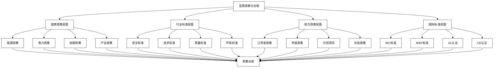

# 监管政策与合规

[首页](../README.md) > 监管政策与合规

## 概述

本章节系统分析储能行业的监管政策环境和合规要求，为亨通集团与云储聚合的合作提供政策指导和合规保障。涵盖安全合规与国际认证、双碳目标与地方政策对接等关键领域。

## 政策框架体系



## 章节内容

### [安全合规与国际认证](./安全合规与国际认证.md)
深入分析储能系统的安全合规要求和国际认证标准，包括VDE-AR-N-4100等国际储能并网认证，以及设备+平台一体的安全策略。

### [双碳目标与地方政策对接](./双碳目标与地方政策对接.md)
分析双碳目标下的政策机遇和地方政策支持，重点关注江苏省储能与虚拟电厂参与电力市场的政策环境。

## 政策环境概览

### 国家政策支持

#### 核心政策文件
| 政策文件 | 发布时间 | 主要内容 | 对储能的影响 |
|----------|----------|----------|-------------|
| **新型储能发展指导意见** | 2021.07 | 明确储能发展目标 | 政策支持明确 |
| **碳达峰行动方案** | 2021.10 | 2030年碳达峰路径 | 储能需求增长 |
| **新型电力系统指导意见** | 2022.01 | 构建新型电力系统 | 储能地位重要 |
| **储能参与电力市场规则** | 2022.05 | 市场化机制建立 | 商业模式清晰 |

#### 政策支持力度
- **装机目标**：2025年新型储能装机30GW以上
- **市场准入**：放开储能参与各类电力市场
- **税收政策**：储能设备享受设备投资税收优惠
- **并网政策**：简化储能项目并网流程

### 地方政策环境

#### 江苏省政策优势
- **发展规划**：2025年储能装机5GW，全国领先
- **市场机制**：电力现货市场和辅助服务市场完善
- **示范项目**：多个储能示范项目获得支持
- **产业配套**：完善的储能产业链配套

#### 政策机遇窗口
1. **双碳目标**：2030年前碳达峰，2060年前碳中和
2. **新型电力系统**：构建以新能源为主体的新型电力系统
3. **电力市场化**：电力市场化改革深化
4. **产业升级**：制造业绿色转型升级

## 合规要求分析

### 安全合规体系

#### 国家标准要求
- **GB/T 36558**：电力系统电化学储能系统通用技术条件
- **GB/T 36548**：电化学储能电站设计规范
- **GB/T 36549**：电化学储能电站运行维护规程
- **GB/T 51048**：电化学储能电站工程设计规范

#### 行业准入门槛
1. **技术资质**：储能设备制造资质
2. **安全资质**：安全生产许可证
3. **电力资质**：电力工程承装承修资质
4. **交易资质**：电力市场交易资质

### 国际认证要求

#### 主要认证标准
- **IEC 62619**：锂离子电池安全要求
- **UL 1973**：固定式储能系统安全标准
- **VDE-AR-N-4100**：德国储能并网技术规范
- **IEEE 1547**：美国分布式电源并网标准

#### 认证价值
1. **市场准入**：获得国际市场准入资格
2. **技术认可**：获得国际技术认可
3. **风险降低**：降低产品责任风险
4. **品牌提升**：提升国际品牌形象

## 合规管理体系

### 合规组织架构

#### 合规管理框架
```
合规委员会
├── 政策研究组
├── 标准制定组
├── 认证管理组
└── 风险控制组
```

#### 职责分工
- **政策研究组**：跟踪政策动态，分析政策影响
- **标准制定组**：参与标准制定，推动标准完善
- **认证管理组**：管理认证流程，维护认证资质
- **风险控制组**：识别合规风险，制定防范措施

### 合规流程管理

#### 合规流程
1. **政策跟踪**：及时跟踪政策法规变化
2. **影响评估**：评估政策对业务的影响
3. **合规审查**：审查业务活动的合规性
4. **风险防范**：制定合规风险防范措施
5. **整改落实**：落实合规整改要求

#### 合规工具
- **合规清单**：建立合规要求清单
- **合规手册**：制定合规操作手册
- **合规培训**：定期开展合规培训
- **合规审计**：定期进行合规审计

## 风险防范

### 合规风险识别

#### 主要风险类型
1. **政策风险**：政策变化导致的合规风险
2. **标准风险**：标准变化导致的技术风险
3. **认证风险**：认证失效导致的市场风险
4. **监管风险**：监管处罚导致的经营风险

#### 风险影响
- **业务中断**：不合规导致业务无法开展
- **经济损失**：合规违规导致罚款损失
- **声誉损害**：合规问题影响企业声誉
- **市场准入**：失去市场准入资格

### 风险防范措施

#### 预防措施
1. **建立机制**：建立合规管理机制
2. **专业团队**：配备专业合规团队
3. **定期检查**：定期进行合规检查
4. **培训教育**：加强合规培训教育

#### 应对措施
1. **快速响应**：建立快速响应机制
2. **专业咨询**：寻求专业法律咨询
3. **积极整改**：积极配合监管整改
4. **危机公关**：做好危机公关处理

## 政策建议

### 对政府的建议

#### 政策完善建议
1. **政策稳定性**：保持政策的连续性和稳定性
2. **标准统一**：推动储能标准的统一和完善
3. **市场机制**：完善储能参与电力市场机制
4. **支持政策**：加大对储能产业的支持力度

#### 监管优化建议
1. **简化流程**：简化储能项目审批流程
2. **包容监管**：对新技术新模式采用包容监管
3. **协同监管**：加强部门间协同监管
4. **国际合作**：加强储能领域国际合作

### 对企业的建议

#### 合规管理建议
1. **重视合规**：高度重视合规管理工作
2. **投入资源**：加大合规管理资源投入
3. **专业化**：建设专业化合规团队
4. **持续改进**：持续改进合规管理体系

#### 发展策略建议
1. **政策导向**：紧跟政策导向发展
2. **标准引领**：积极参与标准制定
3. **国际化**：推进国际化发展战略
4. **创新发展**：加强技术创新发展

## 相关章节

- [企业概况与核心能力](../企业概况与核心能力/README.md) - 了解合规能力基础
- [技术解决方案](../技术解决方案/README.md) - 理解技术合规要求
- [市场机遇与商业模式](../市场机遇与商业模式/README.md) - 把握政策机遇
- [实施策略与合作模式](../实施策略与合作模式/README.md) - 制定合规策略

---

**导航**
- [上一章节：市场机遇与商业模式](../市场机遇与商业模式/README.md)
- [下一章节：实施策略与合作模式](../实施策略与合作模式/README.md)
- [返回首页](../README.md)