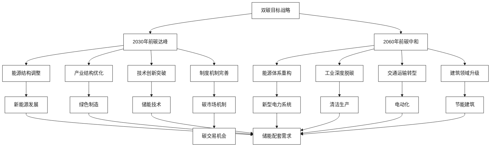
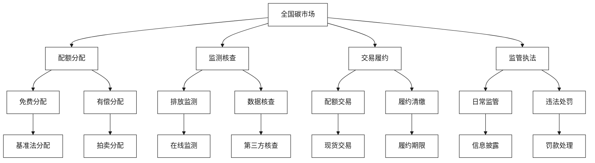

# 双碳目标与地方政策对接

[首页](../README.md) > [监管政策与合规](./README.md) > 双碳目标与地方政策对接

## 问答导引

### Q1: 双碳目标对储能行业带来了哪些机遇？
**A1:** 双碳目标为储能行业带来的机遇包括：
- **政策支持**：国家将储能作为实现双碳目标的重要手段
- **市场需求**：新能源大规模发展需要储能配套
- **投资机会**：绿色金融和碳市场为储能投资提供支持
- **技术驱动**：双碳目标推动储能技术创新发展
- **产业升级**：传统能源企业向新能源转型需要储能

### Q2: 江苏省在储能与虚拟电厂政策方面有哪些优势？
**A2:** 江苏省政策优势体现在：
- **先行先试**：在全国率先开展储能与VPP示范应用
- **政策完善**：电力现货市场和辅助服务市场机制完善
- **资金支持**：省级财政对储能项目给予专项支持
- **产业配套**：完善的储能产业链和技术服务体系
- **应用场景**：丰富的工商业和电网侧应用场景

### Q3: 双方如何联合申报地方试点项目获得政策支持？
**A3:** 联合申报策略包括：
- **优势互补**：亨通的制造能力+云储聚合的平台技术
- **方案完整**：提供硬件+软件+服务的完整解决方案
- **示范意义**：项目具有典型示范和推广价值
- **政策对接**：紧密对接地方政策导向和支持重点
- **产业带动**：项目能够带动当地储能产业发展

## 双碳政策框架

### 国家双碳战略

#### 政策目标与路径


#### 核心政策文件
| 政策文件 | 发布时间 | 主要内容 | 储能相关要求 |
|----------|----------|----------|-------------|
| **碳达峰行动方案** | 2021.10 | 2030年前碳达峰路径 | 大力发展新型储能 |
| **碳中和技术路线图** | 2021.12 | 技术发展路径 | 储能关键技术突破 |
| **新型电力系统指导意见** | 2022.01 | 电力系统转型 | 储能是重要支撑 |
| **"十四五"现代能源体系规划** | 2022.03 | 能源发展规划 | 储能装机30GW+ |

### 储能在双碳中的作用

#### 关键作用机制
1. **新能源消纳**：解决新能源间歇性和波动性问题
2. **电网调峰**：缓解电网峰谷差压力
3. **系统调频**：提供快速频率响应服务
4. **能效提升**：提高整体能源利用效率
5. **碳减排**：减少化石能源消费和碳排放

#### 量化贡献分析
**储能对碳减排的贡献**：
- **新能源利用率提升**：从95%提升到98%
- **化石能源替代**：每MWh储能可替代1.5MWh火电
- **碳减排效果**：每MWh储能年减排CO2约600吨
- **经济价值**：按碳价50元/吨计算，年价值3万元/MWh

## 江苏省政策环境

### 省级政策体系

#### 主要政策文件
```mermaid
%%{init: {
  'theme':'base',
  'themeVariables': {
    'primaryColor':'#ffffff',
    'primaryTextColor':'#1a1a1a',
    'secondaryColor':'#f7f7f7',
    'secondaryTextColor':'#1a1a1a',
    'primaryBorderColor':'#1a1a1a',
    'lineColor':'#1a1a1a'
  }
}}%%
flowchart TB
    A[江苏省储能政策体系] --> B[发展规划]
    A --> C[支持政策]
    A --> D[市场机制]
    A --> E[示范项目]
    
    B --> F[江苏省"十四五"能源发展规划]
    B --> G[江苏省碳达峰实施方案]
    B --> H[新型储能发展实施意见]
    
    C --> I[财政补贴政策]
    C --> J[税收优惠政策]
    C --> K[用地支持政策]
    C --> L[金融支持政策]
    
    D --> M[电力现货市场]
    D --> N[辅助服务市场]
    D --> O[绿电交易市场]
    D --> P[碳交易市场]
    
    E --> Q[镇江储能示范]
    E --> R[南通聚合储能]
    E --> S[苏州园区储能]
    E --> T[无锡数据中心储能]
```

#### 发展目标
**江苏省储能发展目标**：
- **2025年目标**：新型储能装机5GW，全国领先
- **2030年目标**：新型储能装机15GW，建成储能强省
- **技术目标**：掌握储能核心技术，形成完整产业链
- **应用目标**：储能在电力系统中发挥重要作用

#### 支持政策措施
1. **财政支持**
   - 储能项目建设补贴：0.3元/Wh
   - 储能运营补贴：0.1元/kWh
   - 研发创新补贴：项目投资额的10%

2. **税收优惠**
   - 储能设备增值税减免
   - 企业所得税优惠
   - 进口设备关税减免

3. **用地支持**
   - 储能项目用地优先保障
   - 土地出让金减免
   - 简化用地审批流程

4. **金融支持**
   - 绿色金融专项资金
   - 政府产业引导基金
   - 银行贷款利率优惠

### 地市级政策

#### 南京市政策
**南京市新型储能发展行动计划（2023-2025）**
- **发展目标**：建成储能装机1GW
- **支持政策**：储能项目补贴0.3元/Wh
- **重点领域**：工商业储能、电网侧储能
- **示范项目**：建设10个示范项目

#### 苏州市政策
**苏州市储能产业发展规划**
- **产业目标**：形成500亿元储能产业规模
- **技术目标**：突破储能关键技术
- **应用目标**：建设储能应用示范城市
- **政策支持**：设立储能产业发展基金

#### 南通市政策
**南通市分布式储能聚合应用示范**
- **示范规模**：聚合储能500MW
- **技术路线**：分布式储能+虚拟电厂
- **商业模式**：储能即服务+聚合运营
- **政策支持**：示范项目专项支持

#### 镇江市政策
**镇江市储能示范区建设方案**
- **建设目标**：建成国家级储能示范区
- **发展重点**：电网侧储能、用户侧储能
- **产业配套**：引进储能龙头企业
- **政策创新**：储能参与电力市场机制创新

## 政策机遇分析

### 重大政策机遇

#### 1. 新型储能专项政策
**政策内容**：
- 明确储能在新型电力系统中的定位
- 建立储能参与电力市场机制
- 完善储能价格政策和补偿机制
- 加大储能技术创新支持力度

**机遇分析**：
- 政策地位明确，发展前景广阔
- 市场化机制建立，商业模式清晰
- 技术创新支持，竞争优势明显
- 产业链完善，协同发展空间大

#### 2. 虚拟电厂试点政策
**政策内容**：
- 开展虚拟电厂示范应用
- 建立虚拟电厂参与电力市场机制
- 完善虚拟电厂技术标准
- 培育虚拟电厂市场主体

**机遇分析**：
- 云储聚合具备技术和经验优势
- 亨通具备设备和工程能力
- 双方合作形成完整解决方案
- 江苏省是重点试点区域

#### 3. 绿色金融政策
**政策内容**：
- 设立绿色发展基金
- 发行绿色债券支持储能项目
- 银行提供绿色信贷支持
- 保险公司提供绿色保险

**机遇分析**：
- 降低储能项目融资成本
- 拓宽储能项目融资渠道
- 提供风险保障和信用支持
- 促进储能产业规模化发展

### 试点项目机遇

#### 国家级试点项目
1. **新型储能示范项目**
   - 申报条件：技术先进、模式创新
   - 支持力度：国家专项资金支持
   - 申报优势：双方技术和资源互补

2. **虚拟电厂示范项目**
   - 申报条件：聚合规模大、技术成熟
   - 支持力度：政策先行先试
   - 申报优势：云储聚合平台能力强

3. **综合能源服务示范**
   - 申报条件：多能互补、智能高效
   - 支持力度：政策和资金双重支持
   - 申报优势：光储充一体化方案

#### 省级试点项目
1. **江苏省储能聚合示范**
   - 项目内容：分布式储能聚合应用
   - 支持政策：省级专项资金
   - 合作优势：本土企业优先

2. **江苏省虚拟电厂试点**
   - 项目内容：虚拟电厂平台建设
   - 支持政策：市场机制创新
   - 合作优势：技术领先、经验丰富

## 碳市场机制

### 全国碳市场

#### 市场机制


#### 储能在碳市场中的作用
1. **碳减排项目**：储能项目可开发为碳减排项目
2. **CCER机制**：中国核证自愿减排量
3. **碳抵消**：为控排企业提供碳抵消服务
4. **绿色价值**：体现储能的环境价值

#### 经济价值测算
**储能项目碳减排收益**：
- **减排量**：1MWh储能年减排600吨CO2
- **碳价格**：50元/吨CO2（预期）
- **年收益**：600×50=3万元/MWh
- **20年总收益**：60万元/MWh

### 江苏省碳市场

#### 试点经验
江苏省作为碳交易试点省份，具有丰富的碳市场运行经验：
- **覆盖行业**：电力、石化、化工、建材、钢铁、有色
- **参与企业**：800多家重点排放单位
- **交易规模**：累计交易量超过1亿吨
- **价格水平**：20-30元/吨CO2

#### 政策创新
1. **储能碳减排方法学**：制定储能项目碳减排核算方法
2. **绿色电力证书**：储能配套新能源可获得绿证
3. **碳普惠机制**：小微储能项目参与碳普惠
4. **碳金融产品**：开发储能碳金融产品

## 政策对接策略

### 政策跟踪机制

#### 跟踪体系
```
政策跟踪体系
├── 国家层面
│   ├── 发改委政策
│   ├── 能源局政策
│   ├── 工信部政策
│   └── 生态环境部政策
├── 省级层面
│   ├── 江苏省发改委
│   ├── 江苏省工信厅
│   ├── 江苏省能源局
│   └── 江苏能监办
├── 地市层面
│   ├── 南京市政策
│   ├── 苏州市政策
│   ├── 南通市政策
│   └── 镇江市政策
└── 行业层面
    ├── 电网公司政策
    ├── 行业协会政策
    └── 标准化组织
```

#### 跟踪流程
1. **信息收集**：多渠道收集政策信息
2. **分析研判**：深入分析政策影响
3. **机遇识别**：识别政策机遇和风险
4. **策略制定**：制定政策对接策略
5. **行动实施**：实施政策对接行动

### 试点申报策略

#### 申报优势分析
**亨通集团优势**：
- 储能设备制造能力强
- 系统集成经验丰富
- 光纤通信技术领先
- 全球化市场网络

**云储聚合优势**：
- 虚拟电厂平台技术先进
- 电力市场运营经验丰富
- 政策理解深度
- 本土化服务能力

**联合优势**：
- 硬件+软件完整方案
- 制造+运营全链条服务
- 技术+市场双重优势
- 本土+全球双重布局

#### 申报重点项目

#### 1. 江苏省新型储能示范项目
**项目概念**：分布式储能聚合虚拟电厂示范
**技术特色**：
- 光纤通信+储能深度融合
- 云边协同AI智能运维
- 多市场协同优化调度

**示范价值**：
- 技术创新示范
- 商业模式示范
- 政策机制示范

**申报策略**：
- 选择典型应用场景
- 突出技术创新点
- 强调示范推广价值

#### 2. 虚拟电厂建设试点项目
**项目概念**：工商业储能虚拟电厂平台
**核心内容**：
- 聚合100MW储能资源
- 参与电力市场交易
- 提供综合能源服务

**政策对接**：
- 符合虚拟电厂试点要求
- 体现储能聚合价值
- 展现平台运营能力

#### 3. 综合能源服务示范项目
**项目概念**：园区光储充综合能源服务
**服务内容**：
- 光伏+储能+充电桩
- 能源管理+优化调度
- 碳资产+绿电交易

**申报亮点**：
- 多能互补集成优化
- 智能化管理服务
- 绿色低碳发展

### 政策对接行动

#### 政府关系维护
1. **建立联系**：与政府部门建立定期联系
2. **政策建议**：为政府制定政策提供建议
3. **试点参与**：积极参与政府组织的试点
4. **交流合作**：参与政府组织的交流活动

#### 行业影响力提升
1. **标准制定**：参与行业标准制定
2. **论坛发声**：在行业论坛发声
3. **案例分享**：分享成功案例经验
4. **媒体宣传**：通过媒体提升影响力

#### 产学研合作
1. **高校合作**：与知名高校开展合作
2. **科研院所**：与科研院所联合研发
3. **技术创新**：开展前沿技术研究
4. **人才培养**：培养行业专业人才

## 政策风险管理

### 政策风险识别

#### 主要风险类型
1. **政策变化风险**
   - 支持政策调整或取消
   - 市场机制规则变化
   - 补贴标准下调
   - 技术标准变更

2. **执行风险**
   - 地方执行偏差
   - 审批流程复杂
   - 资金拨付延迟
   - 监管要求严格

3. **竞争风险**
   - 政策支持力度分散
   - 竞争对手获得更多支持
   - 市场准入门槛提高
   - 技术路线选择错误

#### 风险影响评估
| 风险类型 | 发生概率 | 影响程度 | 风险等级 | 应对优先级 |
|----------|----------|----------|----------|------------|
| 补贴政策调整 | 中 | 高 | 高 | 高 |
| 市场机制变化 | 低 | 高 | 中 | 中 |
| 技术标准变更 | 中 | 中 | 中 | 中 |
| 审批流程复杂 | 高 | 低 | 中 | 低 |

### 风险防范措施

#### 政策风险防范
1. **多元化布局**：不过度依赖单一政策
2. **技术储备**：保持技术先进性和适应性
3. **合规管理**：严格遵守政策法规要求
4. **关系维护**：与政府部门保持良好关系

#### 执行风险防范
1. **专业团队**：建立专业的政策事务团队
2. **流程优化**：优化内部申报和执行流程
3. **外部资源**：利用外部专业服务机构
4. **经验积累**：总结积累政策执行经验

## 政策建议

### 对政府的建议

#### 政策完善建议
1. **政策稳定性**：保持储能支持政策的连续性
2. **机制创新**：创新储能参与电力市场机制
3. **标准统一**：统一储能技术和安全标准
4. **试点扩大**：扩大储能和虚拟电厂试点范围

#### 实施优化建议
1. **简化流程**：简化储能项目审批流程
2. **提高效率**：提高政策执行效率
3. **加强监管**：加强储能项目事中事后监管
4. **完善服务**：完善储能项目配套服务

### 对行业的建议

#### 发展策略建议
1. **政策导向**：紧跟政策导向发展
2. **技术创新**：加强储能技术创新
3. **标准制定**：积极参与标准制定
4. **国际合作**：加强国际交流合作

#### 合作发展建议
1. **产业协同**：加强产业链上下游协同
2. **资源共享**：实现优势资源共享
3. **风险共担**：建立风险共担机制
4. **收益共享**：建立合理的收益分配机制

## 发展展望

### 政策环境展望
1. **支持力度**：储能支持政策将持续加强
2. **市场机制**：储能参与电力市场机制将更加完善
3. **标准体系**：储能标准体系将更加健全
4. **国际合作**：储能国际合作将更加深入

### 发展机遇展望
1. **市场规模**：储能市场规模将快速增长
2. **技术进步**：储能技术水平将显著提升
3. **成本下降**：储能成本将持续下降
4. **应用拓展**：储能应用场景将不断拓展

### 合作前景展望
1. **政策支持**：双方合作将获得更多政策支持
2. **市场机会**：合作将创造更多市场机会
3. **技术创新**：合作将推动技术创新发展
4. **品牌提升**：合作将提升双方品牌影响力

## 相关资源

### 内部链接
- [安全合规与国际认证](./安全合规与国际认证.md)
- [新型储能与虚拟电厂一体化](../技术解决方案/新型储能与虚拟电厂一体化.md)
- [工商业储能聚合模式](../市场机遇与商业模式/工商业储能聚合模式.md)

### 外部参考
- [国家发展改革委](https://www.ndrc.gov.cn)
- [国家能源局](http://www.nea.gov.cn)
- [江苏省发展改革委](http://fzggw.jiangsu.gov.cn)
- [全国碳市场](http://www.tanjiaoyi.com)

---

**导航**
- [上一页：安全合规与国际认证](./安全合规与国际认证.md)
- [下一页：实施策略与合作模式](../实施策略与合作模式/README.md)
- [返回首页](../README.md)