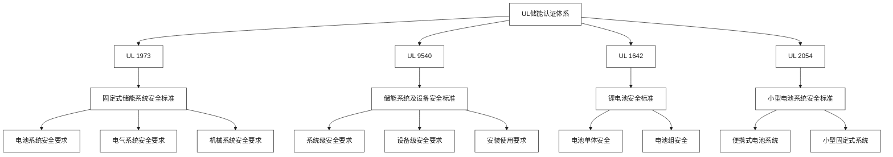
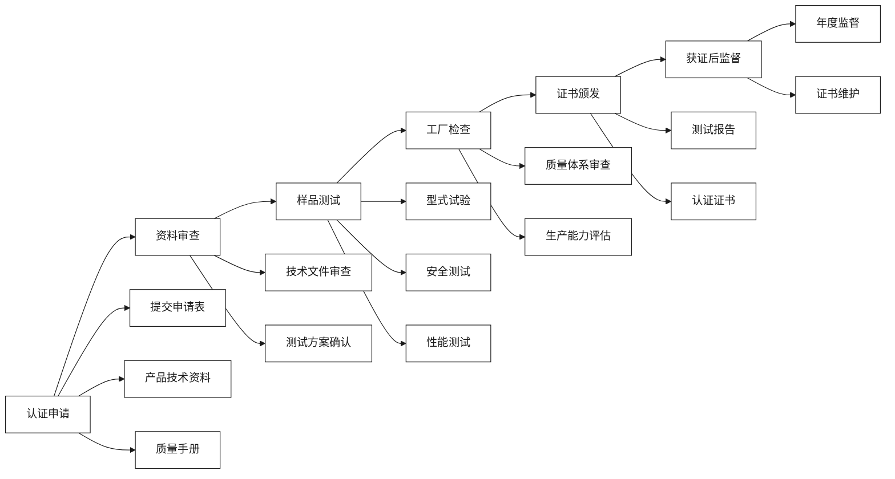
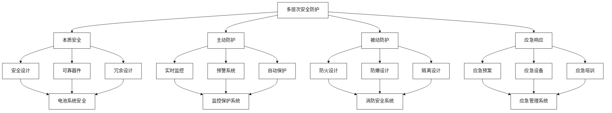
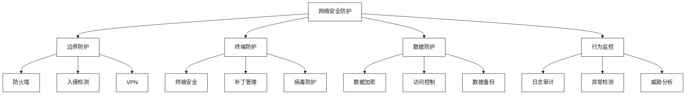

# 安全合规与国际认证

[首页](../README.md) > [监管政策与合规](./README.md) > 安全合规与国际认证

## 问答导引

### Q1: 储能系统的安全合规为什么如此重要？
**A1:** 储能系统安全合规的重要性体现在：
- **人身安全**：防止火灾、爆炸等安全事故
- **设备安全**：确保设备长期稳定运行
- **电网安全**：避免对电网造成冲击和影响
- **法律要求**：满足国家法律法规要求
- **市场准入**：获得市场准入和保险保障

### Q2: 亨通推进的VDE-AR-N-4100认证有什么价值？
**A2:** VDE-AR-N-4100认证的价值包括：
- **技术权威性**：德国电气工程师协会权威认证
- **国际认可度**：欧洲乃至全球储能并网标准
- **市场准入**：进入德国及欧洲市场的必要条件
- **技术标杆**：代表储能技术的先进水平
- **竞争优势**：获得国际市场竞争优势

### Q3: 双方如何共同制定设备+平台一体的安全策略？
**A3:** 一体化安全策略包括：
- **硬件安全**：亨通负责储能设备的本质安全
- **软件安全**：云储聚合负责平台和通信安全
- **系统安全**：共同制定系统级安全策略
- **运行安全**：建立联合安全运行机制
- **应急响应**：制定统一的应急响应预案

## 安全合规体系

### 国家标准体系

#### 基础标准

```mermaid
%%{init: {
  'theme':'base',
  'darkMode': true,
  'themeVariables': {
    'primaryColor':'#ffffff',
    'primaryTextColor':'#1a1a1a',
    'secondaryColor':'#f7f7f7',
    'secondaryTextColor':'#1a1a1a',
    'primaryBorderColor':'#1a1a1a',
    'lineColor':'#1a1a1a'
  },
  'darkThemeVariables': {
    'primaryColor':'#1a1a1a',
    'primaryTextColor':'#ffffff',
    'secondaryColor':'#333333',
    'secondaryTextColor':'#ffffff',
    'primaryBorderColor':'#ffffff',
    'lineColor':'#ffffff'
  }
}}%%
graph TB
    A[国家储能标准体系] --> B[基础标准]
    A --> C[产品标准]
    A --> D[工程标准]
    A --> E[管理标准]
    
    B --> F[GB/T 36558 通用技术条件]
    B --> G[GB/T 36560 电池管理系统]
    B --> H[GB/T 36561 功率变换系统]
    
    C --> I[GB/T 36276 电池安全要求]
    C --> J[GB/T 36972 消防安全要求]
    C --> K[GB/T 37293 电磁兼容要求]
    
    D --> L[GB/T 36548 设计规范]
    D --> M[GB/T 51048 工程设计规范]
    D --> N[GB/T 36549 运维规程]
    
    E --> O[GB/T 36957 验收规范]
    E --> P[GB/T 37186 监控系统]
    E --> Q[GB/T 37187 检测评估]
```


#### 核心标准解读

**GB/T 36558-2018 电力系统电化学储能系统通用技术条件**
- **适用范围**：电力系统用电化学储能系统
- **技术要求**：电气性能、安全性能、环境适应性
- **试验方法**：型式试验、出厂试验、现场试验
- **标识要求**：产品标识、警告标识、操作标识

**GB/T 36972-2018 电力储能用电池管理系统**
- **功能要求**：电池状态监测、安全保护、均衡控制
- **性能指标**：测量精度、响应时间、通信协议
- **安全要求**：过充过放保护、温度保护、绝缘监测
- **可靠性要求**：故障率、平均无故障时间

### 行业标准体系

#### 电力行业标准
| 标准编号 | 标准名称 | 主要内容 | 适用范围 |
|----------|----------|----------|----------|
| **DL/T 1729** | 电化学储能电站并网运行控制规范 | 并网控制要求 | 电网侧储能 |
| **DL/T 1947** | 电化学储能电站运行维护规程 | 运维管理要求 | 所有储能电站 |
| **DL/T 2080** | 电化学储能电站火灾防护装置技术要求 | 消防安全要求 | 储能电站 |
| **DL/T 2081** | 电化学储能电站安全监控系统技术要求 | 安全监控要求 | 储能电站 |

#### 通信行业标准
- **YD/T 3598**：通信用储能电池系统技术要求
- **YD/T 3599**：通信用储能电池系统试验方法
- **YD/T 3600**：通信用储能电池系统安全要求

## 国际认证体系

### 主要国际认证

#### UL认证体系


#### VDE认证体系
**VDE-AR-N-4100 储能系统并网技术规范**
- **适用范围**：低压电网并网储能系统
- **技术要求**：电能质量、保护功能、通信协议
- **测试方法**：型式测试、工厂检查、现场测试
- **认证流程**：申请→测试→评估→发证→监督

**关键测试项目**：
1. **电能质量测试**：谐波、电压波动、闪变
2. **保护功能测试**：过/欠压保护、过/欠频保护
3. **通信协议测试**：Modbus、IEC 61850协议
4. **EMC测试**：电磁兼容性测试

#### IEC国际标准
| 标准编号 | 标准名称 | 主要内容 | 应用领域 |
|----------|----------|----------|----------|
| **IEC 62619** | 固定式储能用锂离子电池安全要求 | 电池安全要求 | 电池系统 |
| **IEC 62933** | 储能系统安全要求 | 系统安全要求 | 储能系统 |
| **IEC 61727** | 光伏系统并网技术要求 | 并网技术要求 | 光储系统 |
| **IEC 61850** | 变电站通信协议 | 通信协议标准 | 电网侧储能 |

### 认证流程与要求

#### 认证申请流程


#### 认证成本与周期
| 认证类型 | 认证周期 | 认证费用 | 有效期 |
|----------|----------|----------|--------|
| **UL 1973** | 6-12个月 | 20-50万元 | 长期有效 |
| **VDE-AR-N-4100** | 3-6个月 | 15-30万元 | 3年 |
| **IEC 62619** | 4-8个月 | 10-25万元 | 3年 |
| **CE认证** | 2-4个月 | 5-15万元 | 3年 |

## 安全风险管理

### 风险识别与评估

#### 主要安全风险
1. **电池安全风险**
   - 热失控风险
   - 电池老化风险
   - 过充过放风险
   - 机械损伤风险

2. **电气安全风险**
   - 短路风险
   - 绝缘失效风险
   - 电弧风险
   - 电磁干扰风险

3. **系统安全风险**
   - 控制系统故障
   - 通信系统故障
   - 监控系统故障
   - 保护系统故障

4. **环境安全风险**
   - 火灾风险
   - 爆炸风险
   - 有害气体泄漏
   - 环境污染风险

#### 风险评估方法
```python
class SafetyRiskAssessment:
    def __init__(self):
        self.risk_matrix = {
            'probability': {'very_low': 1, 'low': 2, 'medium': 3, 'high': 4, 'very_high': 5},
            'severity': {'negligible': 1, 'minor': 2, 'moderate': 3, 'major': 4, 'catastrophic': 5}
        }
    
    def calculate_risk_level(self, probability, severity):
        """
        计算风险等级
        """
        risk_score = self.risk_matrix['probability'][probability] * self.risk_matrix['severity'][severity]
        
        if risk_score <= 4:
            return 'Low'
        elif risk_score <= 9:
            return 'Medium'
        elif risk_score <= 16:
            return 'High'
        else:
            return 'Critical'
    
    def generate_risk_report(self, risks):
        """
        生成风险评估报告
        """
        report = []
        for risk in risks:
            risk_level = self.calculate_risk_level(risk['probability'], risk['severity'])
            report.append({
                'risk_name': risk['name'],
                'risk_level': risk_level,
                'mitigation_measures': risk['mitigation']
            })
        return report
```

### 安全防护措施

#### 多层次防护体系


#### 关键防护技术
1. **电池管理系统（BMS）**
   - SOC/SOH监测
   - 温度监测
   - 电压均衡
   - 故障诊断

2. **热管理系统**
   - 主动散热
   - 被动散热
   - 温度控制
   - 热失控防护

3. **消防安全系统**
   - 早期火灾预警
   - 自动灭火系统
   - 排烟系统
   - 人员疏散

4. **电气保护系统**
   - 过流保护
   - 过压保护
   - 绝缘监测
   - 接地保护

## 网络安全合规

### 网络安全威胁

#### 主要威胁类型
1. **外部攻击**
   - 网络入侵
   - 恶意软件
   - 拒绝服务攻击
   - 数据窃取

2. **内部威胁**
   - 人员操作失误
   - 内部人员恶意行为
   - 权限滥用
   - 数据泄露

3. **供应链威胁**
   - 设备后门
   - 软件漏洞
   - 第三方服务风险
   - 供应商安全风险

#### 网络安全标准
- **GB/T 22239**：信息安全技术 网络安全等级保护基本要求
- **GB/T 25070**：信息安全技术 网络安全监测预警技术要求
- **ISO 27001**：信息安全管理体系要求
- **IEC 62443**：工业自动化和控制系统安全

### 网络安全防护

#### 技术防护措施


#### 管理防护措施
1. **安全制度**：建立完善的安全管理制度
2. **人员培训**：定期开展网络安全培训
3. **应急预案**：制定网络安全应急预案
4. **定期评估**：定期开展安全风险评估

## 合规管理实践

### 合规管理体系

#### 组织架构
```
安全合规委员会
├── 技术合规组
│   ├── 标准研究
│   ├── 测试验证
│   └── 认证管理
├── 法律合规组
│   ├── 法规跟踪
│   ├── 合同审查
│   └── 纠纷处理
├── 运营合规组
│   ├── 运营监督
│   ├── 风险评估
│   └── 整改落实
└── 培训宣传组
    ├── 培训计划
    ├── 宣传教育
    └── 考核评估
```

#### 合规流程
1. **合规识别**：识别适用的法律法规和标准
2. **合规评估**：评估现状与要求的差距
3. **合规规划**：制定合规行动计划
4. **合规实施**：实施合规措施
5. **合规检查**：定期检查合规情况
6. **合规改进**：持续改进合规管理

### 合规监控与审计

#### 合规监控指标
| 指标类型 | 具体指标 | 目标值 | 监控频率 |
|----------|----------|--------|----------|
| **安全指标** | 安全事故次数 | 0次/年 | 实时 |
| **认证指标** | 认证证书有效性 | 100% | 月度 |
| **标准指标** | 标准符合性 | 100% | 季度 |
| **培训指标** | 人员培训覆盖率 | 100% | 年度 |

#### 合规审计机制
1. **内部审计**：定期开展内部合规审计
2. **外部审计**：委托第三方开展合规审计
3. **专项审计**：针对特定问题开展专项审计
4. **跟踪审计**：对整改情况进行跟踪审计

## 国际合作与标准制定

### 国际合作

#### 主要合作组织
- **IEC TC 120**：国际电工委员会储能系统技术委员会
- **IEEE SCC21**：美国电气电子工程师协会储能标准委员会
- **IRENA**：国际可再生能源机构
- **Global Battery Alliance**：全球电池联盟

#### 合作形式
1. **标准制定**：参与国际标准制定
2. **技术交流**：开展技术交流合作
3. **认证互认**：推动认证结果互认
4. **项目合作**：开展国际项目合作

### 标准制定参与

#### 参与策略
1. **积极参与**：积极参与国际标准制定
2. **技术贡献**：贡献中国技术方案
3. **话语权争取**：争取更多话语权
4. **标准输出**：推动中国标准国际化

#### 重点标准
- **IEC 62933-5-1**：储能系统安全要求-电化学储能
- **IEC 62933-5-2**：储能系统安全要求-电化学储能试验方法
- **IEEE 1547.4**：分布式电源并网互连导则
- **UL 9540A**：储能系统热失控试验方法

## 合规成本效益分析

### 合规成本构成

#### 直接成本
- **认证费用**：第三方认证机构费用
- **测试费用**：产品测试和验证费用
- **咨询费用**：专业咨询服务费用
- **人员成本**：合规人员工资成本

#### 间接成本
- **时间成本**：合规流程耗费的时间
- **机会成本**：合规要求影响的商机
- **维护成本**：合规维护和更新成本
- **培训成本**：人员培训和教育成本

### 合规效益分析

#### 经济效益
1. **市场准入**：获得市场准入资格
2. **风险降低**：降低法律和经营风险
3. **保险优惠**：获得保险费率优惠
4. **品牌价值**：提升品牌价值和声誉

#### 社会效益
1. **安全保障**：保障公共安全
2. **环境保护**：减少环境污染
3. **技术进步**：推动技术创新
4. **标准提升**：提升行业标准水平

### 投资回报分析

#### ROI计算模型
```
合规投资回报率 = (合规效益 - 合规成本) / 合规成本 × 100%

其中：
合规效益 = 市场机会增加 + 风险损失避免 + 品牌价值提升
合规成本 = 直接成本 + 间接成本
```

#### 典型项目分析
**项目概况**：某储能系统VDE认证项目
- **认证成本**：25万元
- **测试成本**：15万元
- **人员成本**：10万元
- **总成本**：50万元

**预期效益**：
- **市场机会增加**：200万元/年
- **风险损失避免**：50万元/年
- **品牌价值提升**：30万元/年
- **总效益**：280万元/年

**投资回报率**：(280-50)/50 × 100% = 460%

## 发展建议

### 短期建议（1-2年）
1. **完善体系**：建立完善的合规管理体系
2. **获取认证**：获得关键国际认证
3. **标准制定**：参与相关标准制定
4. **人才培养**：培养专业合规人才

### 中期建议（3-5年）
1. **国际合作**：加强国际合作交流
2. **标准输出**：推动中国标准国际化
3. **技术创新**：推动安全技术创新
4. **生态建设**：建设安全合规生态

### 长期建议（5年以上）
1. **标准引领**：成为国际标准的引领者
2. **技术输出**：输出中国安全技术方案
3. **品牌建设**：建设国际安全品牌
4. **可持续发展**：实现可持续发展目标

## 相关资源

### 内部链接
- [双碳目标与地方政策对接](./双碳目标与地方政策对接.md)
- [新型储能与虚拟电厂一体化](../技术解决方案/新型储能与虚拟电厂一体化.md)
- [风险评估与缓解策略](../实施策略与合作模式/风险评估与缓解策略.md)

### 外部参考
- [国家标准化管理委员会](http://www.sac.gov.cn)
- [中国电力企业联合会](http://www.cec.org.cn)
- [国际电工委员会](https://www.iec.ch)
- [美国保险商实验室](https://www.ul.com)

---

**导航**
- [上一页：监管政策与合规](./README.md)
- [下一页：双碳目标与地方政策对接](./双碳目标与地方政策对接.md)
- [返回首页](../README.md)